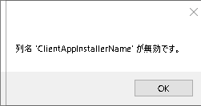
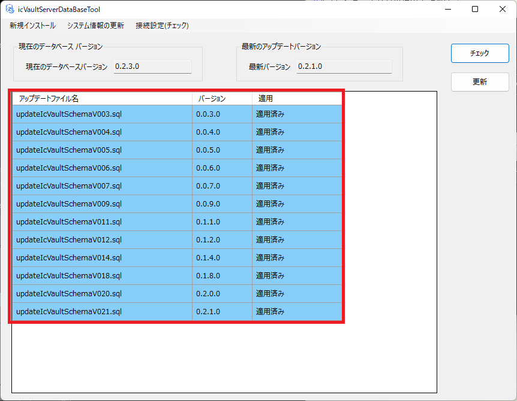
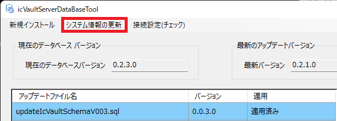

# Application nameが無効

以下のメッセージが表示される場合は、icVaultのバージョンが合っていない可能性があります。

icVaultAdministrationToolを起動し、[チェック]と[更新]します。

改善しない場合は、同画面の[システム情報の更新]を実行します。

更新後にicVaultクライアントを起動し、動作を確認してください。

改善しない場合は、お手数をおかけしますが IRONCADサポートまでご連絡ください。
