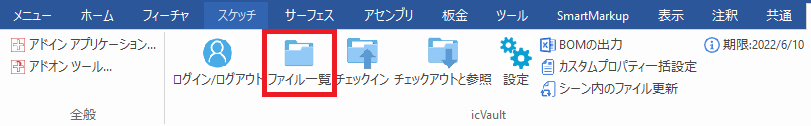
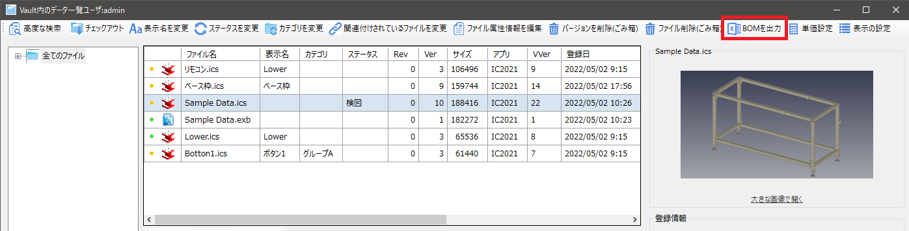
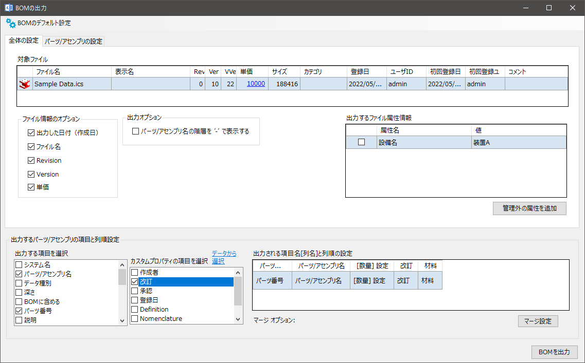
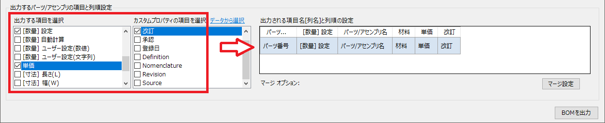
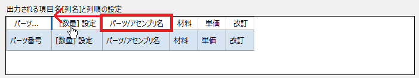
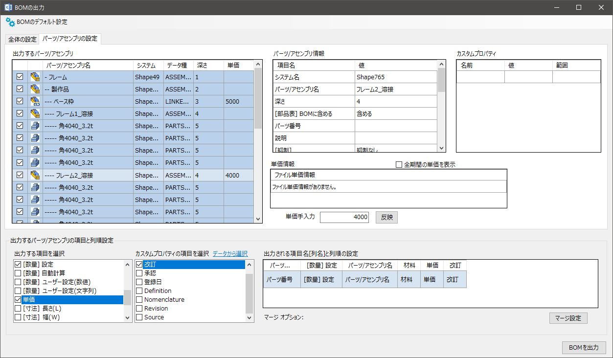
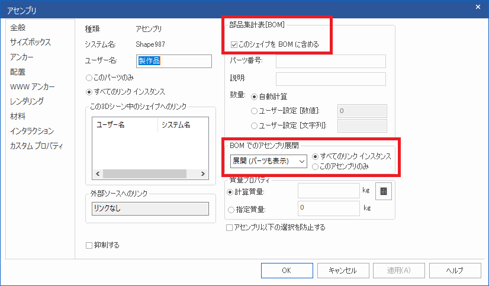
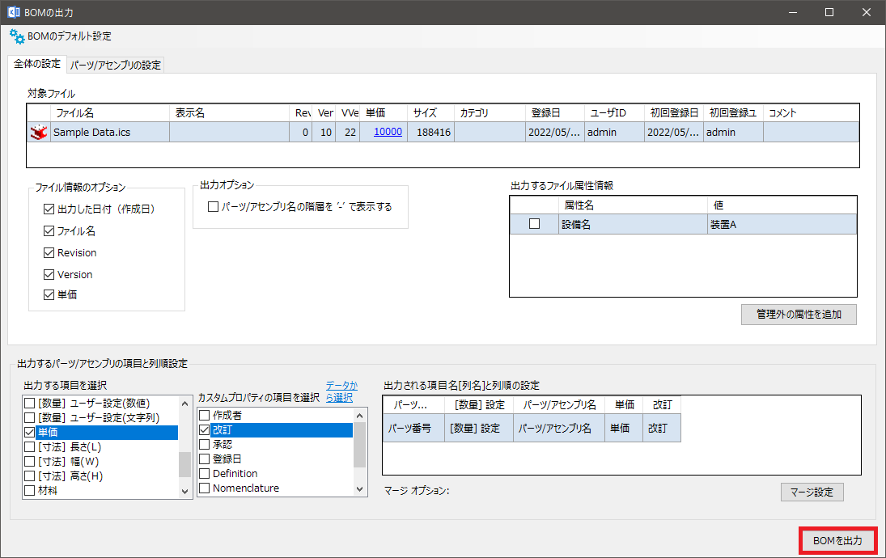
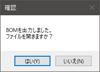
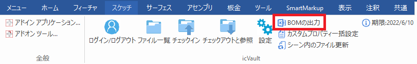

# BOMの出力
本項目では icVault から BOM を出力する方法について説明します。 
BOM はエクセルで作成されます。 
 
icVault では以下の方法で BOM 情報を出力することができます。
<li>icVault に登録(チェックイン)されているデータの BOM 出力(パターン①)</li>
<li>icVault へのファイル登録に関係なく、現在開いているデータのBOM出力(パターン②)</li>
 

<ul>
出力したエクセルから icVault で設定する BOM の出力画面に情報を戻すことはできません。
</ul>

## パターン①:ファイル一覧から出力する場合

icVault に登録されているファイルのBOMを出力する場合は、ファイル一覧のリストから該当のデータを選択し BOM を出力します。

<ul>
icVault に登録されているデータへ単価設定をしており、単価情報も BOM で出力する場合はこちらの方法で実施してください。  
</ul>

### 1. ファイルを選択する

icVault アドインからファイル一覧をクリックします。

続けて、BOM 出力するファイルを選択し [BOMを出力] をクリックします。

### 2. 出力内容を設定する
BOM の出力画面が起動します。

###### 全体の設定
出力する項目や順番を設定します。 

<table>
<tr>
<th>対象ファイル</th>
<td>選択したファイルが表示されます。 
※ファイル一覧で複数選択しても最後に選択したファイルのみ表示されます。
</td>
</tr>
<tr>
<th>ファイル情報のオプション</th>
<td>出力ファイルの情報で、リスト外に表示されます。 
必要な情報にチェックを入れます。</td>
</tr>
<tr>
<th>出力オプション</th>
<td>チェック有り：アセンブリ階層が存在する場合、一番左に表示される名前の前に階層分の"-(ハイフン)"が付加されます。 
例) 2階層のパーツ：-A_01、3階層のパーツ：--A_01
 
</td>
</tr>
<th>出力するファイル属性情報</th>
<td>ファイル属性情報を設定している場合に表示されます。 BOM に反映する場合はチェックを入れます。
</td>
</tr>
<th>出力するパーツ/アセンブリの項目と列順設定</th>
<td>BOMリスト の主要部分になります。　必要な情報にチェックを入れます。 
※詳細は以下で説明
</td>
</tr>
</table>

#### 出力するパーツ/アセンブリの項目と列順設定
**本設定が BOM の主要設定になります。　出力したい項目にチェックを入れ、出力される列順を設定します。**

【項目の選択】 
[出力する項目を選択]、[カスタムプロパティの項目を選択] から出力したい項目にチェックを入れます。　
選択した順番に右側に表示されます。

【列順の変更】 
右側の表示項目(ヘッダー)をマウスの左クリックでドラッグしたまま、移動します。 
設定する順番で BOMリスト が作成されます。

###### パーツ/アセンブリの設定
BOM に出力するパーツ/アセンブリを選択します。

出力するパーツ/アセンブリのチェックの初期設定は、IRONCAD の各プロパティ - 全般設定により決まります。
<li>部品集計表[BOM]</li>
<li>BOMでのアセンブリ展開</li>

### 3. BOM を出力する

〔1〕全て設定後、画面右下の [BOMを出力] をクリックします。

〔2〕任意の場所とファイル名を指定し [保存] をクリックします。 
 
保存が完了すると、確認画面が表示されます。
すぐに開く場合は [はい]、光らない場合は [いいえ] をクリックします。

## パターン②:icVaultアドイン から出力する場合

[BOMの出力] をクリックします。

icVault の登録有無に関わらず、現在開いているデータのBOMを出力する場合に使用します。

<ul>
icVault に登録されているデータを本コマンドで実行する場合、単価設定は表示(反映)されません。 
単価設定は icVault のサーバに情報が登録されているため、必要な場合はファイル一覧のBOMを出力から実施してください。
</ul>

 

以降の操作手順はパターン① 手順2以降と同じ
