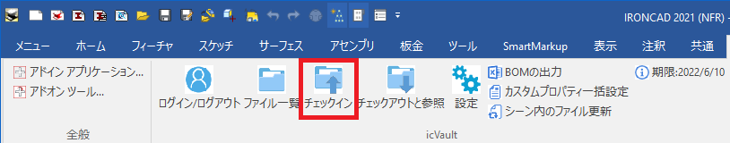
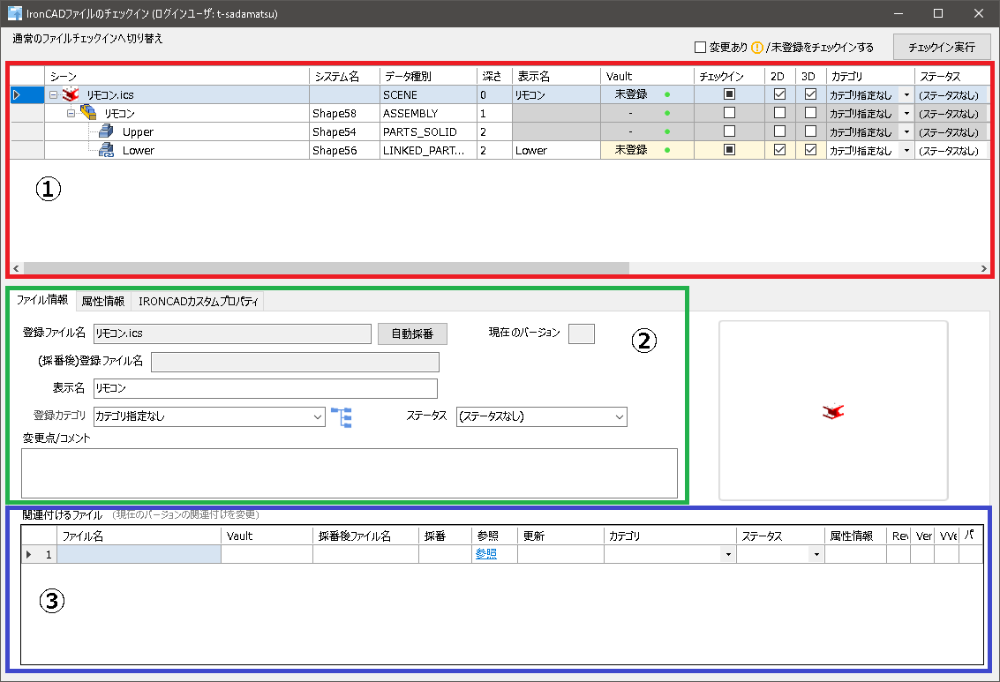
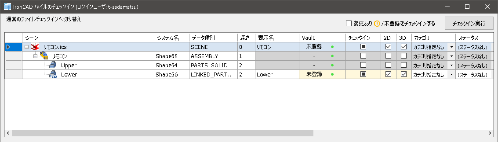
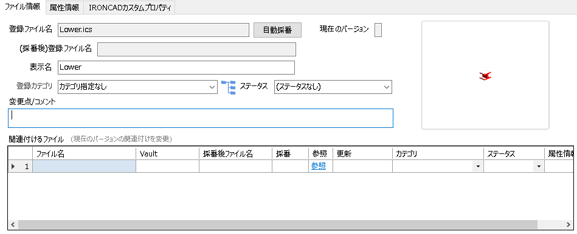
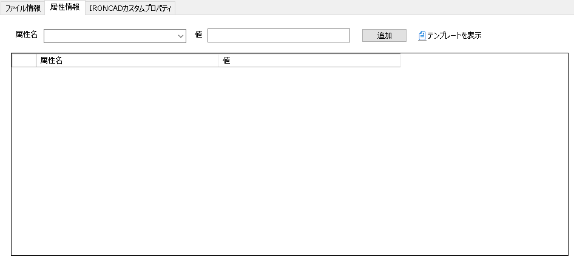
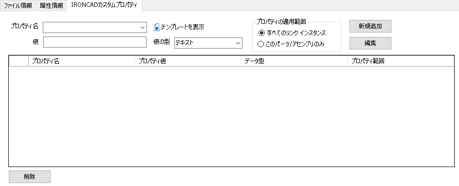
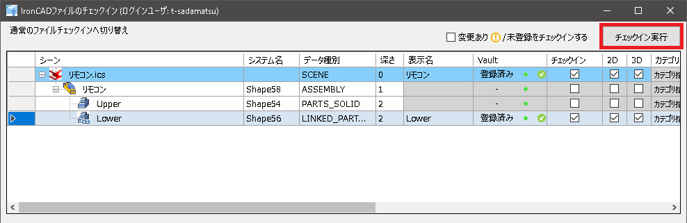
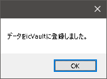

# チェックイン(新規登録)
本項目では、設計データをicVault ファイルサーバへ初めて登録する場合について説明します。 

作業の区切りでデータを PDM(icVault) へ登録する作業をチェックインと言います。 
仕掛中、完成に関わらず icVaultサーバ へ登録することでチームまたは他部署も共有ができるようになります。 

<ul>
共有ルールは「アクセス権の設定」と「カテゴリの設定」でユーザ毎に付与された権限に準じます。
</ul>

 

## データを icVault に登録する

### 1. チェックイン画面を起動する
**※必ずデータを保存してから実施してください。** 

icVault アドイン から [チェックイン] をクリックします。

### 2. チェックイン情報を設定する
チェックイン画面が起動します。 
一番上に登録するデータのファイル名や構成が表示されます。 
チェックインするにあたり、チェックイン(登録)するデータの選択とデータに付与するファイル情報を設定します。

### 3. データを選択する

チェックイン可能なデータは「チェックイン」項目に■が表示されます。 
　■をクリックし、登録するデータとして選択します。 
　※選択すると表示が「レ」に変更されます。

<ul>
<li>初めて登録するデータは Vault 欄に「未登録」と表示されます。</li>
<li>外部リンクが付いたデータもチェックイン対象になります。</li>
</ul>

### 4. ファイル情報を設定する
チェックインするデータに採番やカテゴリなど情報を入力します。
設定した情報は登録するデータ(icsなど)ではなく、icVault へ登録されデータと紐づけられます。

<table>
<tr>
<th>登録ファイル名</th>
<td>デフォルトではデータのファイル名が表示されます。</td>
</tr>
<tr>
<th>〔自動採番〕ボタン</th>
<td>自動採番ルールに従って登録ファイル名を変更する場合に使用します。</td>
</tr>
<tr>
<th>(採番後)登録ファイル名</th>
<td>自動採番を使用した場合に、採番で決定したファイル名が表示されます。</td>
</tr>
<tr>
<th>登録カテゴリ</th>
<td>登録データのカテゴリを選択します。※選択無しでも登録可 
(カテゴリの設定は管理者へご確認ください。)
</td>
</tr>
<tr>
<th>ステータス</th><td>登録データの現在のステータスを選択します。 ※選択無しでも登録可 
(ステータスの設定は管理者へご確認ください。)
</td>
</tr>
<tr>
<th>変更点/コメント</th>
<td>入力は任意。　自由にご使用ください。</td>
</tr>
<tr>
<th>関連付けるファイル</th>
<td>チェックインするデータに関連付けるファイルを登録します。 
[参照]をクリックし、登録します。
</td>
</tr>
</table>

<ul>
<li>何も設定せず、チェックインすることは可能です。</li>
<li>自動採番以外の各設定は icVault へ登録後に変更することができます。</li>
</ul>

 

### 5. 属性情報を設定する(必要な場合のみ)

登録するデータに属性情報を設定します。 
属性情報とは icVault に登録するデータのみに設定可能な情報になります。 
IRONCAD内 のプロパティで設定する属性以外に、登録するデータ自体に情報を付加したい場合に使用します。 
ファイル一覧の高度な検索のキーワードやチーム間での情報伝達内容として活用可能です。

<table>
<tr>
<th>属性名</th>
<td>属性名を入力します。</td>
</tr>
<tr>
<th>値</th>
<td>属性名に対する値を入力します。</td>
</tr>
<tr>
<th>テンプレートを表示</th>
<td>ファイル属性テンプレートを設定している場合にクリックします。テンプレートが表示されます。</td>
</tr>
</table>

入力後、〔追加〕をクリックします。 
入力と追加は登録数分、繰り返し実施します。

<ul>
登録した属性情報はicVault画面上(ファイル一覧など)のみで表示可能となっております。 
取得して、ローカルに保存したデータから直接確認することはできません。
</ul>

### 6. IRONCAD カスタムプロパティを設定する(必要な場合のみ)

通常、IRONCAD のパーツ/アセンブリプロパティ内にあるカスタムプロパティ情報を追加することができます。 
すでにIRONCAD で設定している場合は、こちらに表示されます。

<table>
<tr>
<th>プロパティ名</th>
<td>プロパティ名を入力します。</td>
</tr>
<tr>
<th>値</th>
<td>プロパティ名に対する値を入力します。</td>
</tr>
<tr>
<th>値の型</th>
<td>プルダウンメニューから選択します。 
　IRONCAD のカスタムプロパティと同じ
</tr>
<th>プロパティの適用範囲</th>
<td>適用する範囲を選択します。 
　・すべてのリンク インスタンス:リンクしているすべてのパーツ/アセンブリに適用 
　・このパーツ/アセンブリのみ:選択した要素のみに適用
</tr>
<th>テンプレートを表示</th>
<td>カスタムプロパティテンプレートを設定している場合にクリックします。 テンプレートが表示されます。
</tr>
</table>

入力後、[新規追加] をクリックします。 
入力と新規追加は登録数分、繰り返し実施します。

### 7. チェックインと確認
全て設定後、右上の [チェックイン実行] をクリックします。

チェックイン完了後、メッセージが表示されます。 
[OK] をクリックします。

チェックインが正常に終了すると、上図のようにVault欄が「登録済み」に変わります。
