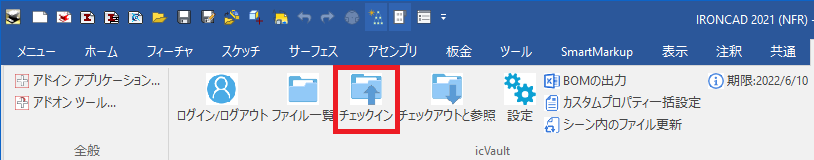
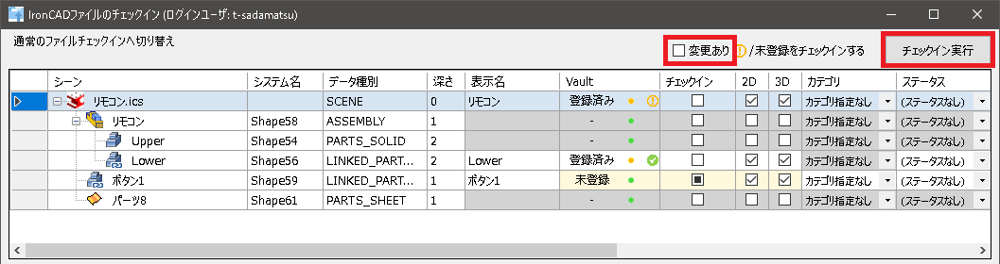
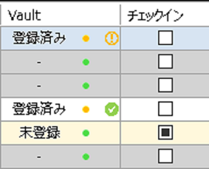
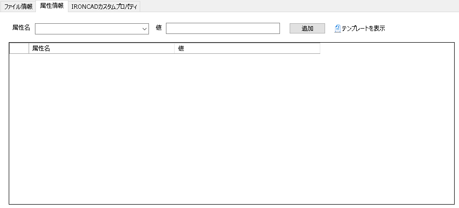
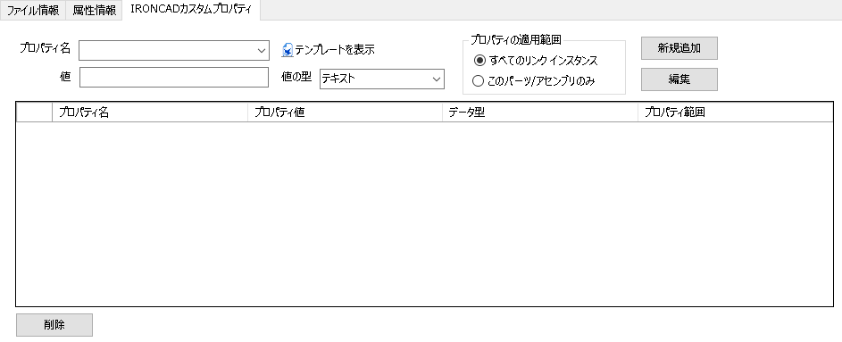
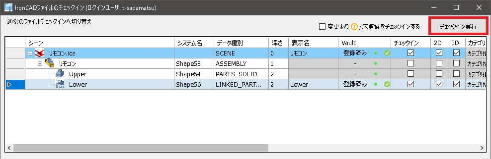
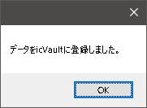

# チェックイン(再登録)
本項目では、すでにicVaultへ登録されているデータをicVault ファイルサーバへ再登録する場合について説明します。 

### 手順 1　チェックイン画面を起動する
**※必ずデータを保存してから実施してください。** 

icVaultアドインから〔チェックイン〕をクリックします。

### 手順2　チェックイン情報を更新する(必要な場合のみ)

ファイル情報・属性情報・カスタムプロパティの内容を変更しない場合は 〔変更あり〕のチェックを入れて
〔チェックイン実行〕をクリックします。

(赤枠拡大) 

チェックイン可能なデータは「チェックイン」項目に■が表示されます。 
　■をクリックし、登録するデータとして選択します。 
　※選択すると表示が「レ」に変更されます。

<table>
<tr>
<th>登録済み</th>
<td>すでにicVaultサーバへ登録されているデータ</td>
</tr>
<tr>
<th>未登録</th>
<td>icVaultへ登録のない新規データ</td>
</tr>
<tr>
<th>オレンジ色の点</th>
<td>自分がチェックアウトしているデータ  ※「チェックアウト」参照 
</td>
</tr>
<tr>
<th>緑の点</th>
<td>誰も掴んでいない編集権を取得できるデータ  ※「チェックアウト」参照
</td>
</tr>
<tr>
<th>オレンジの「!」</th>
<td>形状に変更がある場合
</td>
</tr>
<tr>
<th>緑の「レ」</th>
<td>形状変更が無い場合/td>
</tr>
</table>

<ul>
<li>初めて登録するデータはVault欄に「未登録」と表示されます。</li>
<li>外部リンクが付いたデータもチェックイン対象になります。</li>
</ul>

### 手順 3　ファイル情報を設定する
チェックインするデータに採番やカテゴリなど情報を入力します。
設定した情報は登録するデータ(icsなど)ではなく、icVaultへ登録されデータと紐づけられます。

<table>
<tr>
<th>登録ファイル名</th>
<td>デフォルトではデータのファイル名が表示されます。</td>
</tr>
<tr>
<th>〔自動採番〕ボタン</th>
<td>自動採番ルールに従って登録ファイル名を変更する場合に使用します。</td>
</tr>
<tr>
<th>(採番後)登録ファイル名</th>
<td>自動採番を使用した場合に、採番で決定したファイル名が表示されます。</td>
</tr>
<tr>
<th>登録カテゴリ</th>
<td>登録データのカテゴリを選択します。※選択無しでも登録可 
(カテゴリの設定は管理者へご確認ください。)
</td>
</tr>
<tr>
<th>ステータス</th><td>登録データの現在のステータスを選択します。 ※選択無しでも登録可 
(ステータスの設定は管理者へご確認ください。)
</td>
</tr>
<tr>
<th>変更点/コメント</th>
<td>入力は任意。　自由にご使用ください。</td>
</tr>
<tr>
<th>関連付けるファイル</th>
<td>チェックインするデータに関連付けるファイルを登録します。 
[参照]をクリックし、登録します。
</td>
</tr>
</table>

<ul>
<li>何も設定せず、チェックインすることは可能です。</li>
<li>自動採番以外の各設定はicVaultへ登録後に変更することができます。</li>
</ul>

 

### 手順 4　属性情報を設定する(必要な場合のみ)

登録するデータに属性情報を設定します。 
属性情報とはicVaultに登録するデータのみに設定可能な情報になります。 
IRONCAD内のプロパティで設定する属性以外に、登録するデータ自体に情報を付加したい場合に使用します。 
ファイル一覧の高度な検索のキーワードやチーム間での情報伝達内容として活用可能です。

<table>
<tr>
<th>属性名</th>
<td>属性名を入力します。</td>
</tr>
<tr>
<th>値</th>
<td>属性名に対する値を入力します。</td>
</tr>
<tr>
<th>テンプレートを表示</th>
<td>ファイル属性テンプレートを設定している場合にクリックします。テンプレートが表示されます。</td>
</tr>
</table>

入力後、〔追加〕をクリックします。 
入力と追加は登録数分、繰り返し実施します。

<ul>
登録した属性情報はicVault画面上(ファイル一覧など)のみで表示可能となっております。 
取得して、ローカルに保存したデータから直接確認することはできません。
</ul>

### 手順 5　IRONCADカスタムプロパティを設定する(必要な場合のみ)

通常、IRONCADのパーツ/アセンブリプロパティ内にあるカスタムプロパティ情報を追加することができます。 
すでにIRONCADで設定している場合は、こちらに表示されます。

<table>
<tr>
<th>プロパティ名</th>
<td>プロパティ名を入力します。</td>
</tr>
<tr>
<th>値</th>
<td>プロパティ名に対する値を入力します。</td>
</tr>
<tr>
<th>値の型</th>
<td>プルダウンメニューから選択します。 
　IRONCADのカスタムプロパティと同じ
</tr>
<th>プロパティの適用範囲</th>
<td>適用する範囲を選択します。 
　・すべてのリンク インスタンス:リンクしているすべてのパーツ/アセンブリに適用 
　・このパーツ/アセンブリのみ:選択した要素のみに適用
</tr>
<th>テンプレートを表示</th>
<td>カスタムプロパティテンプレートを設定している場合にクリックします。 テンプレートが表示されます。
</tr>
</table>

入力後、〔新規追加〕をクリックします。 
入力と新規追加は登録数分、繰り返し実施します。

### 手順 6　チェックインと確認
全て設定後、右上の〔チェックイン実行〕をクリックします。

チェックイン完了後、メッセージが表示されます。 
〔OK〕をクリックします。

チェックインが正常に終了すると、上図のようにVault欄が「登録済み」に変わります。
