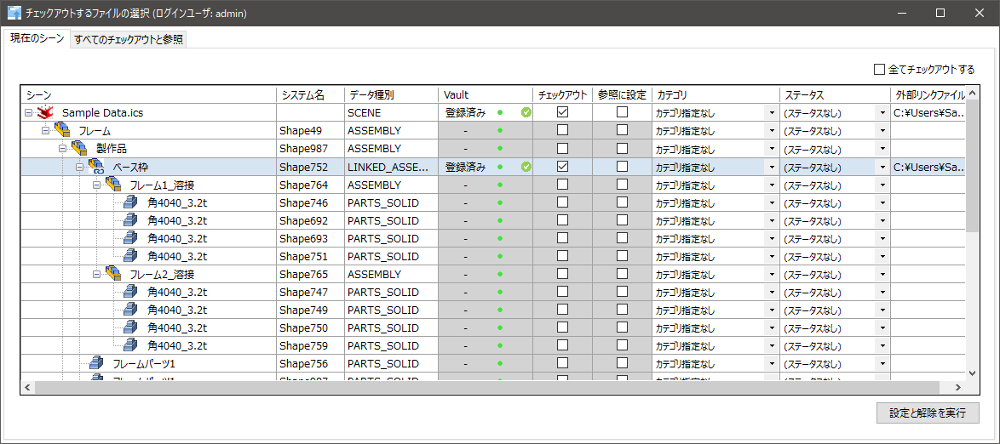
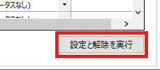
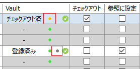
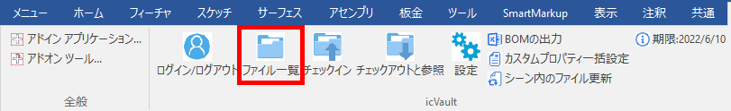
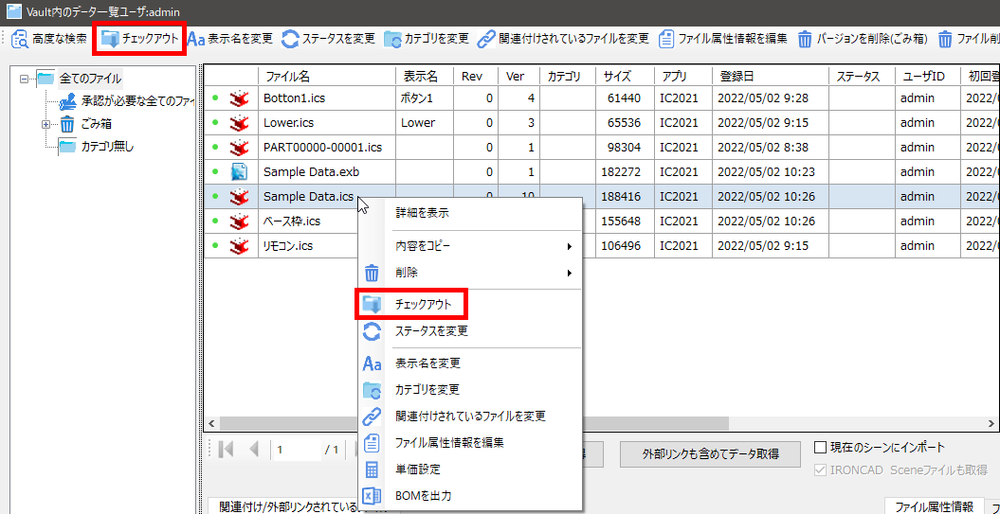
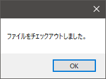
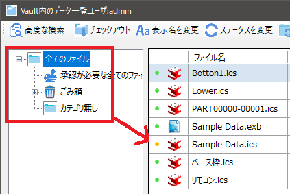

# チェックアウト
チェックアウトとは、icVault に登録されているデータの使用権を取得した状態を示します。 
チェックアウト中のデータは、他のユーザがチェックアウト並びにチェックインすることはできません。 

また icVault には、編集したくないデータを「参照」にすることができます。
他の方のデータを編集はしないが配置しておきたい、または自分のデータでも変更せず、チェックインしたくない場合に活用してください。

チェックアウトする方法は〔ファイル一覧〕または〔チェックアウトと参照〕から実施可能ですが、それぞれ特徴があります。

## 〔チェックアウトと参照〕からチェックアウトする場合
※すでに IRONCAD で開いているデータをチェックアウトする場合は、こちらを使用します。

### 1. チェックアウトするファイルを選択する

ファイルの [チェックアウト]欄 を手動でチェックまたは右上の [全てチェックアウトする] をクリックします。 
参照データにする場合は、[参照に設定] にチェックを入れます。
 

### 2. チェックアウトを実行する
画面右下の [設定と解除を実行] をクリックします。 

表示を確認します。 
　チェックアウト：点がオレンジ色に変化 
　参照　　　　　：濃い緑が追加

<li>チェックアウトと参照の同時設定も可能です。</li>
<li>チェックアウトはするが、変更を登録したくないデータは両方チェックを入れると誤まってチェックインすることを防ぐことができます。</li>

 

## ファイル一覧からチェックアウトする場合

### 1. チェックアウトするファイルを選択して実行する
ファイルを選択し、ツールバーの [チェックアウト] をクリックします。 
(ファイルを右クリック → [チェックアウト] からも同じ操作が可能です。)

### 2. チェックアウトを確認する
チェックアウトの完了画面が表示されます。
[OK] をクリックします。

表示を更新するため、一度別のカテゴリをクリックし、再び元のカテゴリに戻ります。 
チェックアウトしたファイルの左端にある緑の表示がオレンジ色に変わります。

ファイル一覧から操作した場合は、選択したファイルのみチェックアウトされます。 
外部リンクされたデータがある場合、外部リンクデータはチェックアウトされません。

 

