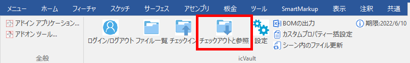

# チェックアウトの解除
自身でチェックアウトしているファイルの使用権を手放します。
使用権を解除することで他のユーザが使用権を取得し、編集できるようになります。

<li>自身がチェックアウトしているファイルのみ解除が可能です。</li>
<li>他のユーザがチェックアウトしているファイルをチェックアウトしたい場合は、管理者へご相談ください。　
管理者は icVaultAdministrationTools から全データに対して強制的にチェックアウトを解除することが可能です。</li>

 

アドインタブ〔チェックアウトと参照〕で実施します。

### 1. チェックアウト一覧を表示する
タブ：[すべてのチェックアウトと参照]をクリックします。

[表示の説明]
<table>
<tr>
<th>チェックアウト/参照</th>
<td>自身がチェックアウトと参照しているすべてのデータが表示されます。 
</td>
</tr>
<tr>
<th>チェックアウトのみ</th>
<td>自身がチェックアウトしているデータのみ表示されます。 
</td>
</tr>
<tr>
<th>参照のみ</th>
<td>自身が参照しているデータのみ表示されます。 
</td>
</tr>
<tr>
<th>全てのユーザのチェックアウトを表示</th>
<td>チェック有り：icVault に登録されているすべてのユーザが対象となります。 
チェック無し：ログインしているユーザのみ対象となります。
</td>
</tr>
</table>

### 2. 解除する
ファイルを選択後、画面右下の [チェックアウト/参照の解除] をクリックします。 

続いて、チェックアウトの完了画面が表示されます。 
[OK] をクリックします。

Windows の標準操作(マウスの左クリックとShiftキー・Ctrlキー)で複数選択が可能です。

 

### 3. 確認する
解除後は任意でファイル一覧の表示が緑に変わっていることを確認します。
オレンジ色の場合は、正常にチェックアウトが解除されていない可能性がありますので、再度操作を確認してください。

