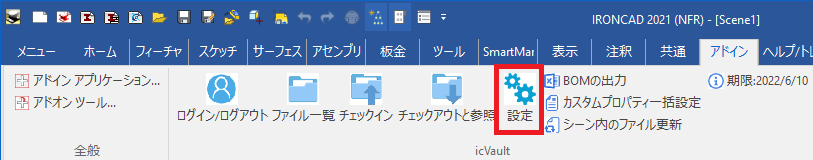
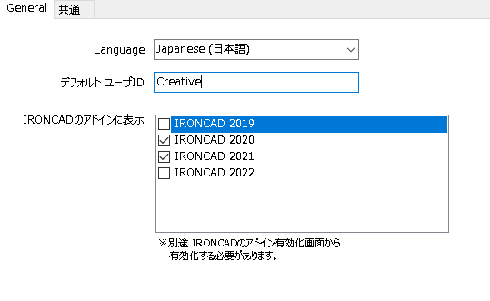
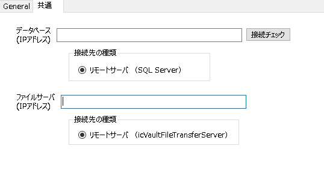
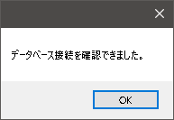
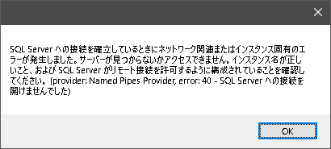
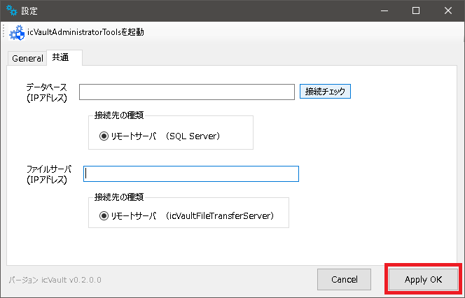

# 初期設定/接続

本項目では、ユーザがicVaultへ接続する際の初期設定について説明します。 
**ユーザは本設定を実施することで、icVaultが使用可能となります。**

〔設定〕コマンドをクリックします。

## Generalの設定

<table>
<tr>
<th>Language</th>
<td>プルダウンから日本語または英語を選択します。</td>
</tr>
<tr>
<th>デフォルト ユーザID</th>
<td> ログイン画面で「ユーザ名」に入力したIDが自動で反映されます。
</td>
</tr>
<tr>
<th>IRONCADのアドインに表示</th>
<td>ご利用のIRONCADバージョンにチェックを入れます。</td>
</tr>
</table>

<ul>
「IRONCAD のアドインに表示」にチェックがないIRONCADバージョンはIRONCADのアドインアプリケーションに表示されません。
</ul>

※ここではまだ〔Apply OK〕をクリックしません。

## 共通の設定
本設定は、ユーザがicVault使用に際し、サーバPCに接続するために実施します。

### 手順 1　サーバのIPアドレスを設定する

<table>
<tr>
<th>データベース(IPアドレス)</th>
<td>サーバーPCのIPアドレスを入力します。 
※IPアドレスは管理者へ確認
</td>
</tr>
<tr>
<th>ファイルサーバ(IPアドレス)</th>
<td>設定するファイルサーバのある端末のIPアドレスを入力します。 
※IPアドレスは管理者へ確認
</td>
<tr>
<th>〔接続チェック〕</th>
<td>入力したIPアドレスが接続できるか確認します。 
</td>
</table>

### 手順 2　接続を確認する

〔接続チェック〕をクリックします。 
接続できた場合は、以下のメッセージが表示されます。

接続できない場合は、入力したIPアドレスが間違っています。 
※正しいIPアドレスを管理者へ確認してください。

## 設定を適用する

接続確認ができたら〔Apply OK〕をクリックします。

