# カスタムプロパティの一括設定
本項目では編集中の IRONCADデータ にカスタムプロパティ情報を一括設定する方法について説明します。 
パーツ/アセンブリ問わず、カスタムプロパティ情報を一画面で追加/変更することができます。

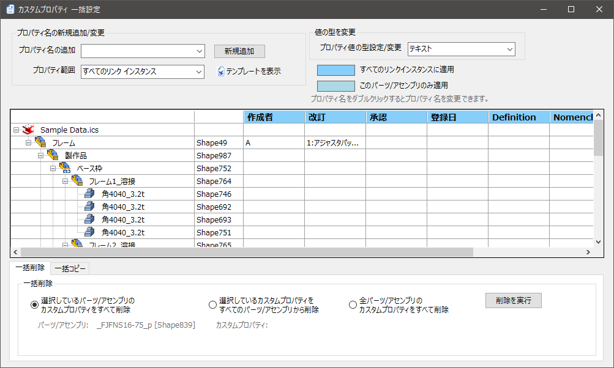

<ul>
シーンブラウザの一部のパーツ/アセンブリのみ設定することはできません。 
</ul>

 

## 個別にカスタムプロパティの追加

### 1. プロパティを設定する
カスタムプロパティ一括設定画面左上のプロパティ名の新規追加/変更欄の 
[プロパティ名の追加]のプルダウンメニューから選択または入力します。
 
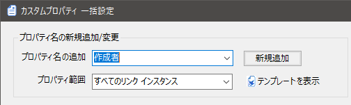

<table>
<tr>
<th>プロパティ名の追加</th>
<td>プロパティ名をプルダウンメニューから選択または入力します。</td>
</tr>
<tr>
<th>プロパティ範囲</th>
<td>すべてのリンクインスタンス： 
　内部リンクされた複数のパーツに対し、1ヶ所入力すると全て同じ情報が反映されます。 
 
このパーツ/アセンブリのみ： 
　内部リンクパーツでも別の情報を入力することができ、個別で入力します。
</td>
</tr>
</table>

<ul>
[プロパティ範囲]設定における[このパーツ/アセンブリのみ]は通常の IRONCAD の機能に存在しません。
</ul>

<ul>
内部リンクパーツ間に異なる情報を付与する際は、2D で作成する部品表にも影響しますので注意して使用してください。
</ul>

 

### 2. プロパティを追加する

[新規追加] をクリックします。 
一覧に設定した項目が追加されます。

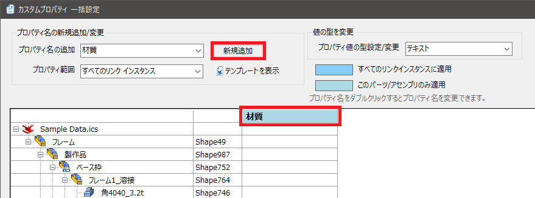

### 3. プロパティ情報を入力する
該当のセルを選択し、プロパティ情報を入力します。 
コピーする場合は、コピーするセルを選択し右クリックのコピーまたはCtrl + cキーでコピー 
続いて、貼り付けるセルを選択し右クリックの貼り付けまたはCtrl + vキーで実施します。

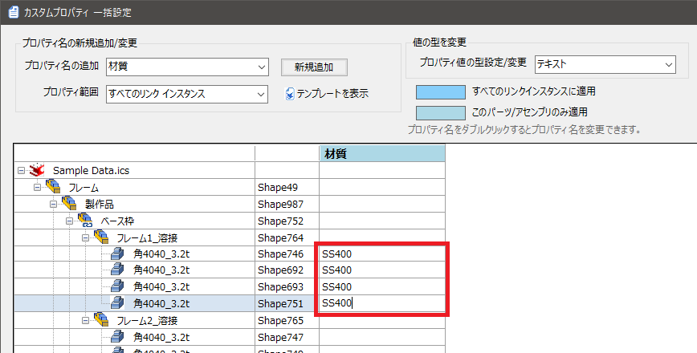

## テンプレートからカスタムプロパティの追加
統一されたテンプレートを設定している場合は、[テンプレートを表示] から選択・追加します。

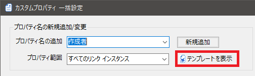

※カスタムプロパティ テンプレートの設定については、以下を参照：

[カスタムプロパティテンプレートの設定](../setup_admin/Master/Ctpy_temp.md)

### 1. テンプレートを選択する

画面左側のテンプレート名のプルダウンメニューから選択します。 
テンプレートに設定した項目の中から必要な項目にチェックを入れます。 
※すべて追加する場合は、[すべて選択/解除] をクリックします。

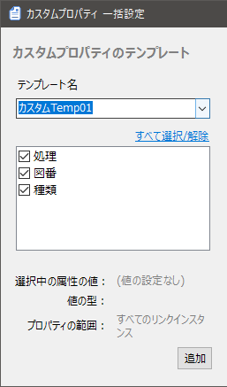

### 2. テンプレートを追加する
選択が完了後、[追加] をクリックします。

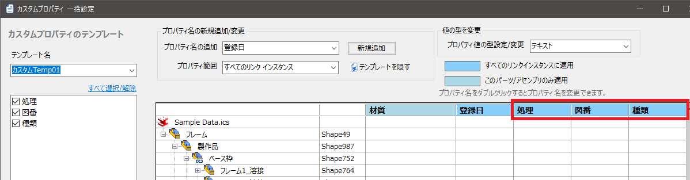

始めはすべて空白のため、以下のメッセージが表示されます。 
続けて [OK] をクリックします。

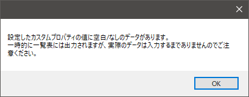

### 3. プロパティ情報を入力する
該当のセルを選択し、プロパティ情報を入力します。 
※<個別にカスタムプロパティの追加>の手順3と同じ

カスタムプロパティの項目に入力されているパーツ/アセンブリが一つもない場合、以下のメッセージが表示されます。 
入力する場合は [いいえ]、項目ごと削除する場合は [はい] をクリックします。

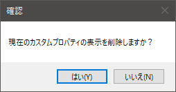

## カスタムプロパティ項目の変更

設定した項目の名前をを変更する場合は該当項目をダブルクリックします。 
セルが黄色になり、プロパティ名を変更して [変更] をクリックします。

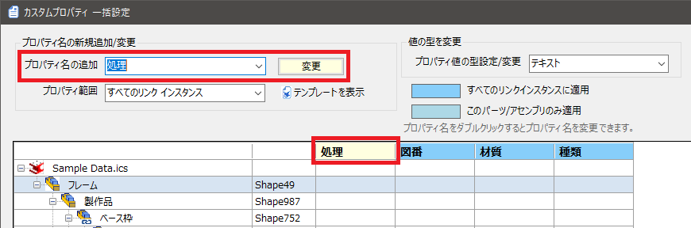

## カスタムプロパティの一括削除
カスタムプロパティ内容を削除する場合、セル単位での削除は選択して Deleteキー で可能です。
[一括削除] では、行・列・すべて削除が可能です。 
 
例：行で削除する場合 
一番左にチェックを入れ、削除したい行のセルのどれか 1つを選択します。 
[削除を実行] をクリックします。

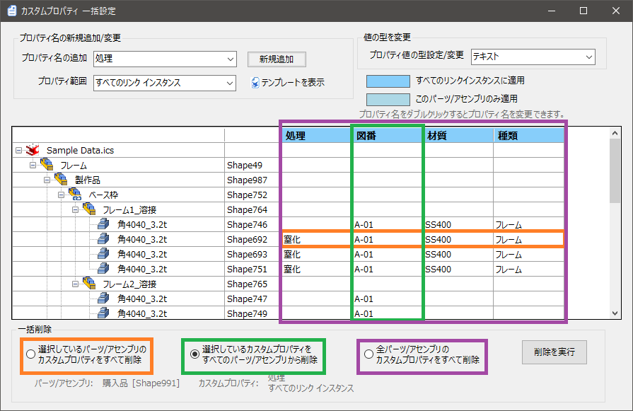

## カスタムプロパティの一括コピー(行ごと)
一括設定画面で他パーツ/アセンブリのカスタムプロパティ情報をコピーすることができます。 

〔1〕画面下の [一括コピー] を選択します。

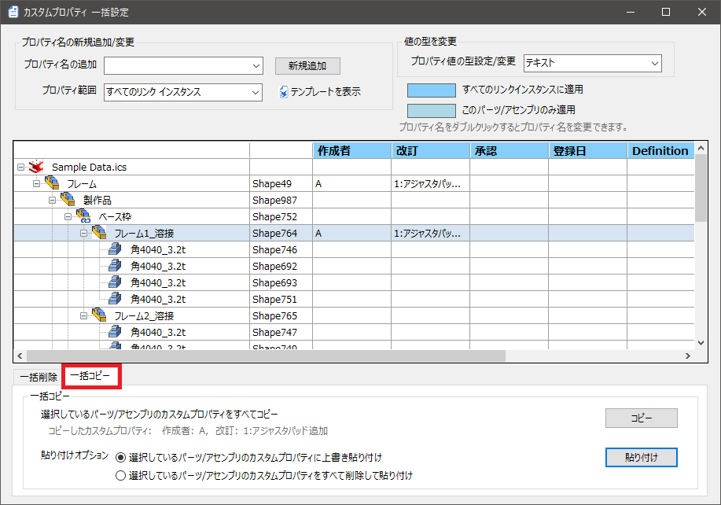

〔2〕コピー元のパーツまたはアセンブリを選択し、[コピー] をクリックします。

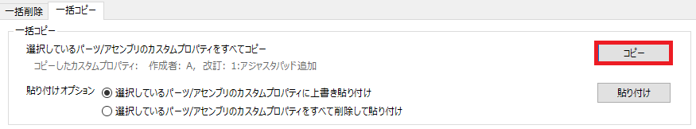

〔3〕コピー先に貼り付けする 
貼り付ける前に [貼り付けオプション] を選択します。 
選択後、[貼り付け] をクリックします。

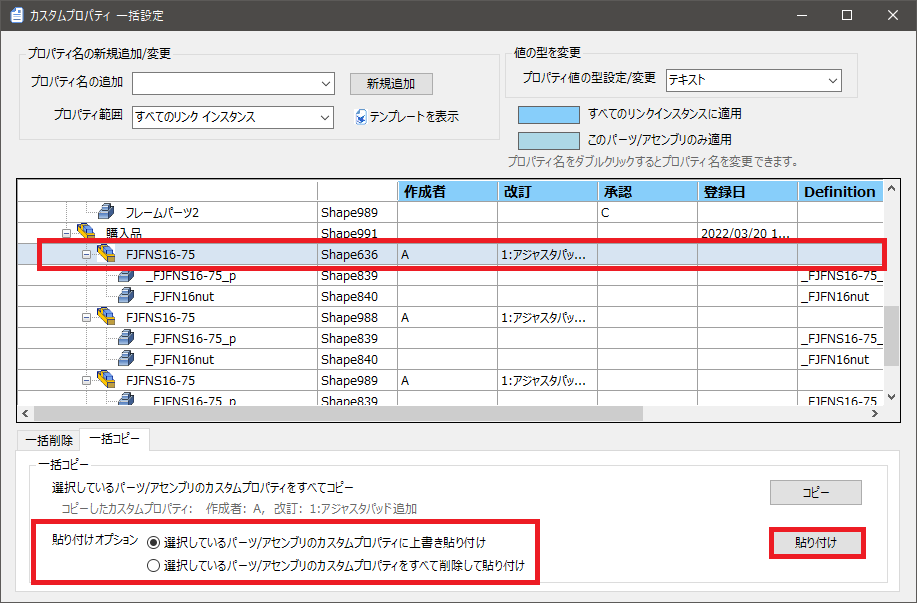

<ul>
<li>内部リンクされたパーツ/アセンブリは同時に貼り付けされます。</li>
<li>列ごとや一部の範囲をコピー/貼り付けすることはできません。</li>
</ul>

 
