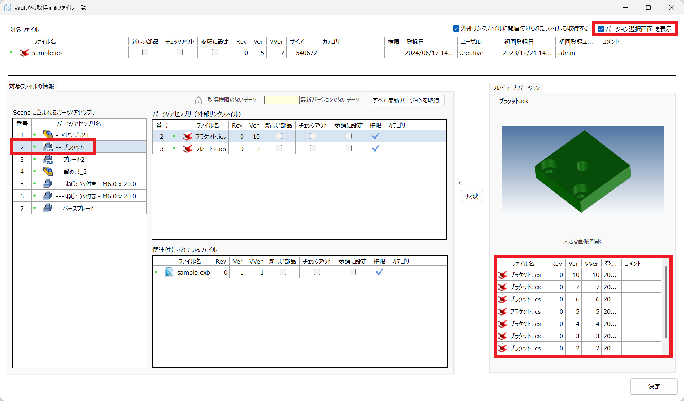
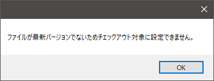

# データの承認とステータス変更
本項目では設計中のデータの承認について説明します。 
**設計データを承認する上司または管理職向けのご案内になります。** 
 
設計業務では、必ず検図や承認が実施されます。 
承認のアクセス権限を付与された担当者が実施後に承認/却下をすることができます。 
承認/却下後は、ステータスの設定に沿ったルールでファイル一覧に表示されるステータスが変更されます。

<ul>
アクセス権限、ステータスの設定内容や追加/変更についてはicVault管理者へ確認してください。
</ul>

<table>
<tr>
<th>データを取得</th>
<td>ファイル一覧で選択したファイルのみ取得します。</td>
</tr>
<tr>
<th>外部リンクも含めてデータ取得</th>
<td>ファイル一覧で選択したファイルと外部リンクで紐づいているファイルを取得します。</td>
</tr>
<tr>
<th>現在のシーンにインポート</th>
<td>チェック有り： 
　開いているシーンファイルに読み込まれます。 
 
チェック無し： 
　新しいシーンファイルで開きます。 
</td>
</tr>
<tr>
<th>IRONCAD Sceneファイル も取得</th>
<td>3D と紐づいている 2Dファイル(exb) を選択した場合に選択できます。 
　チェック有り： 
　　3Dファイルも一緒に取得します。 
 
　チェック無し： 
　　選択した 2Dファイル のみ取得します。
</td>
</tr>
</table>

### データを取得する場合
※先に [現在のシーンにインポート]設定 を選択してください。 

一覧からファイルを選択し、[データを取得] をクリックします。

### 外部リンクも含めてデータ取得する場合
※先に [現在のシーンにインポート]設定 を選択してください。 

1. 一覧からファイルを選択し、[外部リンクも含めてデータ取得] をクリックします。

2. 取得する条件を設定

<table>
<tr>
<th>新しい部品</th>
<td>icVault に登録されているデータとは別に新しいデータとして取得します。</td>
</tr>
<tr>
<th>チェックアウト</th>
<td>データ取得と同時にチェックアウトします。</td>
</tr>
<tr>
<th>参照に設定</th>
<td>参照データとして取得します。　※チェックインできません。
</td>
</tr>
</table>

<ul>
参照として取得したデータは通常の IRONCAD と同じデータで編集も可能です。 
ローカル作業時は編集状態を保存することも可能ですが、チェックインが出来ない設定となっているため
チェックイン操作の際に警告メッセージが表示されます。
</ul>

3. 外部リンクファイルの選択　※必要時のみ 

外部リンクされたファイルは、IRONCAD と同じくアイコンに外部リンクのマークが付きます。 
外部リンクファイルは別のバージョンを取得したい場合は、画面右上の [バージョン選択画面を表示] にチェックを入れます。

バージョン一覧から選択し、[反映] をクリックします。

ただし古いバージョンを反映させた場合、チェックアウトはできません。

　4. データを取得する 

設定完了後、右下の [決定] をクリックします。 
続いて、保存するフォルダを指定し [保存] します。

