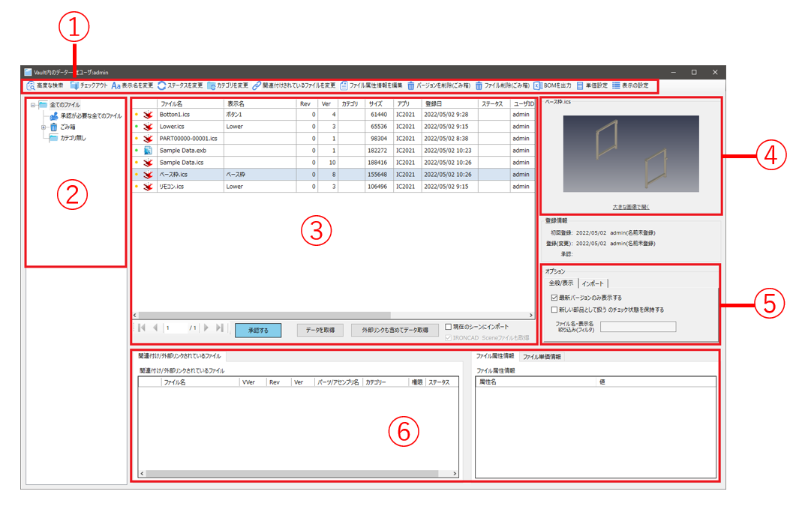
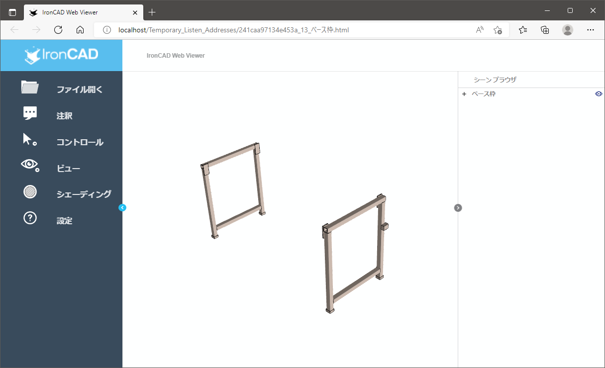
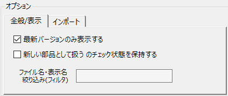
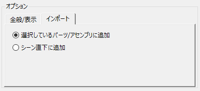

# ファイル一覧画面と各部名称

ユーザがファイルの状態の確認・変更・取得する際に使用します。

### ①　ツールバー
ファイル一覧内のデータ検索やカテゴリ・ステータスの変更など、様々な設定が可能です。 
※別項で説明

### ②　カテゴリ一覧
設定されている全カテゴリが表示されます。

### ③　登録ファイル一覧
チェックインされている全てのファイルが表示されます。

権限が付与されていないカテゴリのファイルは表示されません。

 

### ④　プレビュー画面
チェックインしたときにプレビュー画像が保存されているデータは、ファイルを選択した際に画像が表示されます。 
画像をクリックするとicWebViewerが起動し、IRONCADがインストールされていない/ライセンスを持っていないユーザも回転や拡大・縮小してデータを確認することが可能です。

プレビュー画面下の〔大きな画面で開く〕をクリックすると、別画面で画像が表示されます。

### ⑤　オプション
ファイル一覧の設定を変更することができます。

[全般/表示] 

<table>
<tr>
<th>最新のバージョンのみ表示する</th>
<td>チェック有り： 
　複数のバージョンが登録されている場合、最新バージョンのみ一覧に表示されます。(通常設定) 
 
チェック無し： 
　登録されている全てのバージョンが一覧に表示されます。
</td>
</tr>
<tr>
<th>ファイル名・表示名絞り込み(フィルタ)</th>
<td>キーワードを入力して、表示を限定することができます。
</td>
</tr>
</table>

[インポート] 
インポートするファイルを追加する場所を選択します。

<table>
<tr>
<th>追加場所の選択</th>
<td>【選択しているパーツ/アセンブリに追加】 
　開いているシーンの特定のアセンブリ内にインポートされます。 
 
【シーン直下に追加】 
　開いているシーンの一番下にインポートされます。
</td>
</tr>
</table>

### ⑥　ファイルに付随する情報の表示

#### 関連付け/外部リンクされているファイル
選択したファイルに関連付けされているファイルが表示されます。 
例）リンクされた2D図面(exb)や任意で関連付けした資料(pdf, エクセルなど)

#### ファイル属性/単価情報
選択したファイルに登録されている属性/単価情報が表示されます

ファイル属性情報とは、ユーザがチェックインする(した)ファイルに対して登録する情報です。 
チェックインやファイル一覧の〔ファイル属性情報を編集〕で付与することができます。登録するファイル自体に記録される情報です。 

単価情報とは、ファイル一覧の〔単価設定〕で登録する情報です。

