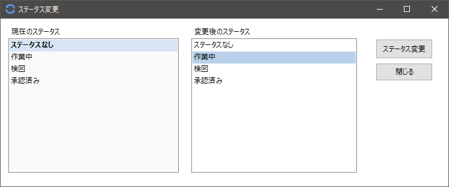
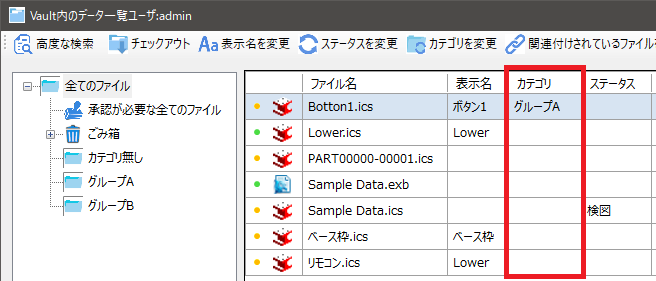
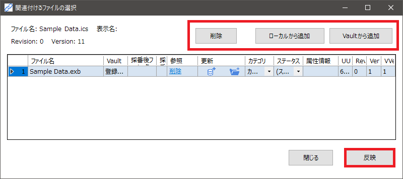

# ツールバーの操作
検索、ファイルに付与した情報やカテゴリの変更、単価など様々な情報を設定・変更することができます。 
左側のコマンドから順に説明を記載します。

### 高度な検索
icVaultに登録されているファイルが増えると一覧で見つけることが難しくなっていきます。
〔高度な検索〕によりファイルを早く探しだし、データを取得することができます。 

1．〔検索ワード〕欄にキーワードを入力し、〔検索〕クリックします。 
2．キーワードを含むファイルが検索結果に表示されます。 
3．ファイルを選択し、中身の情報を確認します。 
4．〔Vaultデータ一覧で表示〕をクリックします。 

より細かく絞り込んだ検索をする場合は、検索ボタン横の〔詳細検索を表示〕にチェックを入れます。 

### チェックアウト
選択したファイルをチェックアウトします。

※参照 : [ファイル一覧からチェックアウトする場合](../Checkout.md)

### 表示名を変更
チェックインする際に自由にコメントを入力できる項目になります。 

変更したいファイルを選択し、ツールバーの〔表示名の変更〕をクリックします。 
ダイアログの[変更後の表示名]に入力し、〔表示名を変更〕をクリックします。

入力した情報はファイル一覧の表示名に反映されます。

### ステータスを変更
ステータス(進捗状況)を変更します。 
 
ファイルを選択し、ファイル一覧の〔ステータスの変更〕をクリックします。 
ダイアログの変更後のステータスを選択し、〔ステータス変更〕をクリックします。

変更した情報はファイル一覧のステータスに反映されます。

### カテゴリを変更
カテゴリ(icVault内の区分け)を変更します。 

ファイルを選択し、ファイル一覧の〔カテゴリの変更〕をクリックします。 
ダイアログの変更後のカテゴリを選択し、〔カテゴリ変更〕をクリックします。

変更した情報はファイル一覧のカテゴリに反映されます。

### 関連付けされているファイルを変更
選択したファイルに関連付けたいファイルがある場合に設定します。 

ファイルを選択し、ファイル一覧の〔関連付けされているファイルを変更〕をクリックします。 
ダイアログの変更後のカテゴリを選択し、〔カテゴリ変更〕をクリックします。 

<table>
<tr>
<th>ローカルから追加</th>
<td>使用しているPCに保存されているデータから選択します。
</td>
</tr>
<tr>
<th>Vaultから追加</th>
<td>icVaultに登録され、ファイル一覧に表示されるファイルから選択します。
</td>
</tr>
<tr>
<th>削除</th>
<td>すでに関連付けされているファイルを一覧から選択し、(関連を)削除します。
</td>
</tr>
</table>

設定後〔反映〕をクリックします。

### ファイル属性情報を変更
選択したファイルの属性情報を追加・編集します。

ファイル属性は、登録するファイル自体(.ics/ .exb/ .dwgなど)に記録される情報です。 
例えば使用される設備名、グループ名、作成者などをファイルに設定しておくと登録者以外の人に対してファイルの概要を見える化することもできます。 
 
[属性名]と[値]を入力し、〔追加〕をクリックします。 

事前にテンプレートを作成している場合は、追加ボタン右横の〔テンプレートを表示〕をクリックします。 
テンプレート名のプルダウンメニューから選択し、必要な属性にチェックを入れ〔追加〕をクリックします。

設定後〔反映〕をクリックします。

### バージョンを削除(ごみ箱)
選択したファイルの特定のバージョンのみ削除します。 
〔バージョンを削除(ごみ箱)〕をクリックし、〔OK〕をクリックします。

ファイル一覧の[Ver]や[VVer]に削除したバージョンのファイルが消えていることを確認します。

削除したファイルバージョンは、左側の カテゴリ - ごみ箱の[特定のバージョン削除]に移動されます。

バージョンを削除(ごみ箱)実行後もデータはicVault内に残っています。 
icVaultから削除する場合は、カテゴリのごみ箱を選択し〔ごみ箱からファイル削除〕を実行してください。

 

### ファイル削除(ごみ箱)
選択したファイルの全バージョンを削除します。 
〔ファイル削除(ごみ箱)〕をクリックし、〔OK〕をクリックします。

ファイル一覧からファイル自体が消えていることを確認します。 
削除したファイルは、左側の カテゴリ - ごみ箱の[ファイル削除]に移動されます。

ファイル削除(ごみ箱)実行後もデータはicVault内に残っています。 
icVaultから削除する場合は、カテゴリのごみ箱を選択し〔ごみ箱からファイル削除〕を実行してください。

 

### BOMを出力
選択したファイルのBOM情報をエクセルに出力します。

※動画

### 単価設定
選択したファイルに単価を設定します。 
[単価]に値を入力し、〔新規追加〕をクリックします。 

<table>
<tr>
<th>単価</th>
<td>単価を入力します。</td>
</tr>
<tr>
<th>コメント</th>
<td>コメントを入力します。※入力は任意で無くても可</td>
</tr>
<tr>
<th>適用開始日/終了日</th>
<td>単価の適用期間が決まっている場合に設定します。 
期間が決まっていない場合は、[無期限に設定]をクリックします。 
</td>
</tr>
<tr>
<th>全バージョンに紐づく単価に設定</th>
<td>チェック有り：icVaultに登録されている全バージョンに適用されます。 
チェック無し：選択したファイルバージョンのみ適用されます。
</td>
</tr>
<tr>
<th>新規追加</th>
<td>設定した単価情報を新規追加します。 
追加後は一覧に表示されます。
</td>
</tr>
<tr>
<th>クリア</th>
<td>入力した単価情報をクリア(初期状態に戻す)します。</td>
</tr>
</table>

### 表示の設定
表示の設定は、ユーザがファイル一覧の表示状態を調整する際に設定します。

設定はユーザが使用するIRONCAD毎に実施してください。

 

###### 表示全般

<table>
<tr>
<th>ファイル一覧をIRONCADのウィンドウより前面に表示する</th>
<td>チェック有り：IRONCAD画面と重なっている時に常にファイル一覧が前面に表示されます。 
チェック無し：IRONCAD画面と重なっている時にIRONCAD操作時は背面に移動します。。
</td>
</tr>
<tr>
<th>ウィンドウサイズ設定</th>
<td>ファイル一覧のウィンドウサイズを数値で指定することができます。 
※開いた後にマウスでサイズ変更は可能
</td>
</tr>
<tr>
<th>使用する3D Viewerのバージョン</th>
<td>プレビュー画面をクリックした際に起動するicWebViewerのバージョンを設定します。  
</td>
</tr>
</table>

###### カテゴリツリーの表示

カテゴリの展開状態を設定します。

<table>
<tr>
<th>現在と同じに設定</th>
<td>デフォルトの展開/折りたたみの設定で調整した表示状態で設定します。
</td>
</tr>
<tr>
<th>全て展開</th>
<td>全階層を展開した状態でカテゴリを表示します。 
</td>
</tr>
<tr>
<th>全て折りたたむ</th>
<td>トップの[全てのファイル]のみ表示されます。 
展開する場合は、[＋]をクリックしていきます。
  
</td>
</tr>
</table>

###### ファイル一覧の表示

ファイル一覧の項目の表示/非表示や並び順を設定します。 

表示設定のチェック有無で表示項目を決定し、項目名をマウスの左クリックでドラッグしたまま移動したい場所に持っていくだけで並び替えができます。

ユーザが使いやすいように必要な項目や並び順に設定することを推奨します。

 

