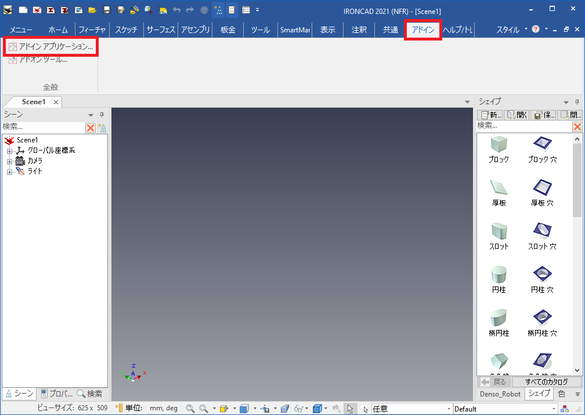
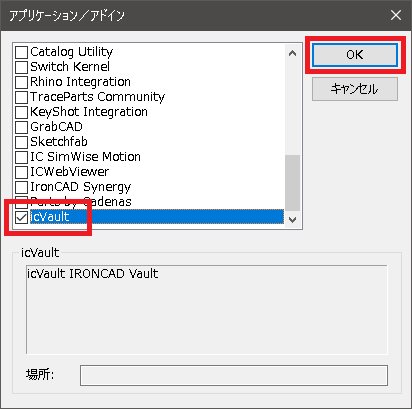
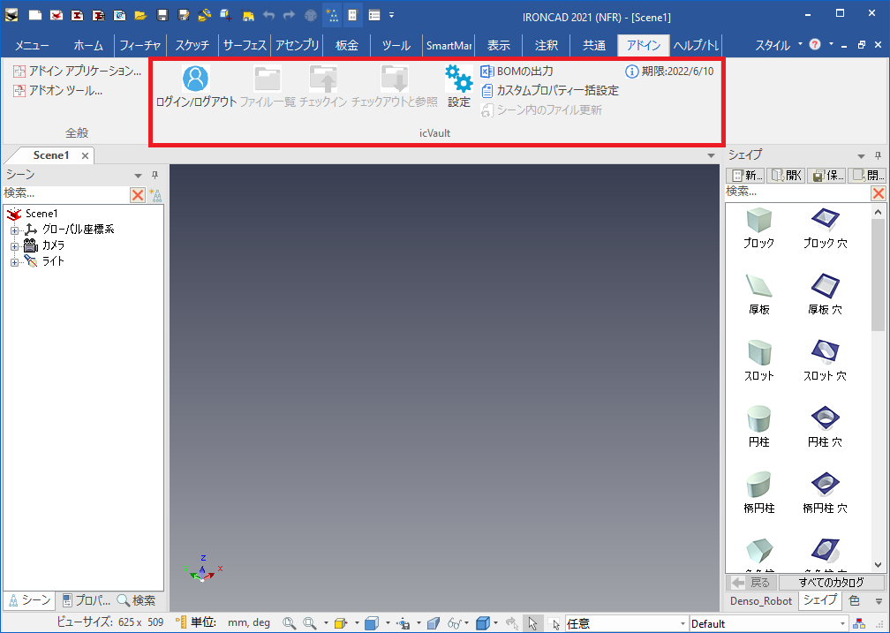

# icVault の起動(ユーザ)
本項目では、ユーザが IRONCAD から icVault を起動する手順を説明します。
IRONCAD で動作するアドインソフトウェアは、すべて IRONCAD画面 のアドインタブから有効化します。

## icVaultアドイン の有効化設定

### 1. 設定場所を開く
※IRONCAD が起動している状態で操作してください。 

[アドイン]タブ → [全般]グループ → [アドインアプリケーション] をクリックします。

### 2. icVault を有効化する
アドインアプリケーション画面の一番下へスクロールします。 
[icVault] にチェックを入れ、[OK] をクリックします。

### 3. 表示を確認する
IRONCAD の [アドイン]タブ に icVault のコマンドが表示されます。

