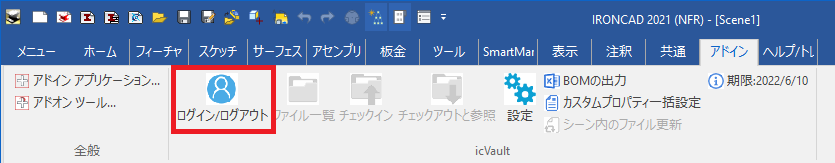
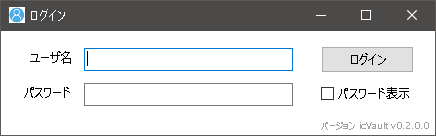
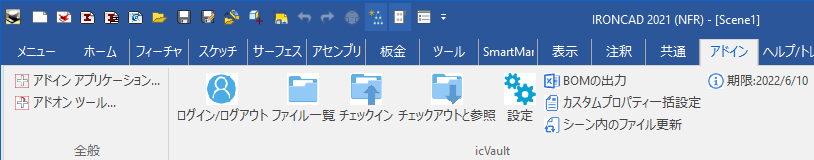
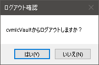

# ログイン/ログアウト
ユーザがIRONCADからicVaultへログイン/ログアウトする方法を説明します。

## ログイン

### 手順1　起動する
icVaultアドインから〔ログイン/ログアウト〕をクリックします。

### 手順2　IDを入力する
登録されたユーザ名とパスワードを入力し、〔ログイン〕をクリックします。

<ul>
icVaultAdministrationTools に登録されていないユーザはログインできません。 
管理者にユーザ登録をしてもらい、ログインしてください。
</ul>

 

### 手順3　コマンドを確認する
 正常にログインが完了すると、コマンドが全て選択可能になります。

## ログアウト

icVaultアドインから〔ログイン/ログアウト〕をクリックします。

続いて、確認画面が表示されます。 
〔はい〕をクリックします。

