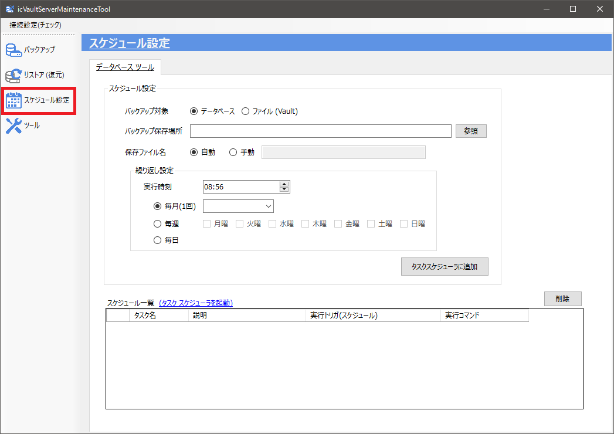
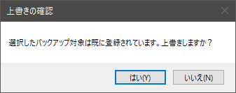
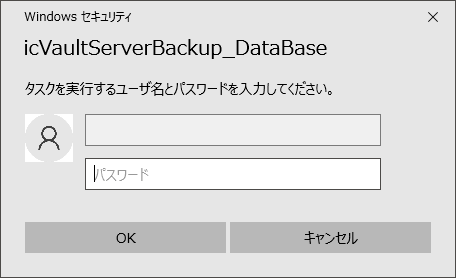
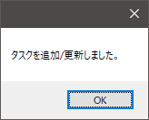
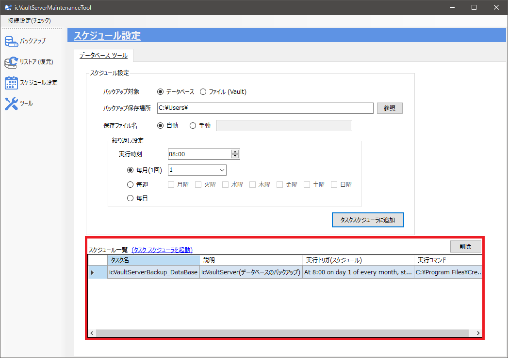
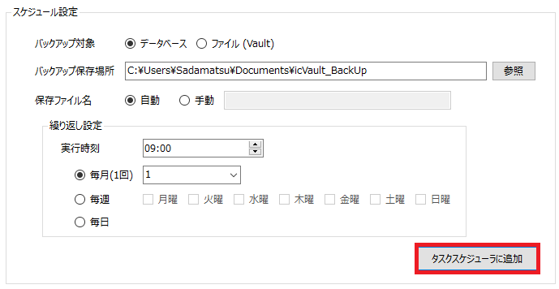
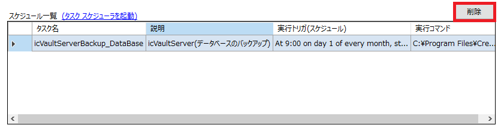

# 定期バックアップの設定
バックアップを定期的に実行(スケジュール)する設定ができます。 
毎月1回実行 / 毎週(曜日)実行 / 毎日実行のスケジュールが行えます。 
※データベースとファイル (Vault)のスケジュールはそれぞれ1つのみスケジュールできます。 
定期バックアップは以下のメニューから設定します。

### スケジュールを設定する
1.　スケジュール設定の各項目を設定し、〔タスクスケジューラに追加〕をクリックします。

<table>
<tr>
<th>バックアップ対象</th>
<td>バックアップする対象を選択します。</td>
</tr>
<tr>
<th>バックアップ保存場所</th>
<td>バックアップを保存するフォルダを選択します。</td>
</tr>
<tr>
<th>保存ファイル名</th>
<td>[自動] 以下のファイル名で作成されます。 
　データベース: cvmIcVaultDb_yyyyMMddhhmmss.bak 
　ファイル(Vault): icVaultDataBackup_yyyyMMddhhmmss.zip 
 
[手動] 常に同じファイル名でバックアップを作成します
</td>
<tr>
<th>繰り返し設定</th>
<td>実行時刻:   指定した時刻に実行します。 
毎月(1回):  指定した日付の実行時刻で月1回実行されます。 
毎週:       チェックした曜日の実行時刻に実行されます。 
毎日:       毎日1回 実行時刻に実行されます。
</td>
</tr>
</table>

既にバックアップ対象で選択したバックアップ対象がスケジュールされている場合
以下のメッセージが表示されます。

2.　追加/更新する
設定を追加/変更する場合は、セキュリティのため管理者のIDとパスワードの入力が必要になります。 
実行するユーザとパスワードを入力し、〔OK〕をクリックします。

タスクが正常に追加されるとメッセージが表示されます。 
〔OK〕をクリックし、完了します。

3.　スケジュール設定の確認
設定完了後、スケジュール一覧に追加されていることを確認します。

<ul>
<li>初めてスケジュール設定を行う場合は、現在の時刻に近い時刻を実行時刻に設定し、正しく動作するか確認してください。</li>
<li>設定する環境やユーザの権限により正しく実行されない場合があります。</li>
</ul>

### スケジュールを変更する
1.　スケジュール設定の内容変更し、〔タスクスケジューラに追加〕をクリックします。

2.　追加/更新する
設定を追加/変更する場合は、セキュリティのため管理者のIDとパスワードの入力が必要になります。 
実行するユーザとパスワードを入力し、〔OK〕をクリックします。

タスクが正常に追加されるとメッセージが表示されます。 
〔OK〕をクリックし、完了します。

### スケジュールを削除する
スケジュール一覧の右側にある〔削除〕をクリックします。

