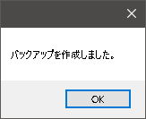

# icVaultツールからバックアップ

icVaultServerはデータベースサーバとファイルサーバの2つのサーバから構成されています。 
データベースサーバはデータベースのバックアップ、ファイルサーバはVault(ファイル)のバックアップを定期的に行うことで、各サーバの障害発生時に復元を行うことが可能です。 
データ(データベース/ファイル)のバックアップはicVaultServerMaintenanceTool(メンテナンスツール) から行います。

<ul>
<li>バックアップを行っていないデータの復元はできません。ご注意ください。</li>
<li>icVaultServerの管理者もしくは内容を十分理解できる方のみ操作してください。</li>
</ul>

## データベースサーバのバックアップ
〔接続取得〕をクリックし、接続とサーバの状態を取得します。

続いて〔バックアップ〕をクリックし、バックアップの保存先・ファイル名を指定します。 

正常にバックアップが終了すると以下のメッセージが表示されます。 
〔OK〕をクリックします。

## ファイルサーバのバックアップ

〔接続取得〕をクリックし、サーバの状態を取得します。

続いて〔バックアップ〕をクリックし、バックアップの保存先・ファイル名を指定します。 
※ファイルサーバのバックアップは数分～数時間かかる場合があります。

正常にバックアップが終了すると以下のメッセージが表示されます。 
〔OK〕をクリックします。

