# icVaultServerバックアップから復元する
icVaultServerはバックアップファイルの時点にリストア(復元)することが可能です。 
データ(データベース/ファイル)のリストア(復元)はicVaultServerMaintenanceTool(メンテナンスツール)から行います。

<ul>
<li>icVaultServerの管理者もしくは内容を十分理解できる方のみ操作してください。</li>
<li>データベースサーバ/ファイルサーバが同一端末でない場合、それぞれの端末でツールを実行する必要があります。</li>
<li>事前にバックアップを行っていない場合はデータの復元はできません。</li>
</ul>

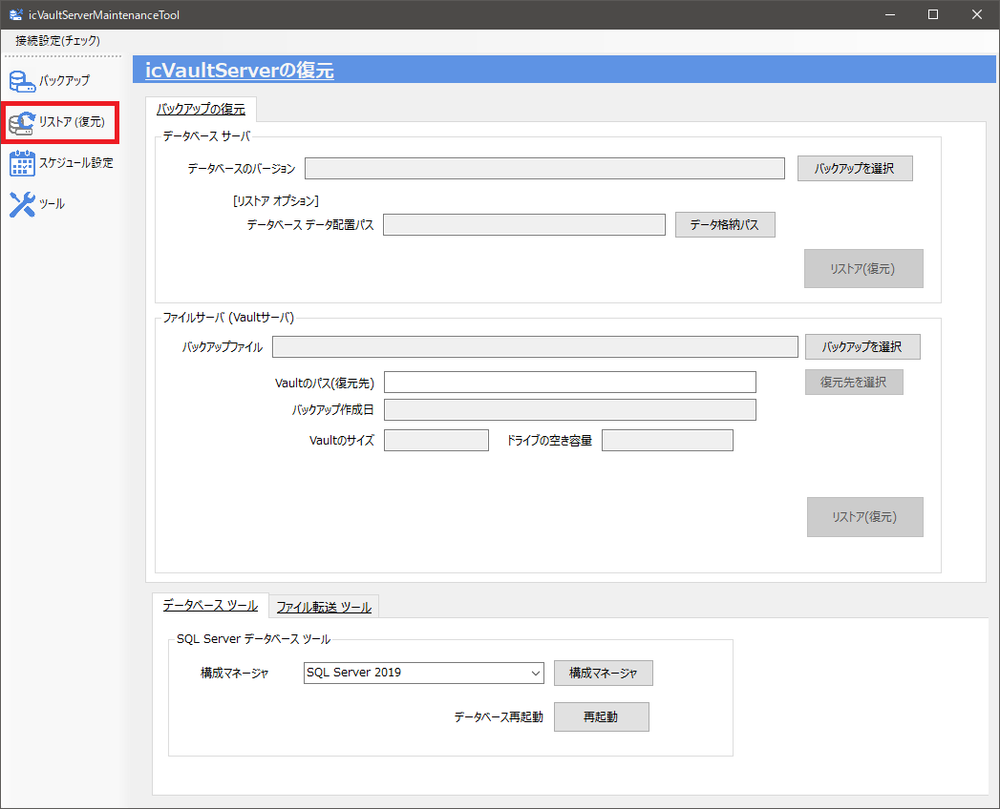

### データベースのリストア(復元)
icVaultServerの復元画面の[データベース サーバ]枠内を操作します。

<ul>
現在のデータベースは上書きされますのでご注意ください。
</ul>

1.　〔バックアップを選択〕をクリックします。

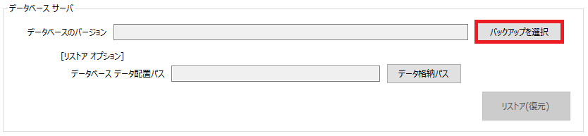

2.　復元するバックアップファイル(bak)を指定し、〔開く〕をクリックします。

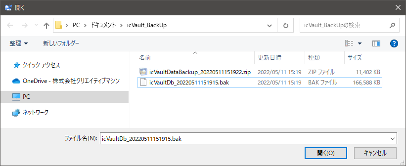

3.　〔リストア(復元)〕をクリックします。

4.　正常に復元されると完了のメッセージが表示されます。 
〔OK〕をクリックします。

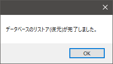

#### データベースの復元に失敗する場合
以下の操作により復元が成功する場合があります。

**【操作1】** 
1.　[データベース ツール] – [データベース再起動]の〔再起動〕をクリックします。 
データベースが再起動されます。

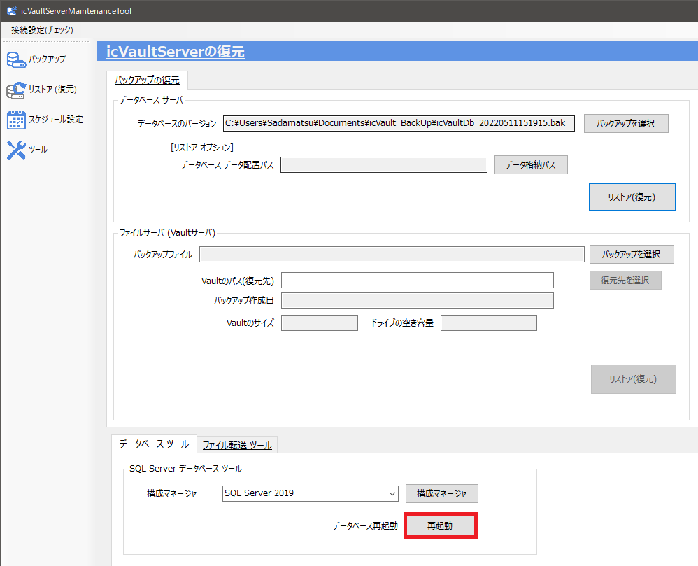

2.　再度〔リストア(復元)〕をクリックし、リストアを実行します。

※操作1で復元できない場合 

**【操作2】** 
リストアオプションに新しいデータベース格納パスを指定します。 

1.　データベース サーバ内 - [リストアオプション] の〔データ格納パス〕をクリックします。

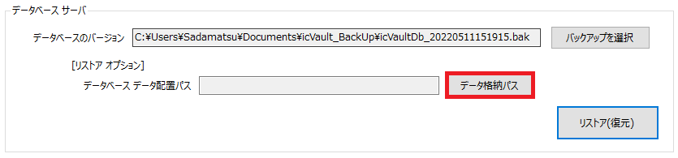

2.　データベースのデータを格納するパスを指定し、〔開く〕をクリックします。

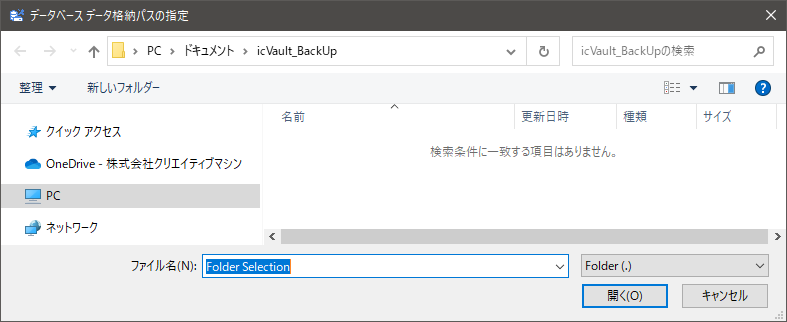

3.　再度〔リストア(復元)〕をクリックし、リストアを実行します。

### ファイルサーバのリストア(復元)
icVaultServerの復元画面の[ファイルサーバ(Vaultサーバ)]枠内を操作します。

<ul>
<li>Vaultを配置するパスを変更する場合は、復元先を選択のボタンをクリックし、新しいVaultの配置場所(復元先)を指定してOKをクリックします。</li>
<li>バックアップを選択後に表示される[Vaultのサイズ]が[ドライブの空き容量]より小さいことを確認しリストア(復元)を行ってください。</li>
</ul>

<ul>
復元先に同一のファイル名が存在する場合、すべて上書きされますのでご注意ください。
</ul>

1.　〔バックアップを選択〕をクリックします。

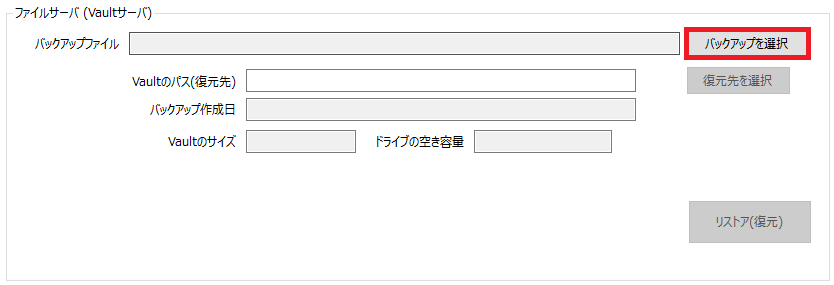

2.　復元するバックアップファイル(zip)を指定し、〔開く〕をクリックします。

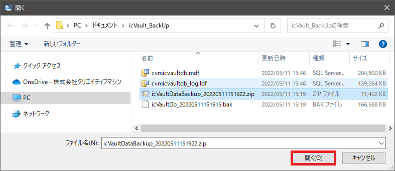

3.　〔リストア(復元)〕をクリックします。 
※データ容量によりリストアには数分～数時間かかる場合があります。

4.　正常に復元されると完了のメッセージが表示されます。 
〔OK〕をクリックします。

5.　復元するファイルサーバのパス設定を選択します。 
設定を変更する場合は〔はい〕、以前のまま変更しない場合は〔いいえ〕をクリックします。

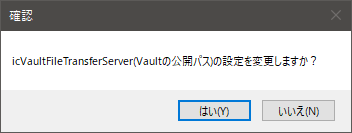

6.　設定の反映を選択します。 
設定を反映する場合は〔はい〕、以前のまま変更しない場合は〔いいえ〕をクリックします。 

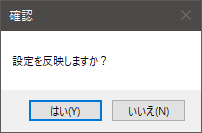

7　変更完了 
〔OK〕をクリックし、終了します。

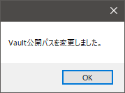
