# ソフトウェアのインストール (サーバ)
本項目は、icVault をご利用いただく際のシステム管理者向けのご案内になります。 

<ul>
ユーザーの設定やアクセス権の設定はクライアント側でインストールする icVault.msi に含まれます。 
データベースサーバーにも icVault.msi をインストールすることをお勧めします。
</ul>

## icVaultサーバーの推奨システム条件
<table>
<tr>
<th>CPU</th>
<td>2 コア以上(2.5GHz以上) 
</td>
</tr>
<tr>
<th>RAM(メモリ) </th>
<td>8GB以上 
</td>
</tr>
<tr>
<th>ハードディスク容量</th>
<td>200GB以上 
</td>
</tr>
<tr>
<th>OS</th>
<td>Windows Server 2019 Standard/ Essentioas/ IoT Strage</td>
</tr>
<tr>
<th>SQL </th>
<td>Microsoft SQL Server 2019 Standard/ Express</td>
</tr>
</table>

<ul>
<li>Windows Server の種類によってはアクセスするユーザー分の CAL が別途必要です。</li>
<li>余程のユーザー数や大量のデータを取り扱わない限りExpressで運用可能です。</li>
</ul>

## インストール手順

### 1.インストールメディアを開く

isoファイルを右クリックし、マウントします。

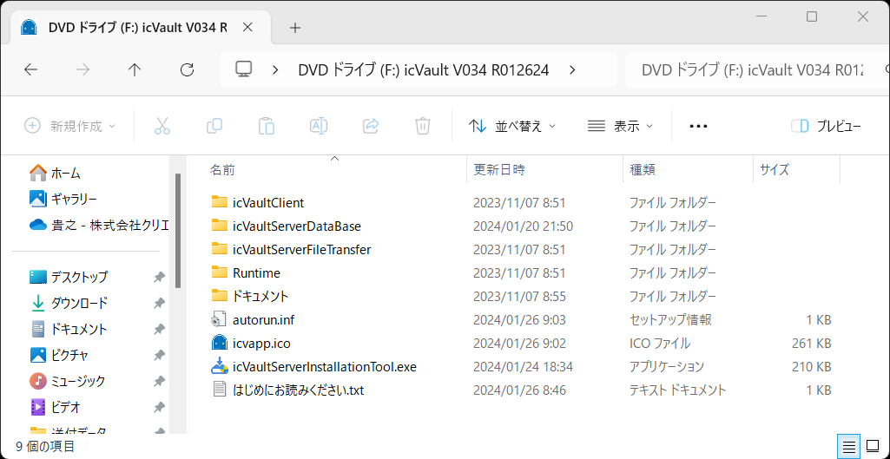

<ul>
インストールファイル一式をローカルフォルダへ移動して作業をする場合は、保存階層のパスの長さにご注意ください。
Windows のパス長さには制限があります。 
 260文字 を超えるパスの場合、インストールが正常に終了しません。 
フォルダに日本語を使用している場合 子音のパスは2とカウントされます。 
例) は → ha
</ul>

### 2.インストールする

〔1〕icVaultServerInstallationTool.exe をダブルクリックします。

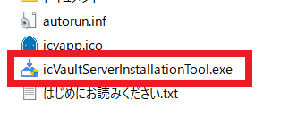

初めてインストールする場合は、以下のメッセージが表示される場合があります。 
[詳細情報] → [実行] の順にクリックします。
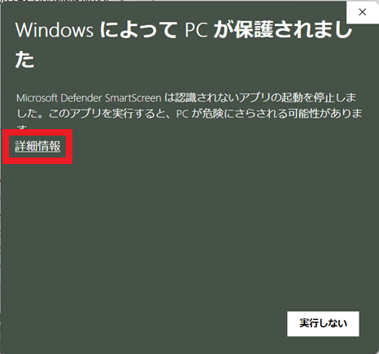
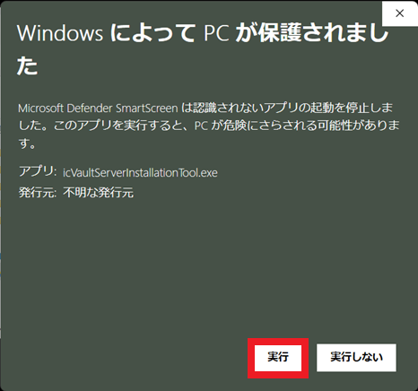

下記が表示される場合は、[はい] をクリックします。
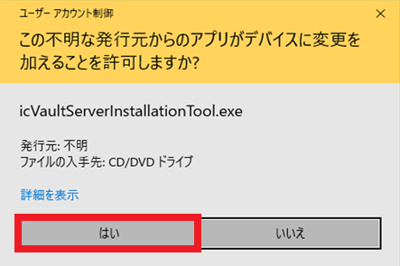

〔2〕[icVaultサーバを新規インストールする] をクリックします。

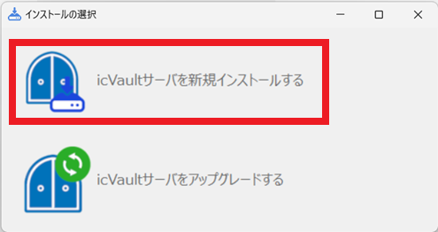

〔3〕インストールの種類を選択し、[インストール] をクリックします。

 画面右上の [インストール設定] から、SQL Server のパスワード(sa)を設定/変更することも可能です。

※通常は自動でチェックが入るため、そのままインストールします。

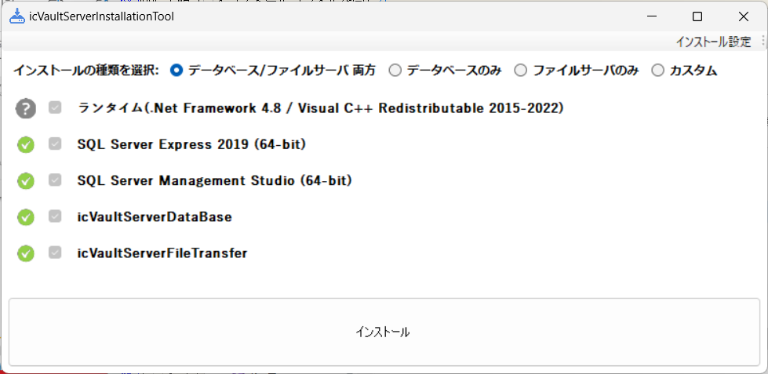

|選択|内容|
|---|---|
|データベース/ファイルサーバ両方|データベースサーバとファイルサーバをインストールします。（同じサーバで運用する場合）|
|データベースのみ|データベースサーバをインストールします。|
|ファイルサーバのみ|ファイルサーバをインストールします。|
|カスタム|インストールするパッケージを選択してインストールします。|

#### SQL Server のパスワード設定画面

下図赤線部にパスワードを入力し、[OK] をクリックします。

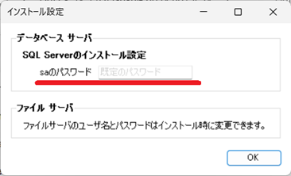

### 3.インストール中の画面と操作

#### ランタイムのインストール（自動：操作不要）
※インストールは数分かかります。

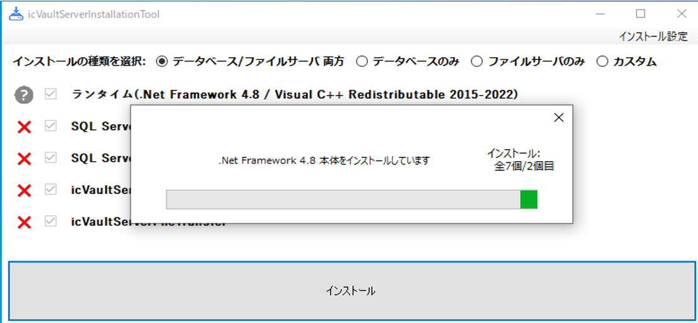

#### SQL Server のインストール（自動：操作不要）
[インストール時の種類でデータベースが含まれているものを選択するとインストールされます。] 
※インストールは数分かかります。

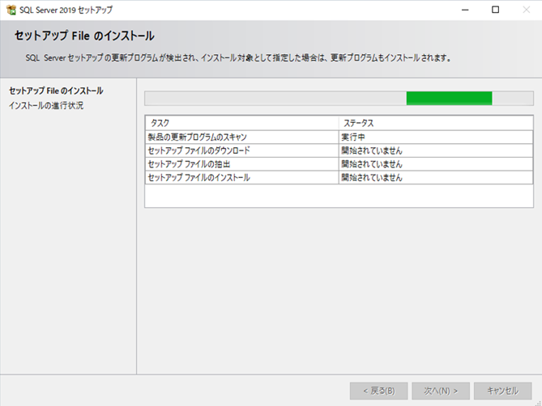

#### SQL Server Management Studio(SSMS)のインストール（自動：操作不要）
[インストール時の種類でデータベースが含まれているものを選択するとインストールされます。] 
※インストールは数分かかります。

#### icVaultServerDataBaseのインストール（**操作が必要です**）
[インストール時の種類でデータベースが含まれているものを選択するとインストールされます。] 

〔1〕 [次へ] をクリックします。

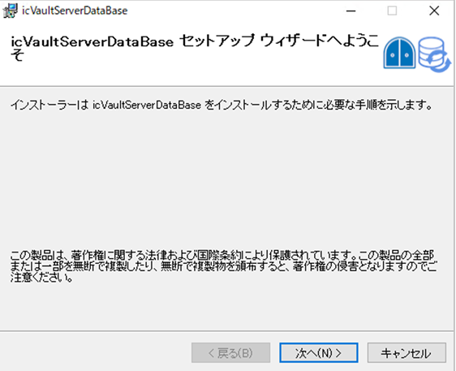

〔2〕[次へ] をクリックします。

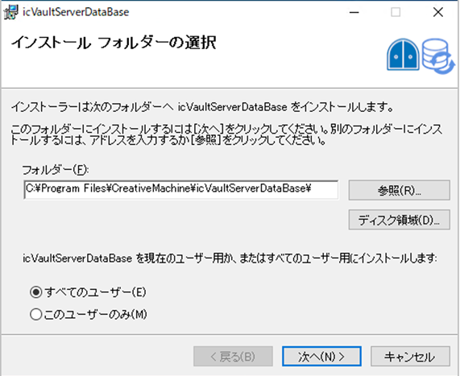

〔3〕[次へ] をクリックします。

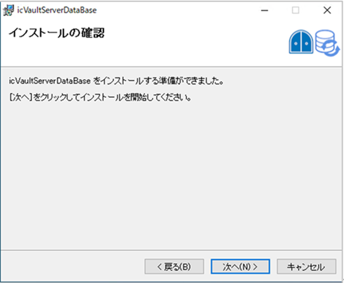

※数秒かかります。

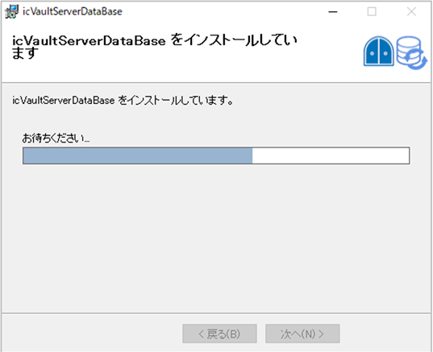

〔4〕設定の確認メッセージが表示されます。[デフォルト設定] をクリックします。 
SQL Serverの(sa)権限のパスワードを変更している場合は設定を開くをクリックします。

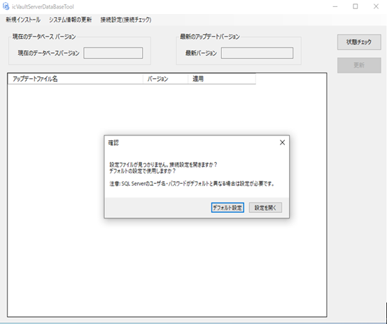
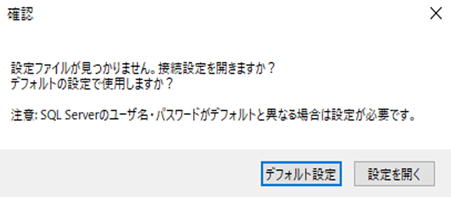

設定を開くをクリックした場合、下記が表示されます。 
[タブ 共通:icVault]-[データベース 接続の設定]から[接続設定を表示する]をダブルクリックすると接続のユーザ名/パスワード設定が表示されます。

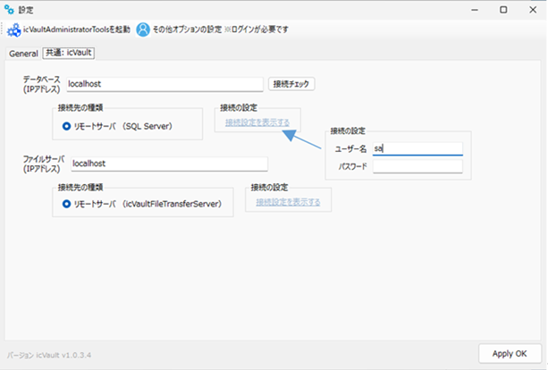

〔5〕データベースがインストールされます。 
※インストールには2分ほどかかります。

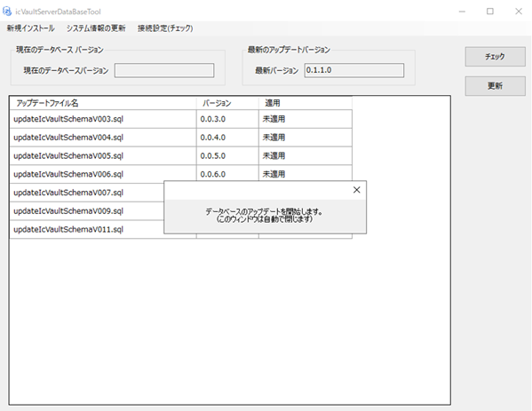
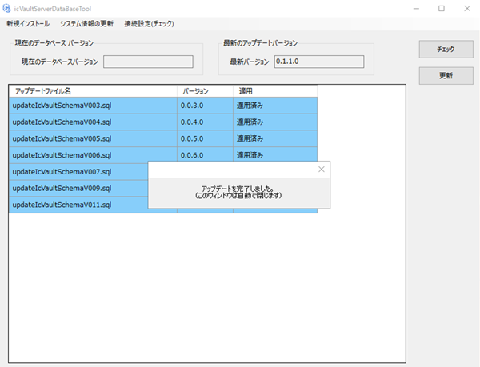

〔6〕インストール完了メッセージを確認し、[閉じる] をクリックします。

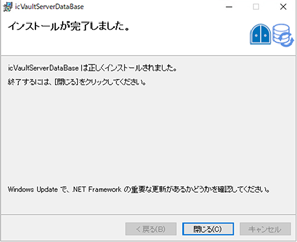

#### icVaultServerFileTranserのインストール

[インストール時の種類でファイルサーバが含まれているものを選択するとインストールされます。] 

〔1〕セットアップウィザード画面が表示します。 
[次へ] をクリックします。

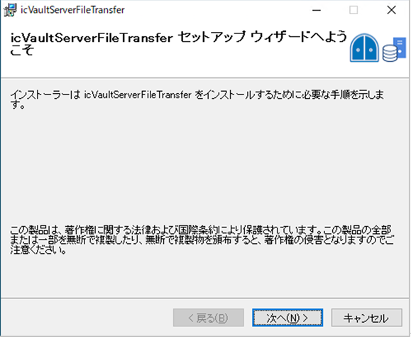

〔2〕インストールフォルダの選択  
インストール先とユーザー条件を指定します。 ※インストールフォルダはデフォルトを推奨します。 
[次へ] をクリックします。

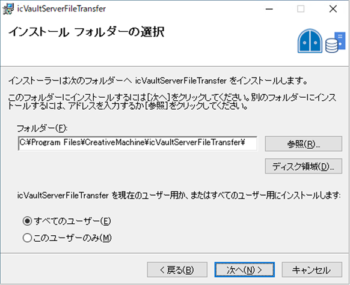

〔3〕インストールの確認 
[次へ] をクリックします。 
※数秒かかります。

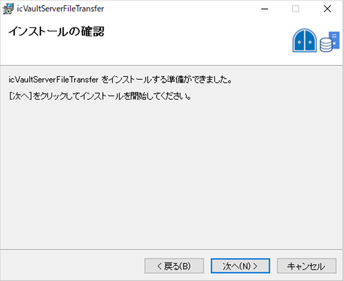

〔4〕データ保存場所とファイルサーバの設定 
何も指定せず [OK] をクリックすると、データ保存場所はデフォルト値 C:\icVault になります。 
パスを指定する場合は [参照] をクリックします。

<ul>
ファイルサーバのユーザ名とパスワードを指定する場合は、ユーザーとパスワードを入力します。
変更した場合、すべてのIRONCADにインストールされた icVault の設定変更が必要です。
必要がなければ変更しないことをお勧めします。
</ul>

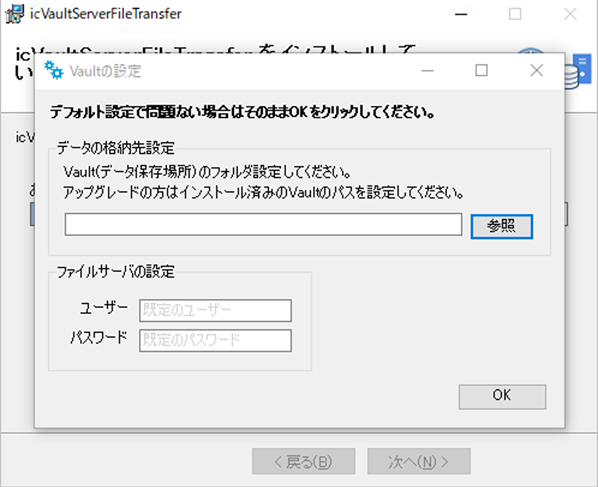

 指定せず [OK] をクリックした場合は以下のメッセージが出ます。 
[はい] をクリックします。　※自動的に C:\icVault に設定されます。 
[いいえ] をクリックすると前設定画面に戻ります。

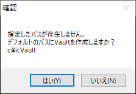

任意の場所を指定する場合は、icVaultの設定画面から [参照] をクリックし、保存場所を選択します。

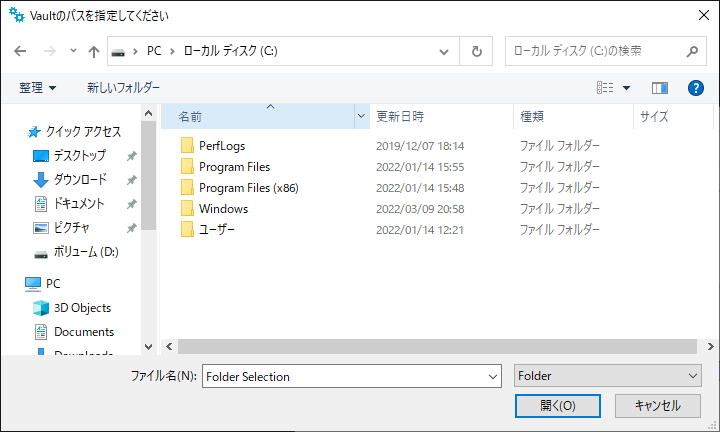

保存場所を指定後、[OK] をクリックします。

〔5〕インストールの完了 
[閉じる] をクリックし、終了します。

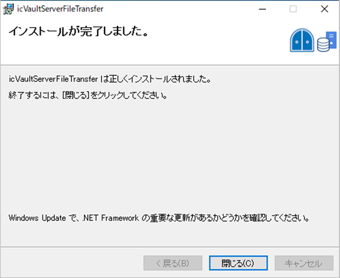

### 4.インストール後の確認

インストール結果が表示されます。 
インストールが正常に終了した場合は [インストールが完了しました] が表示されます。 
インストールに失敗した項目がある場合は、失敗した項目が表示されます。

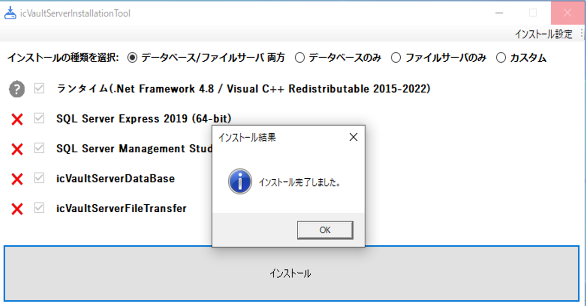

また[OK] をクリック後、✅ が入っている項目は正しくインストールされています。

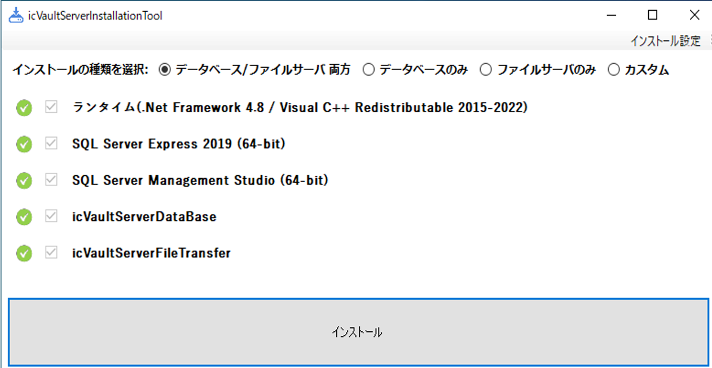

### 5.icVault のインストール(クライアントと同じ)

> 参照：[クライアント(新規)](../../setup_cli/Install/Install_client_new.md)

