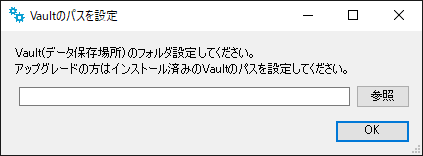

# ソフトウェアのインストール (サーバ)
本項目は、icVaultをご利用いただく際のシステム管理者向けのご案内になります。 

**インストールするソフトウェア** 
<li>1_icVaultServerDataBase_NewInstall.cmd　※初回のみ</li>
<li>icVaultServerDataBase.msi</li>
<li>icVaultServerFileTransfer.msi</li>
<li>icVault.msi</li> 

<ul>
ユーザーの設定やアクセス権の設定はクライアント側でインストールするicVault.msi に含まれます。 
データベースサーバーにもicVault.msi をインストールすることをお勧めします。
</ul>

## icVaultサーバーの推奨システム条件
<table>
<tr>
<th>CPU</th>
<td>2 コア以上(2.5GHz以上) 
</td>
</tr>
<tr>
<th>RAM(メモリ) </th>
<td>8GB以上 
</td>
</tr>
<tr>
<th>ハードディスク容量</th>
<td>200GB以上 
</td>
</tr>
<tr>
<th>OS</th>
<td>Windows Server 2019 Standard/ Essentioas/ IoT Strage</td>
</tr>
<tr>
<th>SQL </th>
<td>Microsoft SQL Server 2019 Standard/ Express</td>
</tr>
</table>

<ul>
<li>Windows Server の種類によってはアクセスするユーザー分のCALが別途必要です。</li>
<li>余程のユーザー数や大量のデータを取り扱わない限りExpressで運用可能です。</li>
</ul>

## インストールの手順

### 手順 1　インストールファイルを開く

1.　インストールメディアを開きます。

<ul>
インストールファイル一式をローカルフォルダへ移動して作業をする場合は、保存階層のパスの長さにご注意ください。
Windows10 のパス長さには制限があります。 
 256文字を超えるパスの場合、インストールが正常に終了しません。 
フォルダに日本語を使用している場合 子音のパスは2とカウントされます。 
例) は → ha
</ul>

2.　icVaultServerDataBaseを開き、1_icVaultServerDataBase_NewInstall.cmd をダブルクリックします。

インストールが開始されます。3 つのソフトウェアがインストールされます。

<table>
<tr>
<th>SQL Server 2019 Express</th>
<td>icVaultのデータベース本体 
(自動インストール)
</td>
</tr>
<tr>
<th>SQL Server Management Studio </th>
<td>データベースを操作するツール 
(自動インストール)
</td>
</tr>
<tr>
<th>icVaultServerDataBase</th>
<td>データベースの作成・アップデートするツール 
(手動でインストールが必要)
</td>
</table>

### 手順 2　データベースのインストール

初めに自動でインストールが開始されます。

#### 1. SQL Server 2019のインストール [自動]

※インストールには数分かかる場合があります。

インストール完了後、「次へ」をクリックします。

#### 2. SQL Server Management Studioのインストール [1に続き自動でインストールが開始されます] 
※インストールには数分かかる場合があります。

#### 3. icVaultServerDataBaseのインストール [手動]

SQL Server Management Studioのインストールが終了後に自動でセットアップウィザードが表示されます。 

※自動でセットアップウィザードが表示されない場合は、以下をダブルクリックしてください。

1.　セットアップウィザード画面が表示します。 
　　「次へ」をクリックします。

2.　インストールフォルダの選択 
　　インストール先とユーザー条件を指定します。 
　　※インストールフォルダはデフォルトを推奨します。 
　　「次へ」をクリックします。

3.　インストールの種類 
　　新規インストールにチェックを入れます。 
　　〔次へ〕をクリックします。

4.　インストールの確認 
　　〔次へ〕をクリックします。

5.　データベースのインストール 
　　※インストールには数分かかる場合があります。

 

(データベースのアップデートを開始します。)
 
(データベースのアップデート完了)

※完了後、ウィンドウは自動で閉じます。

6.　インストールの完了 
　　「閉じる」をクリックし、終了します。

#### インストール後の確認
Windowsのスタートメニューに以下の3つのフォルダが追加されていることを確認します。

<li>icVault</li>
<li>Microsoft SQL Server2019</li>
<li>Microsoft SQL Server Tools 18</li>

### 手順 3　icVaultServerFileTranserのインストール

icVaultServerFileTransferを開き、icVaultServerFileTransfer.msiをダブルクリックします。

1.　セットアップウィザード画面が表示します。 
　　「次へ」をクリックします。

2.　インストールフォルダの選択  
　　インストール先とユーザー条件を指定します。 
　　※インストールフォルダはデフォルトを推奨します。 
　　「次へ」をクリックします。

3.　インストールの確認 
　　「次へ」をクリックします。 
　　※数秒かかります。

4.　データベースのインストール [自動でインストールが開始されます。 
　　※インストールには数分かかる場合があります。

5.　icVaultで使用する全データの保存場所を指定します。 
　　・指定しない場合は「OK」をクリックします。 
　　・保存場所を指定する場合は「参照」をクリックします。

5-1.　指定せず「OK」をクリックした場合は以下のメッセージが出ます。 
　　「はい」をクリックします。　※自動的にC:\icVaultに設定されます。

5-2.　保存場所を指定する場合は「参照」をクリックし、保存場所を選択後に「開く」をクリックします。

　　「OK」をクリックします。

6.　インストールの完了 
　　「閉じる」をクリックし、終了します。

#### インストール後の確認

タスクマネージャーを起動し、サービスにicVaultFileTransferServerが追加され{実行中}になっていることを確認します。

### 手順 4　icVaultのインストール(クライアントと同じ)
icVaultを開き、icVault.msiをダブルクリックします。

1.　セットアップウィザード画面が表示します。 
　　「次へ」をクリックします。

2.　インストールフォルダの選択  
　　インストール先とユーザー条件を指定します。 
　　※インストールフォルダはデフォルトを推奨します。 
　　「次へ」をクリックします。

3.　インストールの確認 
　　「次へ」をクリックします。 
　　※数秒かかります。

4.　icVaultのインストール [自動でインストールが開始されます] 
　　※インストールには数分かかる場合があります。

5.　インストールの完了 
　　「閉じる」をクリックし、終了します。

#### インストール後の確認
Windowsのスタートメニューに以下の3つのファイルが追加されていることを確認します。

