# ソフトウェアのアップデート (サーバ)
本項目は、icVaultをご利用いただく際のシステム管理者向けのご案内になります。 
新しいバージョンのicVaultがリリースされた場合にアップデートを実施します。

**アップデートに必要なソフトウェア** 
<li>icVaultServerDataBase.msi</li>
<li>icVaultServerFileTransfer.msi</li>
<li>icVault.msi</li>  

ユーザーの設定やアクセス権の設定は icVault に含まれます。 
データベースサーバもicVault.msl のアップデートを実施してください。。

 

## アップデートの手順

### 手順 1　インストールファイルを開く

インストールメディアを開きます。

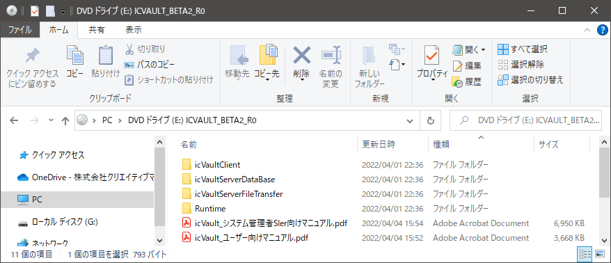

### 手順 2　icVaultServerDataBaseのアップデート

icVaultServerDataBase.msiをダブルクリックします。

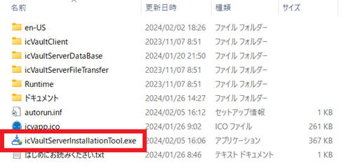

1.　 セットアップウィザード画面が表示します。 
　　「次へ」をクリックします。

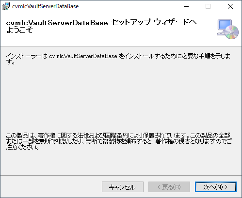

2.　インストールフォルダの選択 
　　※インストールフォルダはデフォルトを推奨します。 
　　「次へ」をクリックします。

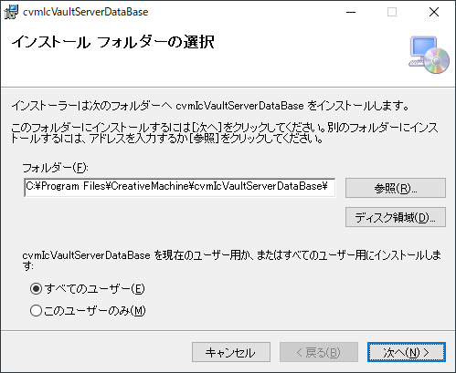

3.　インストールの種類 
　　アップグレード インストールにチェックを入れ、「次へ」をクリックします。

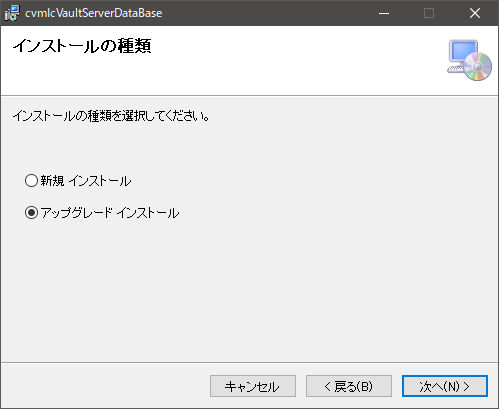

4.　インストールの確認 
　　「次へ」をクリックします。

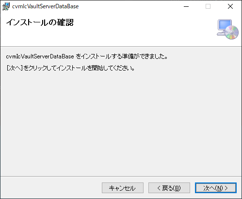

5.　インストールの実行 
　　数秒かかります
　　「次へ」をクリックします。

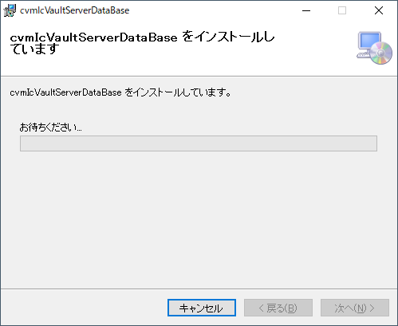

設定の復元が表示された場合は、選択してください。 
設定を引き継ぐ場合は〔はい〕 
設定を引き継がない場合は〔いいえ〕をクリックします。 

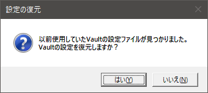

〔いいえ〕をクリックし、設定を引き継がなかった場合は、ユーザがicVault使用時にファイル一覧がクリアされた状態になります。

 

6.　データベースのアップデート 
　　データベースの作成/アップデートは自動で開始されます。 
　　※数秒かかる場合があります。

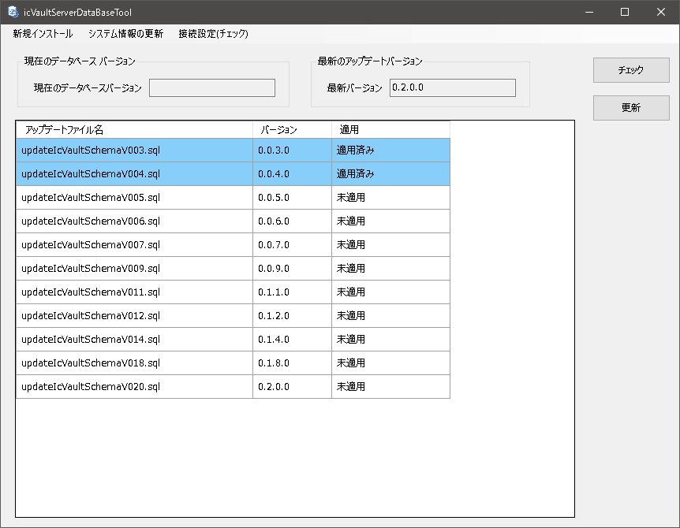

7.　アップデートの完了 
　　「閉じる」をクリックし、完了します。

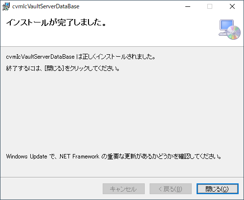

### 手順 3 icVaultServerFileTranserのアップデート
icVaultServerDataBase.msiをダブルクリックします。

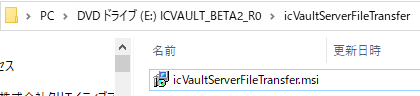

1.　セットアップウィザード画面が表示します。 
　　修復へチェックを入れ、「完了」をクリックします。

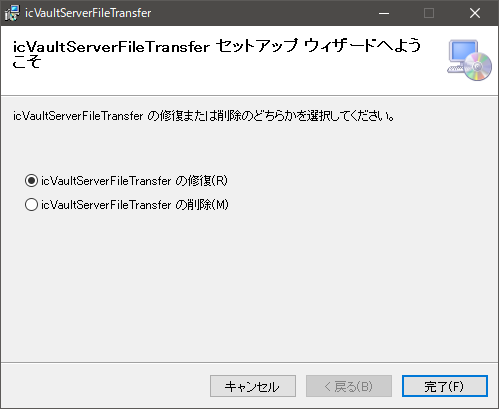

2.　インストールが開始されます。 
　　設定の復元確認メッセージが表示されます。 

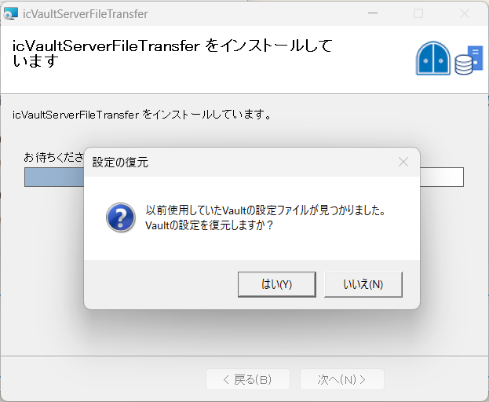

　　続いて、〔OK〕をクリックします。

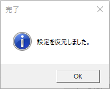

〔いいえ〕をクリックし、設定を引き継がなかった場合は、ユーザがicVault使用時にファイル一覧がクリアされた状態になります。

 

3.　アップデートの完了 
　　「閉じる」をクリックし、完了します。

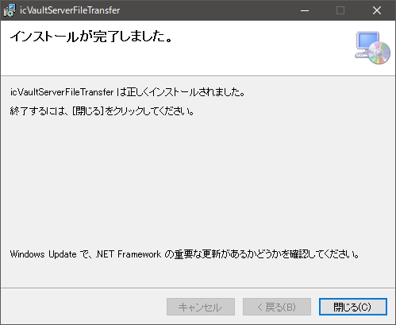

### 手順 4 icVaultのアップデート
icVault.msiをダブルクリックします。 
※ユーザーアカウント制御画面が表示された場合は「はい」をクリックします。

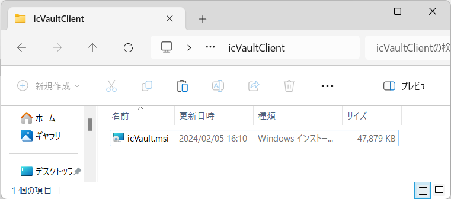

1.　セットアップウィザード画面が表示されます。 
　　「次へ」をクリックします。

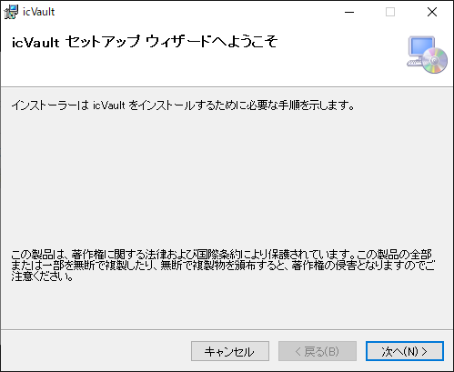

2.　インストールフォルダの選択 
　　インストール先とユーザー条件を指定します。 
　　前回と同じ階層を確認し、「次へ」をクリックします。

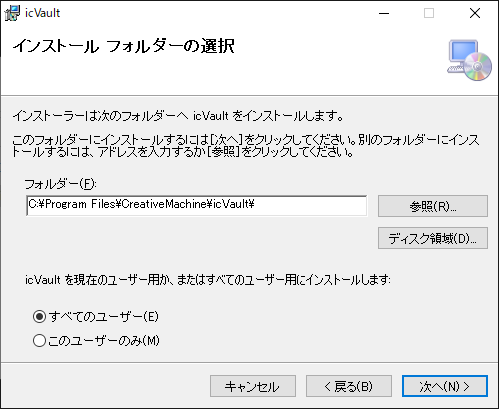

3.　インストール開始 
　　※数秒かかる場合があります。

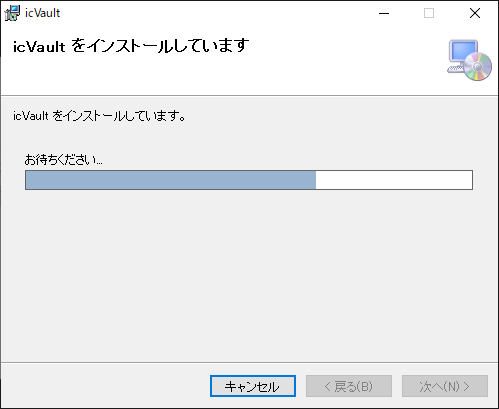

4.　インストールの完了 
　　「閉じる」をクリックし、終了します。

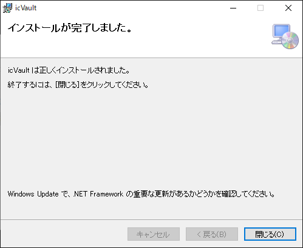
