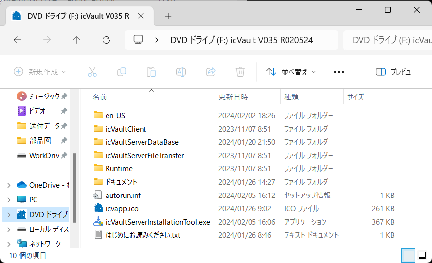
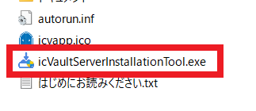
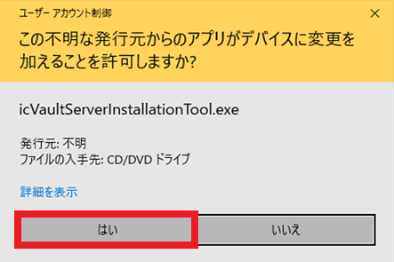
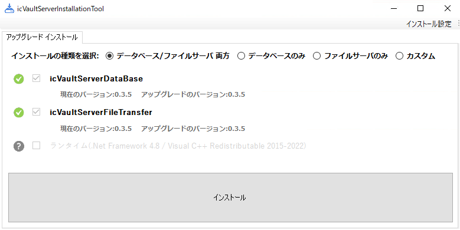
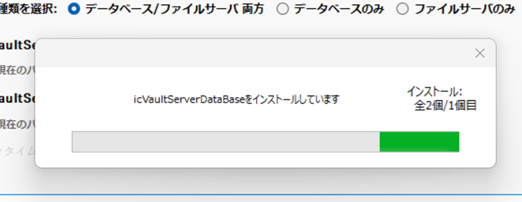
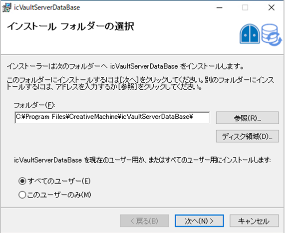
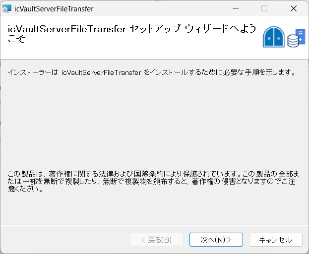
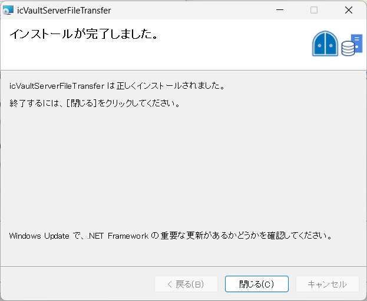

# ソフトウェアのアップグレード (サーバ)
本項目は、icVault をご利用いただく際のシステム管理者向けのご案内になります。 
新しいバージョンの icVault がリリースされた場合にアップグレードを実施します。

ユーザの設定やアクセス権の設定は icVault に含まれます。 
データベースサーバも icVault.msi のアップグレードを実施してください。。

 

## アップグレードの手順

### 1. インストールメディアを開く

iso ファイルをマウントします。

### 2. アップグレードする

〔1〕icVaultServerInstallationTool.exe をダブルクリックします。

初めてインストールする場合は、以下のメッセージが表示される場合があります。 
[詳細情報] → [実行] の順にクリックします。

下記が表示される場合は、[はい] をクリックします。

〔2〕[icVaultサーバをアップグレードする] をクリックします。

〔3〕アップグレードの種類を選択し、[インストール] をクリックします。 
※通常は自動でチェックが入るため、そのままインストールします。

しばらく時間がかかる場合があります。

〔4〕セットアップウィザード画面が表示します。 
[次へ] をクリックします。

〔5〕インストールフォルダの選択 
※インストールフォルダはデフォルトを推奨します。 
[次へ] をクリックします。

〔6〕インストールの確認 
[次へ] をクリックします。

〔7〕インストールの実行 
数秒かかります
[次へ] をクリックします。

〔8〕データベースのアップデート 
データベースの作成/アップグレードは自動で開始されます。 
※数秒かかる場合があります。

〔9〕アップデートの完了 
[閉じる] をクリックし、完了します。

### 3. icVaultServerFileTranser のアップグレード

〔1〕セットアップウィザード画面が表示します。 
[次へ] をクリックします。

〔2〕インストールフォルダの選択 
※インストールフォルダはデフォルトを推奨します。 
[次へ] をクリックします。

〔3〕インストールの確認 
[次へ] をクリックします。

〔4〕インストールが開始されます。 
設定の復元確認メッセージが表示されます。 
よければ [はい] をクリックします。

続いて、[OK] をクリックします。

設定の復元画面で [いいえ]をクリックした場合は、ご使用の環境に合わせて icVault の保存場所と接続先を再設定してください。

〔5〕アップデートの完了 
[閉じる] → [OK] をクリックし、終了します。

### 4. icVault のアップグレード(クライアントと同じ)

> 参照：[クライアント(アップグレード)](../../setup_cli/Install/Install_client_re.md)
