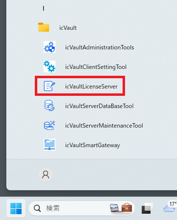
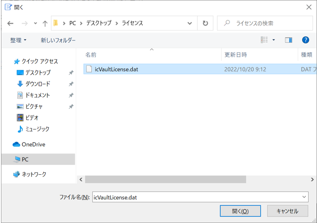
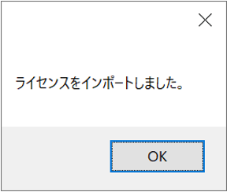

# icVault のライセンスの認証する

### 入手したライセンスデータをインポートする

〔1〕スタートメニューから [icVault] → [icVaultLicenseServer] を起動します。

〔2〕タブ:通常版ライセンスから [インポート] をクリックします。

〔3〕IRONCAD サポートから受領したライセンスデータ(dat) を開きます。

〔4〕ライセンスがインポートされます。[OK] をクリックします。

※ライセンスをインポート後にユーザ側で使用できるかご確認ください。
