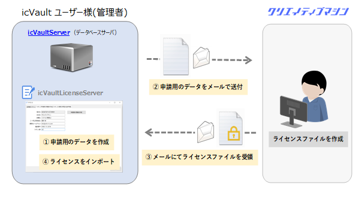
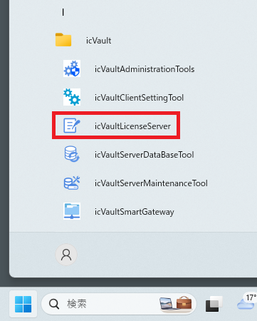
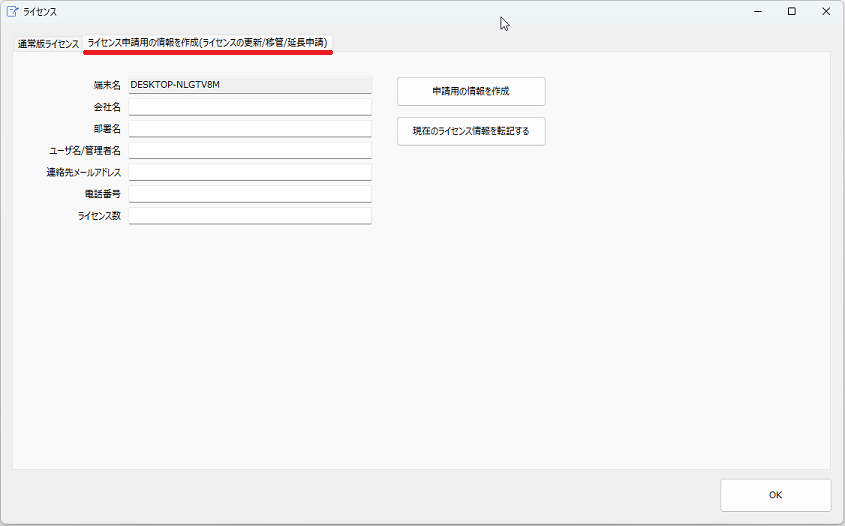
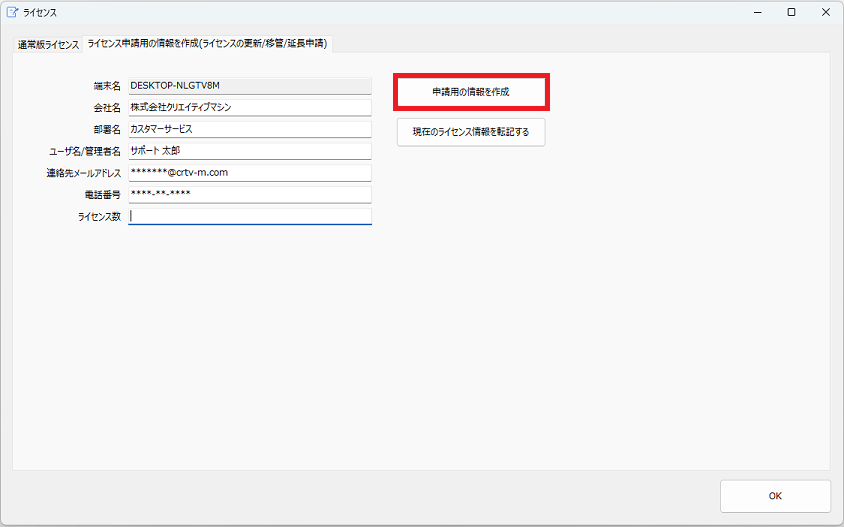
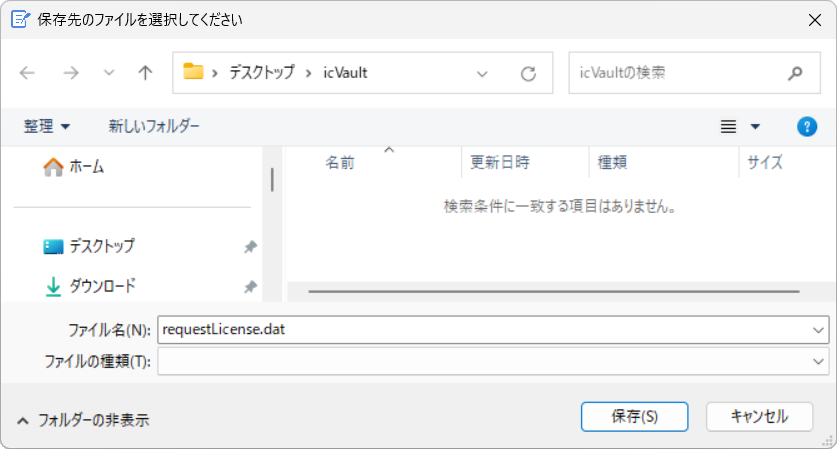
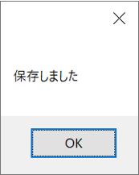
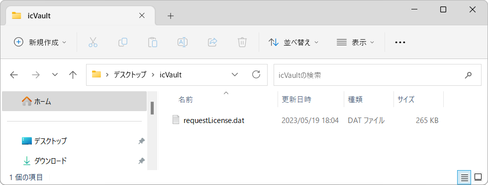

# ライセンス申請用データの作成

icVaultのライセンスはサーバ端末固有のライセンスとなります。 
評価版ライセンスの延長・通常版ライセンスの申請・サーバ端末の変更時など運用する端末で当社へのライセンス申請用のデータを作成していただく必要があります。

## ライセンスの仕組み

### 手順 1　申請データを作成する
1.　スタートメニューから[icVault]-[icVaultLicenseServer]を起動します。
タブ:ライセンス申請用の情報を作成(ライセンスの更新/移管/延長申請)をクリックします。

2.　タブ:ライセンス申請用の情報を作成(ライセンスの更新/移管/延長申請)をクリックします。

3.　入力欄に情報を入力し、[申請用の情報を作成] をクリックします。

4.　保存場所を選択し、[保存] をクリックします。

5.　申請用のデータが作成されます。[OK] をクリックします。

### 手順 2　申請データを送付する
1.　保存した datファイルをIRONCAD サポートへメールで送付する

IRONCAD TechBase の[問い合わせ] より、送付してください。

https://techbase.ironcad.jp/portal/ja/home

### 手順 3　ライセンスデータを入手する
1.　送付したdat ファイルから、IRONCAD サポートがライセンスデータを作成します。 
作成後に、申請者へ送付されます。

