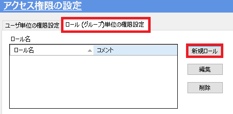

# アクセス権の設定

アクセス権は登録する(されている)ユーザに必要な権限を設定します。 
次の章で設定するカテゴリに対してアクセス権限を設定することで他部署のデータを不用意に操作したり、誤ってデータを取得/登録することを防止します。 

icVault で管理することにより従来のフォルダ管理では難しいデータのセキュリティを向上させることができます。

**アクセス権には「読み取り」,「書き込み」,「削除」,「承認」の設定があり、 
ユーザ単位とロール(グループ)単位でのアクセス権限設定が可能です。**

## ユーザ単位でのアクセス権限設定
システムに登録されているユーザ毎にアクセス権限を設定します。

### 手順 1　ユーザを選択する
「タブ：ユーザ単位の権限設定」を開き、アクセス権限を変更するユーザを選択します。

続けて、[編集] をクリックします。

### 手順 2　アクセス権限を変更する
編集したいカテゴリの「読み取り」,「書き込み」,「削除」,「承認」のセルを選択し、[チェック] をクリックします。

<ul>
<li>セルは複数選択が可能です。</li>
<li>セルを選択後、右クリックまたは画面右側の [チェック] , [チェック解除] のボタンでも操作可能です。</li>
</ul>

### 手順 3　変更を反映する
[反映] をクリックします。 

「ユーザのアクセス権限を登録しました。」のメッセージが表示されます。 
[OK] をクリックします。

設定したアクセス権限に「レ」が付いていることを確認します。

## ロール(グループ)単位でのアクセス権限設定
複数人(ユーザ)を纏めて1つのグループにしたものをロールと呼びます。 

システムに登録されている複数のユーザをグループに纏める(ロールを作成する)操作はアクセス権の設定から行います。 
ロールを作成後にアクセス権限を設定することができます。

### 手順 1.　新規ロールを作成する
アクセス権限の設定画面から「タブ：ロール(グループ)単位の権限設定」を開きます。 
続いて、[新規ロール] をクリックします。

### 手順 2.　内容を設定する
ロールの権限設定画面が開きます。

<table>
<tr>
<th>ロール名</th>
<td>ロール(グループ)名を入力します。</td>
</tr>
<th>説明(入力任意)</th>
<td>ロールの纏まりの意図（説明）を入力します。</td>
</tr>
<tr>
<th>ユーザ一覧・ロールの対象ユーザ</th>
<td>ユーザ一覧から選択し、[ロールに追加] で対象ユーザに追加します。 
対象から外す場合は、右欄からユーザを選択し、[ロールから削除] します。
</td>
</tr>
<tr>
<th>ロールのアクセス権限設定</th>
<td>ロールのアクセス権限を設定します。 
※設定方法はユーザ単位の手順2と同じ</td>
</tr>
</table>

### 手順 3.　設定を登録する
すべて入力、設定を完了後、画面右上の [登録] をクリックします。

設定完了画面が表示されます。 
[OK] をクリックします。

設定が反映されていることを確認します。

## ロールの変更
ロールのユーザとアクセス権限を変更する際に操作します。 
アクセス権限の設定画面から「タブ：ロール(グループ)単位の権限設定」を開きます。 
編集したいロールを選択し、[編集] をクリックします。

その後の操作は、「ロール(グループ)単位でのアクセス権限設定」と同じです。

## ロールの削除
使用しなくなったロールを削除する際に操作します。 
アクセス権限の設定画面から「タブ：ロール(グループ)単位の権限設定」を開きます。 
削除したいロールを選択し、[削除] をクリックします。

<ul>
削除したロールは元に戻せませんのでご注意ください。
</ul>

