# カテゴリの追加/削除
カテゴリとはicVault内に作られる疑似的なフォルダ(パーテーション)です。 
カテゴリを作成し、設計データにカテゴリ(格納場所)を設定することでアクセス権限を持ったユーザまたはロール(グループ)のみ
閲覧や選択することができます。 
 
**カテゴリはアクセス権限と共に、データの運用・セキュリティに重要な設定となります。 
管理者とユーザ間で相談して決定してください。**

<ul>

カテゴリ例：ユーザ、グループ、プロジェクト、取引先 など 
※管理しやすい項目を設定してください。
</ul>

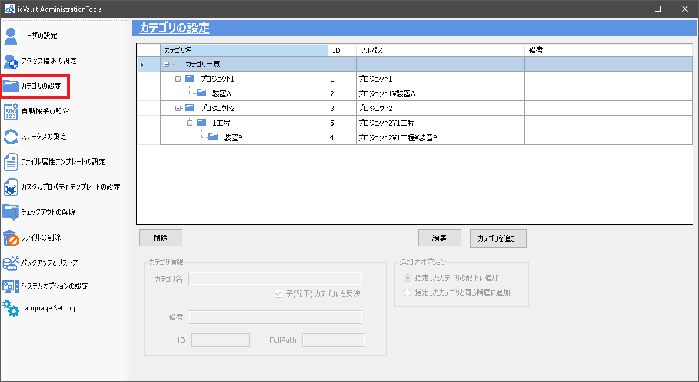

## カテゴリの追加

### 手順 1　新規カテゴリを作成する
カテゴリの設定画面から〔カテゴリの追加〕をクリックします。

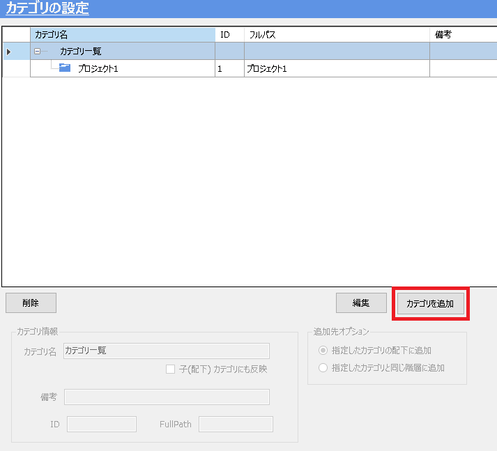

<ul>

<li>既存のカテゴリ配下または同じ階層に作成する場合は、既存のカテゴリを選択してから〔カテゴリを追加〕をクリックします。</li>
<li>初期は一番上のカテゴリ一覧が選択されています。</li>
</ul>

### 手順 2　カテゴリ情報を入力する

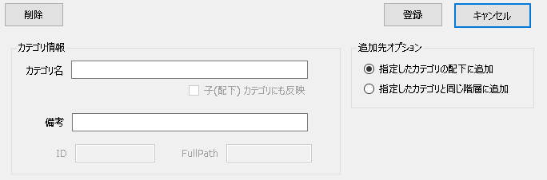

###### カテゴリ情報
<table>
<tr>
<th>カテゴリ名</th>
<td>カテゴリ名を入力します。</td>
</tr>
<tr>
<th>備考(入力任意)</th>
<td>必要事項を自由に入力します。</td>
</tr>
</table>

###### 追加先オプション
<table>
<tr>
<th>指定したカテゴリ配下に追加</th>
<td>[チェック時] 
現在選択しているカテゴリの直下(1階層下)にカテゴリが追加されます。</td>
</tr>
<tr>
<th>指定したカテゴリと同じ階層に追加</th>
<td>[チェック時] 
現在選択しているカテゴリと同じ階層にカテゴリが追加されます。
</td>
</tr>
</table>

### 手順 3　登録する
入力完了後、〔登録〕をクリックします。

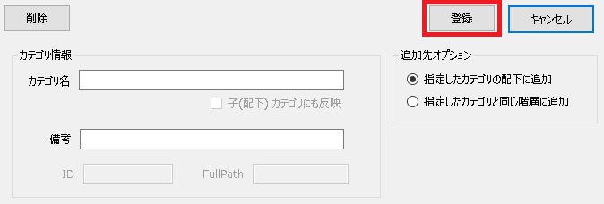

続いて、確認メッセージが表示されます。 
〔はい〕をクリックし、カテゴリが追加されていることを確認します。

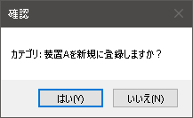

## カテゴリの削除

### 手順 1　カテゴリの選択と削除
削除するカテゴリを選択し、情報が表示されていることを確認し、〔削除〕をクリックします。

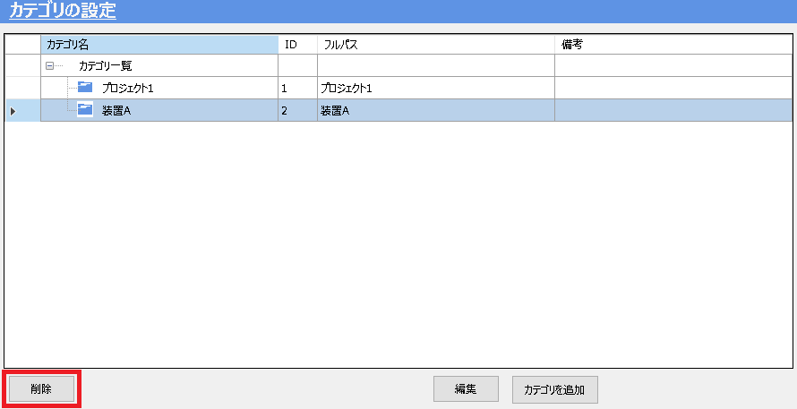

続いて、、確認メッセージが表示されます。 
〔はい〕をクリックし、カテゴリが削除されていることを確認します。

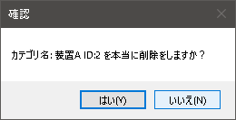

## カテゴリの変更

### 手順 1　変更するカテゴリを選択する
一覧より内容を変更するカテゴリを選択します。

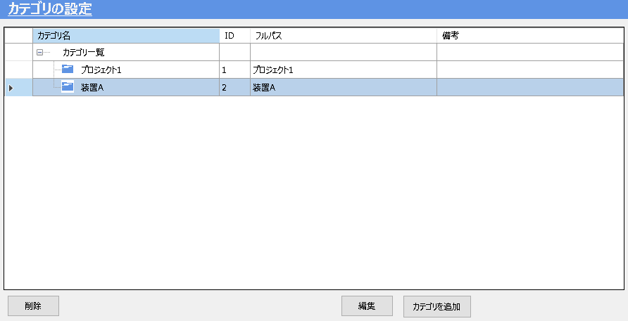

### 手順 2　カテゴリ内容を変更する
変更するカテゴリの情報が表示されていることを確認し、〔編集〕をクリックします。

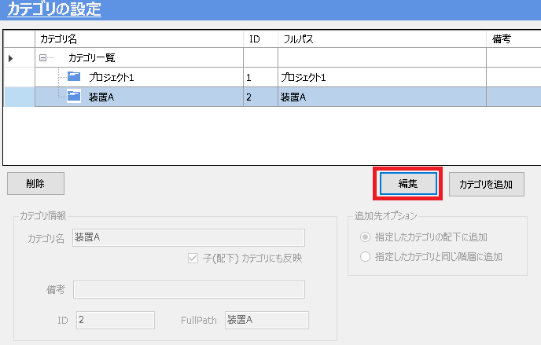

### 手順 3　更新する
カテゴリ情報を変更し、〔更新〕をクリックします。

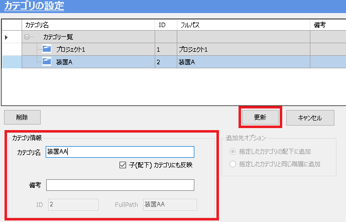

続いて、確認メッセージが表示されます。 
〔はい〕をクリックし、カテゴリが変更されていることを確認します。

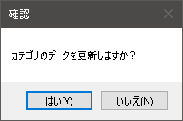
