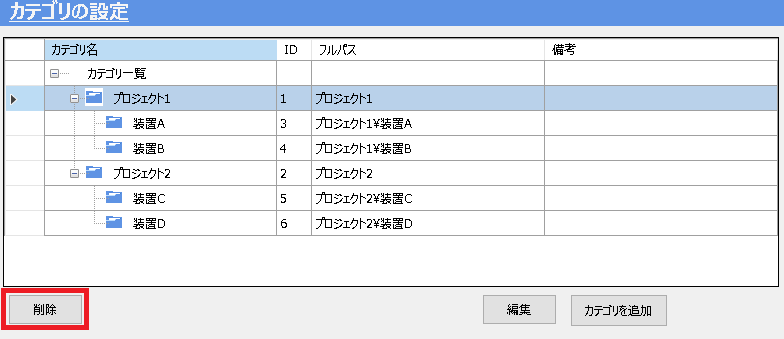
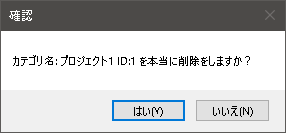
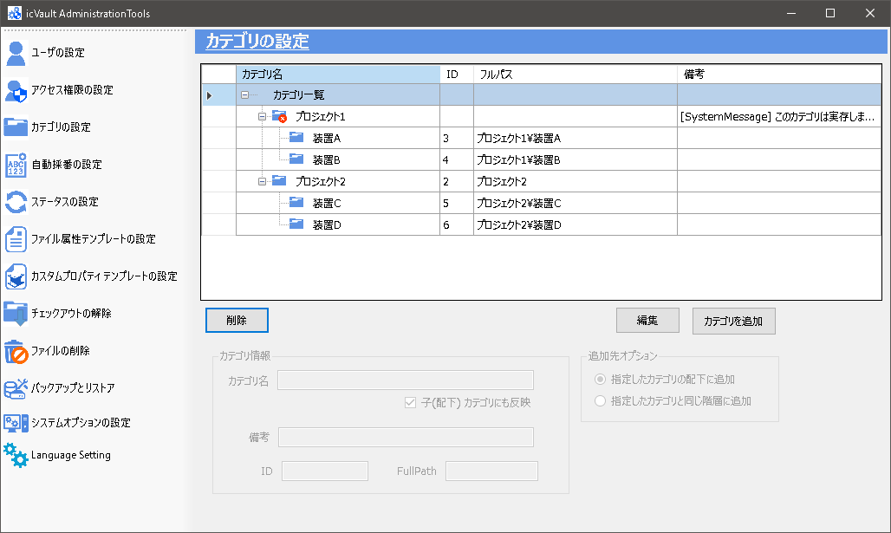
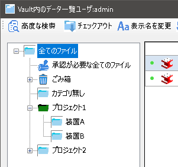
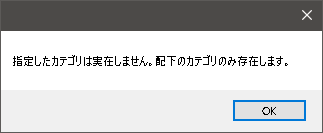
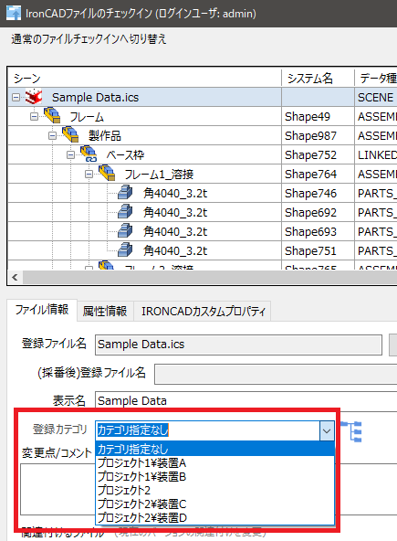

# カテゴリの便利な使い方

## カテゴリを分類として表示しておきたいがデータを登録させない場合

分類が難しい部品は大きな分類のカテゴリに無造作に登録されていくことが多く、
運用期間が長くなるに連れて、登録データが増えていき使いにくくなってしまいます。

**カテゴリ設定で子カテゴリを残したまま、親カテゴリを削除すると、データを登録できないカテゴリを作成することができます。** 

***
【作成例】 
通常、プロジェクト1やプロジェクト2は1つのカテゴリとして認識されるためデータの登録が可能です。 
実際にデータを登録するカテゴリはプロジェクト内の装置A や装置Cとするときにプロジェクト1や2にデータを登録できないように設定します。
***

### 手順 1　カテゴリを選択し、削除する
**プロジェクト1をデータ登録できないカテゴリに変更する場合** 
プロジェクト1のカテゴリを選択し、〔削除〕をクリックします。

続いて、〔はい〕をクリックします。

### 手順 2　カテゴリ一覧を確認する
プロジェクト1のカテゴリアイコンに赤い×マークが付きます。
子カテゴリは残したまま、親カテゴリを削除した状態が作成されます。 
この時、親カテゴリ(プロジェクト1)にはデータを登録することができません。 
プロジェクト1は分類のためだけのカテゴリになります。

<ul>

アクセス権限の設定で〔読み取り〕〔書き込み〕を不可にする場合も同じ状況を作ることができます。
</ul>

　
## 親カテゴリを削除した際の表示

### 　ファイル一覧の表示

データを登録できない、分類のためだけのカテゴリはファイル一覧では以下のように緑のアイコンで表示されます。

プロジェクト1のカテゴリをクリックすると以下のメッセージが表示されます。

　
### 　チェックインの表示
データを登録できないカテゴリはカテゴリそのものが表示されません。

