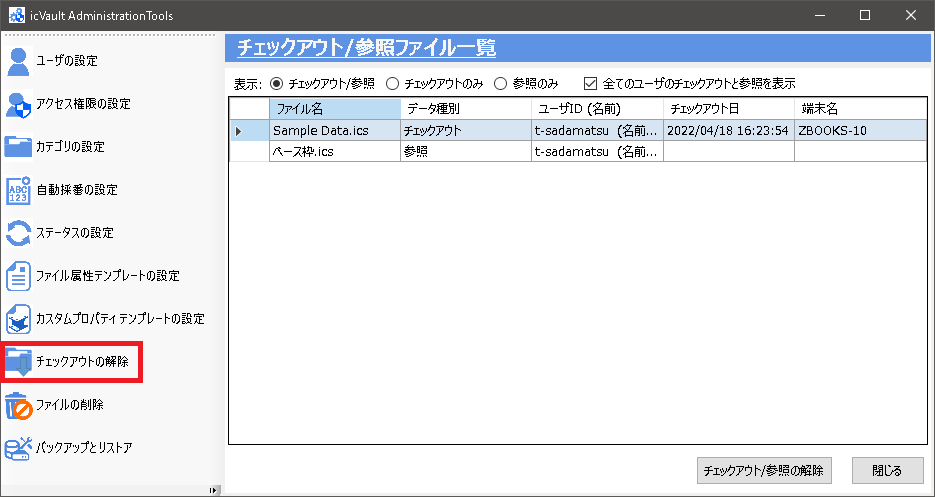
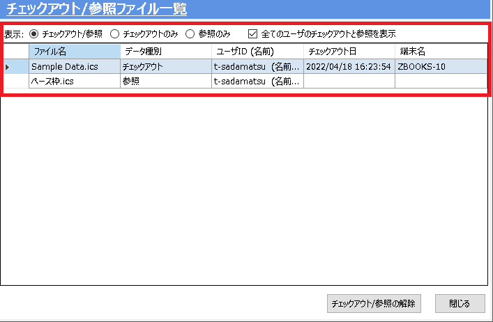
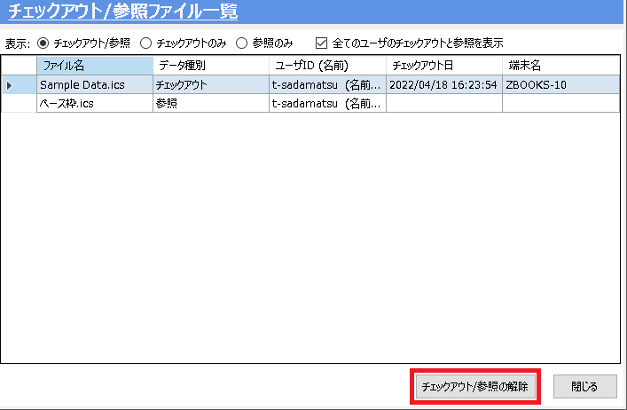
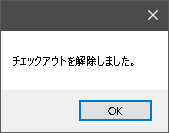

# チェックアウトの解除(管理者)
本ツールのチェックアウトの解除は、ユーザがチェックアウトしたままのファイルがあ場合に管理者が強制的にチェックアウト解除することができます。

<ul>
<li>本ツールで管理者がチェックアウト解除してもユーザ側にメッセージは表示されません。</li>
<li>チェックアウトを解除する前にユーザへ確認の上、実施することを推奨します。</li>
</ul>

### 1. チェックアウトするファイルを選択する

###### 表示の説明
<table>
<tr>
<th>チェックアウト/参照</th>
<td>チェックアウトと参照されている全ファイルが表示されます。</td>
</tr>
<tr>
<th>チェックアウトのみ</th>
<td>チェックアウトされている全ファイルが表示されます。</td>
</tr>
<tr>
<th>参照のみ</th>
<td>参照されている全ファイルが表示されます。</td>
</tr>
<tr>
<th>全てのユーザのチェックアウトと参照を表示</th>
<td>[チェック有り] 
　icVault に登録されている全ユーザの情報が表示されます。 
[チェック無し] 
　管理者がチェックアウトしているファイルのみ表示されます。
</td>
</tr>
</table>

### 2. チェックアウトを解除する
[チェックアウト/参照の解除] をクリックします。

続いて、解除完了のメッセージが表示されます。 
[OK] をクリックします。

一覧からファイルが消えていることを確認します。
