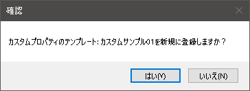

# IRONCAD カスタムプロパティ　テンプレートの設定
通常、IRONCADのパーツ/アセンブリでは要素を右クリックし、プロパティ(パーツプロパティ/アセンブリプロパティ)から
必要な情報を記録することができます。 
これらは2D(CAXA Draft)で図面を作成される際も活用できる情報です。 
icVaultには効率よく、カスタムプロパティ情報を設定できる機能が備わっています。 

 
事前に設定することで、ユーザは作成したパーツ/アセンブリデータに対し効率的にカスタムプロパティ情報を付与することができます。 
 
設定したカスタムプロパティテンプレートは「カスタムプロパティ一括設定」使用時に反映されます。

## カスタムプロパティテンプレートの作成

### 手順 1　新規作成
カスタムプロパティに登録する項目が予め決まったパッケージがある場合は、
そのテンプレートとテンプレートに含めるプロパティ項目をパッケージ毎に作成することができます。

カスタムプロパティ入力テンプレート一覧から〔新規追加〕をクリックします。

### 手順 2　登録内容を設定する

<table>
<tr>
<th>テンプレート名</th>
<td>任意のテンプレート名を入力します。</td>
</tr>
<tr>
<th>カスタムプロパティ名入力欄に表示する</th>
<td>[チェック有り] 
　ユーザが使用する際にプルダウンで登録したカスタムプロパティ名が表示されます。 
[チェック無し] 
　ユーザが使用する際にプルダウンで登録したカスタムプロパティ名が表示されません。
</td>
</tr>
<tr>
<th>テンプレートID</th>
<td>テンプレートを作成後、自動で数字が付与されます。</td>
</tr>
<tr>
<th>表示順</th>
<td>テンプレート一覧の表示順を変更できます。(-100～100) 
数字の小さい順に上から順番に並びます。　※後から変更可能
</td>
</tr>
</table>

### 手順 3　テンプレートを登録する
入力後、〔登録〕をクリックします。

続いて、確認メッセージが表示されます。 
〔はい〕をクリックします。

## テンプレートに含まれるプロパティの設定
先ほど登録したテンプレートに含まれるプロパティ属性を設定します。

### 手順 1　新規作成
カスタムプロパティ入力テンプレート一覧からテンプレートを選択します。 
続いて、選択したテンプレートに含まれるプロパティの〔新規追加〕をクリックします。

### 手順 2　プロパティを設定する

<table>
<tr>
<th>プロパティ名</th>
<td>任意のプロパティ名を入力します。 (例：取引先、施工方法など)</td>
</tr>
<tr>
<th>値の型</th>
<td>プルダウンメニューから選択します。 
　IRONCADのカスタムプロパティと同じ
</td>
</tr>
<tr>
<th>値</th>
<td>デフォルト表示させたい値を入力します。※空欄でも可</td>
</tr>
<tr>
<th>範囲</th>
<td>適用する範囲を選択します。 
　・すべてのリンク インスタンス:リンクしているすべてのパーツ/アセンブリに適用 
　・このパーツ/アセンブリのみ:選択した要素のみに適用
</td>
</tr>
<tr>
<th>カスタムプロパティ名入力欄に表示する</th>
<td>[チェック有り] 
　ユーザが使用する際にプルダウンで登録したカスタムプロパティ名が表示されます。 
 
[チェック無し] 
　ユーザが使用する際にプルダウンで登録したカスタムプロパティ名が表示されません。
</td>
</tr>
<tr>
<th>表示順</th>
<td>テンプレート一覧の表示順を変更できます。(-100～100) 
数字の小さい順に上から順番に並びます。　※後から変更可能
</td>
</tr>
</table>

### 手順 3　プロパティを登録する
入力後、〔登録〕をクリックします。

続いて、確認メッセージが表示されます。 
〔はい〕をクリックします。

## テンプレート・プロパティの編集

### 手順 1　項目を選択し、編集する
テンプレート・プロパティ内容を編集する場合は、項目を選択し〔編集〕をクリックします。

### 手順 2　内容を更新する
内容を変更後、〔更新〕をクリックします。

続いて、確認メッセージが表示されます。 
〔はい〕をクリックします。

## テンプレート・プロパティの削除

### 手順 1　項目を選択し、削除する
テンプレート・プロパティを削除する場合は、項目を選択し〔削除〕をクリックします。

続いて、確認メッセージが表示されます。 
〔はい〕をクリックします。

