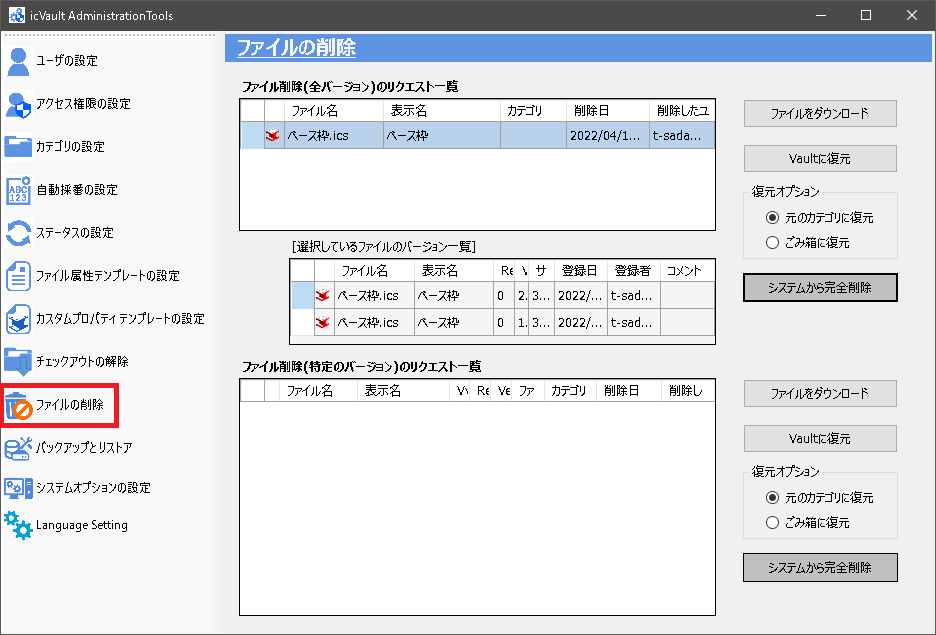
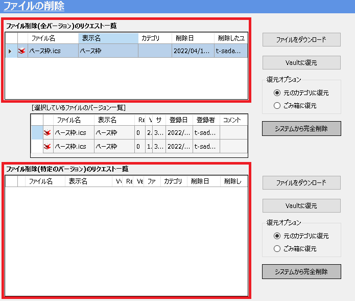
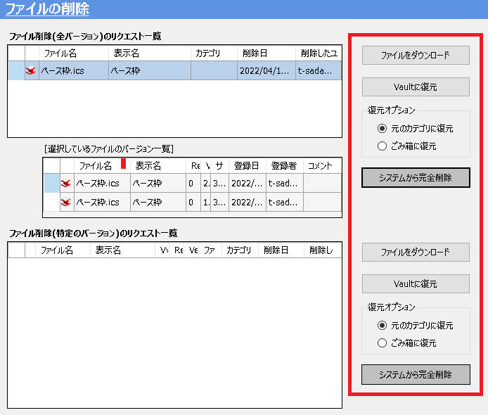
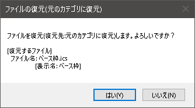
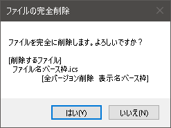

# ファイルの削除
ユーザが icVaultSmartGateway のファイル削除(ごみ箱)、バージョンを削除(ごみ箱)を実行し、
さらにごみ箱から完全に削除されたファイルが表示されます。 
 
ユーザが icVaultアドイン でごみ箱に移動した時点では、サーバにデータが残っています。 
管理者は、ごみ箱に移動された全データもしくはバージョン毎にサーバから完全に削除することが可能です。 

<ul>
不要なデータは定期的にサーバから完全に削除されることを推奨します。
</ul>

 

<ul>
削除後は元に戻せませんのでご注意ください。
</ul>

 

### 1. 削除するバージョンを選択する
ファイルの削除(全バージョン)または(特定のバージョン)のリクエスト一覧から、ファイルを選択します。

### 2. 処理方法を選択する
選択したファイルに対し、適用する処理を選択します。

<table>
<tr>
<th>ファイルをダウンロード</th>
<td>icVaultアドインから削除したファイルをダウンロードします。</td>
</tr>
<tr>
<th>Vaultに復元</th>
<td>icVaultアドイン (ユーザ側)へデータを復元します。 
※復元オプション:復元する場所を事前にチェックします。
</td>
</tr>
<tr>
<th>システムから完全削除</th>
<td>ファイルサーバから完全にファイルを削除します。</td>
</tr>
</table>

#### ファイルをダウンロードする場合
保存場所を指定して、[開く] をクリックします。

#### Vaultに復元する場合
ファイルの復元の確認メッセージが表示されます。 
[はい] をクリックします。

#### システムから完全削除する場合
ファイルから完全に削除の確認メッセージが表示されます。 
[はい] をクリックします。

