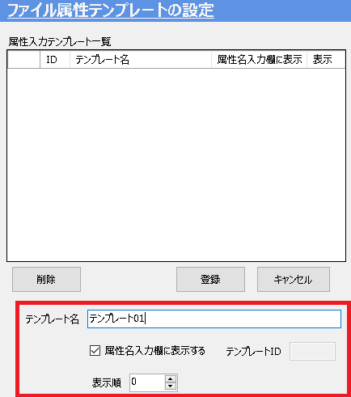

# ファイル属性テンプレートの設定
ファイル属性とは、登録するファイル自体(.ics/ .exb/ .dwgなど)に記録される情報です。 
例えば使用される設備名、グループ名、作成者など単体のパーツ/アセンブリではなく、ファイル自体に属性を設定したい場合に使用します。 
チーム同士や前後工程との意思疎通に活用することができます。。

<ul>
<li>ファイル属性は icVault のサーバに記録されます。　サーバから取得したデータ自体で確認することはできません。</li>
<li>IRONCAD内でパーツ/アセンブリに付与するカスタムプロパティ情報ではありません。</li>
<li>2D部品表や表題欄に反映することはできません。</li>
</ul>

## ファイル属性テンプレートの作成

### 1. 新規作成

属性入力テンプレート一覧(※設定画面左側)の [新規追加] をクリックします。

### 2. 登録内容を設定する

<table>
<tr>
<th>テンプレート名</th>
<td>任意のテンプレート名を入力します。</td>
</tr>
<tr>
<th>「属性名入力欄に表示する」</th>
<td>[チェック有り] 
　ユーザが使用する際にプルダウンで登録した属性名が表示されます。 
 
[チェック無し] 
　ユーザが使用する際にプルダウンで登録した属性名が表示されません。
</td>
</tr>
<tr>
<th>テンプレートID</th>
<td>テンプレートを作成後、自動で数字が付与されます。</td>
</tr>
<tr>
<th>表示順</th>
<td>テンプレート一覧の表示順を変更できます。(-100～100) 
数字の小さい順に上から順番に並びます。　※後から変更可能
</td>
</tr>
</table>

### 3. テンプレートを登録する
入力後、[登録] をクリックします。

続いて、確認メッセージが表示されます。 
[はい] をクリックします。

## テンプレートに含まれる属性の設定
先ほど登録したテンプレートにファイル属性を設定します。

### 1. 新規作成
属性入力テンプレート一覧(※設定画面左側)からテンプレートを選択します。 
続いて、選択したテンプレートに含まれる属性(※設定画面右側)の [新規追加] をクリックします。

### 2. 属性情報を入力する

<table>
<tr>
<th>属性名</th>
<td>任意の属性名を入力します。 (例：グループ名)</td>
</tr>
<tr>
<th>値</th>
<td>デフォルト表示させたい値を入力します。※空欄でも可
</td>
</tr>
<tr>
<th>「属性名入力欄に表示する」</th>
<td>[チェック有り] 
　ユーザが使用する際にプルダウンで登録した属性名が表示されます。 
[チェック無し] 
　ユーザが使用する際にプルダウンで登録した属性名が表示されません。
</td>
</tr>
<tr>
<th>表示順</th>
<td>テンプレート一覧の表示順を変更できます。(-100～100) 
数字の小さい順に上から順番に並びます。　※後から変更可能
</td>
</tr>
</table>

### 3. ファイル属性を登録する
属性内容を入力後、[登録] をクリックします。

続いて、確認メッセージが表示されます。 
[はい] をクリックします。

## テンプレート・属性の編集

### 1. 項目を選択し、編集する
テンプレート・属性内容を編集する場合は、項目を選択し [編集] をクリックします。

### 2. 内容を更新する
内容を変更後、[更新] をクリックします。

続いて、確認メッセージが表示されます。 
[はい] をクリックします。

## テンプレート・属性の削除

### 1. 項目を選択し、削除する
テンプレート・属性を削除する場合は、項目を選択し [削除] をクリックします。

続いて、確認メッセージが表示されます。 
[はい] をクリックします。

