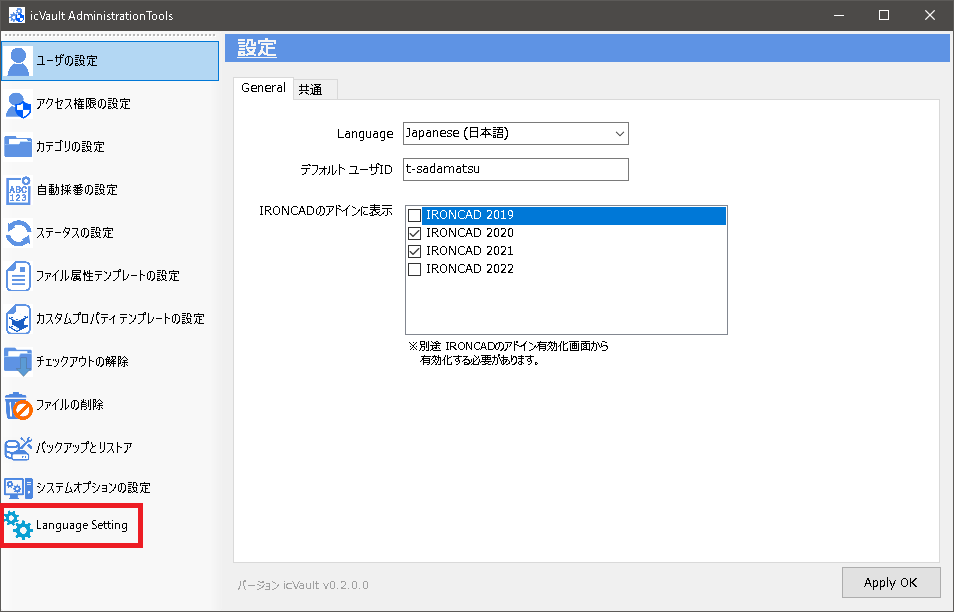
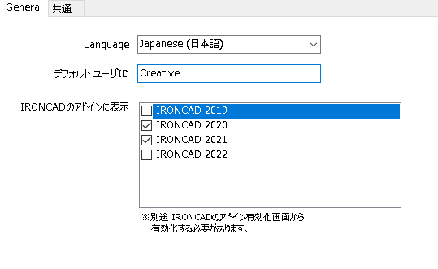
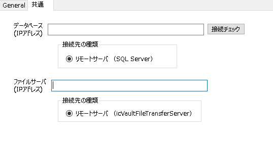

# Language Setting
本項目は、表示する言語・適用するIRONCAD バージョン、サーバ接続設定(ユーザのみ)などを実施します。

## Generalの設定

<table>
<tr>
<th>Language</th>
<td>プルダウンから日本語または英語を選択します。</td>
</tr>
<tr>
<th>デフォルト ユーザID</th>
<td> icVaultクライアントのログイン画面で「ユーザ名」に設定した ID が自動で反映されます。
</td>
</tr>
<tr>
<th>IRONCAD のアドインに表示</th>
<td>ご利用の IRONCAD バージョンにチェックを入れます。</td>
</tr>
</table>

<ul>
「IRONCAD のアドインに表示」にチェックがない IRONCAD バージョンは IRONCAD のアドインアプリケーションに表示されません。
</ul>

※ここではまだ [Apply OK] をクリックしません。

## 共通の設定
本設定は、主にユーザが icVault アドインの [設定] からサーバに接続するために実施します。
サーバ PC 本体では、接続確認用としてご利用ください。

<table>
<tr>
<th>データベース(IPアドレス)</th>
<td>icVaultServerDataBase.msi を運用するサーバーのIPアドレスを入力します。
</td>
</tr>
<tr>
<th>ファイルサーバ(IPアドレス)</th>
<td>設定するファイルサーバのある端末のIPアドレスを入力します。
</td>
</table>

General と共通の両方を設定後、[Apply OK] をクリックします。

