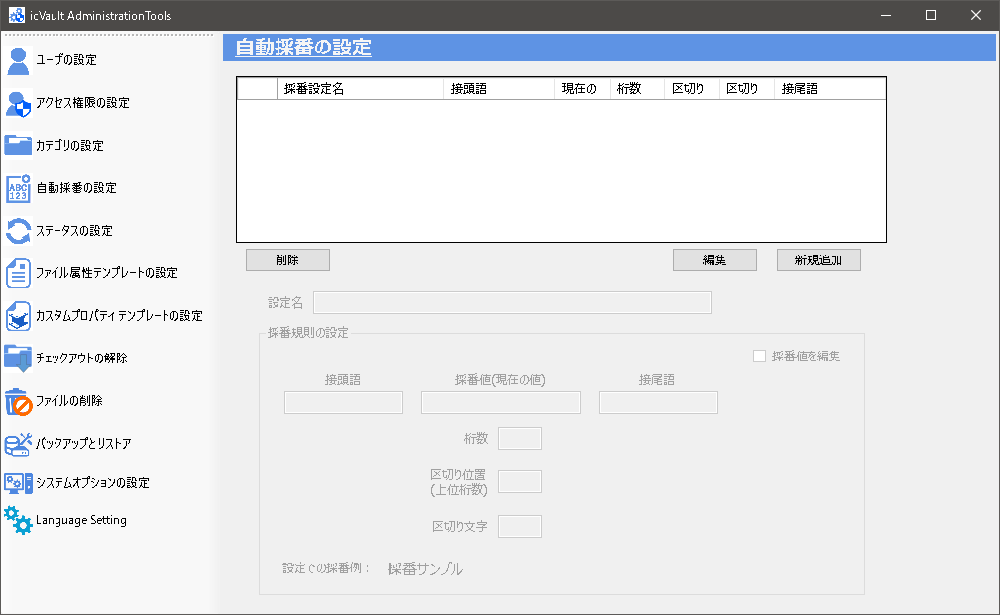

# 自動採番の設定
データの自動採番設定/変更は左側メニューの [自動採番の設定] で行います。  
自動採番は初めてチェックインするデータに付与することができます。

<ul>
既にチェックインされているデータを採番する場合は新しい部品としてデータを取得し、名前を変更して新規でチェックインしてください。 
その場合、icVault 内にある元ファイルは必要に応じて削除してください。
</ul>

## 自動採番の追加

### 1. 採番ルールの新規作成
[新規追加] をクリックします。

### 2. 採番情報を入力する
始めに「設定名」に自動採番名(タイトル)を入力します。

###### 採番既定の設定
<table>
<tr>
<th>接頭語</th>
<td>頭に付ける固定ワードを設定します。 
※頭に付ける固定ワードが無い場合は設定不要です。
</td>
</tr>
<tr>
<th>採番値(現在の値)</th>
<td>現在の採番値が表示されます。 
変更する必要がある場合は採番値を編集のチェックを入れ編集します。
</td>
</tr>
<tr>
<th>桁数</th>
<td>採番値の桁数を設定します。 
</tr>
<tr>
<th>区切り位置(上位桁数)</th>
<td>桁数に区切り文字を入れるときに上位の桁数を設定します。 
※区切り文字が要らない場合は設定不要です。
</td>
</tr>
<tr>
<th>区切り文字</th>
<td>区切りに使用する文字を設定します。
</td>
</tr>
<tr>
<th>接尾語</th>
<td>尾に付ける固定ワードを設定します。 
※尾に付ける固定ワードが無い場合は設定不要です
</td>
</tr>
<tr>
<th>採番値を編集</th>
<td>[チェック有り] 
　現在の採番値が編集できます。 
　※既に採番を開始している場合は、採番値を変更すると採番できなくなる 　　(採番値が重複)ことがあります。 
　　変更する際はご注意ください。 
 
[チェック無し] 
　現在の採番値は編集できません。
</td>
</tr>
</table>

### 3. 自動採番を登録する
入力完了後、[登録] をクリックします。

続いて、確認のメッセージが表示されます。 
[はい] をクリックします。

###### 設定例と採番例)

　

## 自動採番の削除

### 1. 設定した自動採番を選択する。
自動採番の設定を開き、一覧から削除する採番設定名を選択します。 
削除するステータスの情報が表示されていることを確認してください。

### 2. 自動採番を削除する。
[削除] をクリックします。

続いて、確認のメッセージが表示され、[OK] をクリックします。

自動採番が削除されていることを確認します。
