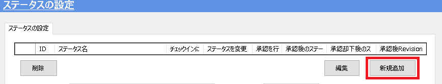

# ステータスの追加/削除/変更
icVaultのステータスとは登録(チェックイン)されているデータの現在の「状態」を示します。 
チーム間の連携や後工程とのやり取りの際、仕掛中なのか完成しているのかなどの意思表示や上司の確認に使用できます。 
 
また、上司や管理職の方がファイル一覧からデータの承認を行う場合、承認/却下により自動的にステータスが変更される機能もあります。 

**データの状態を分かりやすく見える化することができます。 
アクセス権やカテゴリと共に設定することをお勧めします。**

## ステータスの追加

### 手順 1　新規シートを作成する
〔新規追加〕をクリックします。

### 手順 2　ステータス情報を入力する
追加するステータス情報を入力します。

<table>
<tr>
<th>ステータス名</th>
<td>ステータス名を入力します。</td>
</tr>
<tr>
<th>ステータスID</th>
<td>[システムで自動設定されます。入力不要]</td>
</tr>
<tr>
<th>[チェックイン]のステータス選択に表示する
</th>
<td>[チェック有り] 
　チェックイン時のステータス選択肢に表示されます。 
 
[チェック無し] 
　チェックイン時のステータス選択肢に表示されません。
</td>
</tr>
<tr>
<th>[ステータスを変更]に表示する</th>
<td>[チェック有り] 
　ステータスを変更 の変更後のステータスの選択肢に表示されます。 
 
[チェック無し] 
　ステータスを変更 の変更後のステータスの選択肢に表示されません。 
</td>
</tr>
<tr>
<th>承認後のステータス</th>
<td>承認された後に自動移行するステータスを選択します。</td>
</tr>
<tr>
<th>承認後 Revisionを改訂する</th>
<td>[チェック有り] 
　承認時にファイルのRevisionを自動改訂します。 
 
[チェック無し] 
　承認時にファイルのRevisionを自動改訂しません。 
</td>
</tr>
<tr>
<th>承認[却下]後のステータス</th>
<td>承認が却下された後に自動移行するステータスを選択します。</td>
</tr>
</table>

### 手順 3　ステータスを登録する
入力完了後、〔登録〕をクリックします。

続いて、確認のメッセージが表示されます。
〔OK〕をクリックします。

### 手順 4　ステータスを確認する
ステータスの設定一覧に登録したステータスがあることを確認します。

## ステータスの削除

### 手順 1　削除するステータスを選択する

### 手順 2　ステータスを削除する
削除するステータスの情報が表示されていることを確認し、〔削除〕をクリックします。

続いて、確認のメッセージが表示されます。 
〔はい〕をクリックします。

### 手順 3　ステータスを確認する
ステータス設定の一覧から項目が削除されていることを確認します。

## ステータスの変更

### 手順 1　変更するステータスを選択する

### 手順 2　ステータス情報を変更する
変更するステータス情報が表示されていることを確認し、〔編集〕をクリックします。

### 手順 3　ステータス情報を更新する
ステータス内容を変更し、〔更新〕をクリックします。

続いて、確認のメッセージが表示されます。 
〔はい〕をクリックします。

ステータスの設定画面で内容が変更されていることを確認します。
