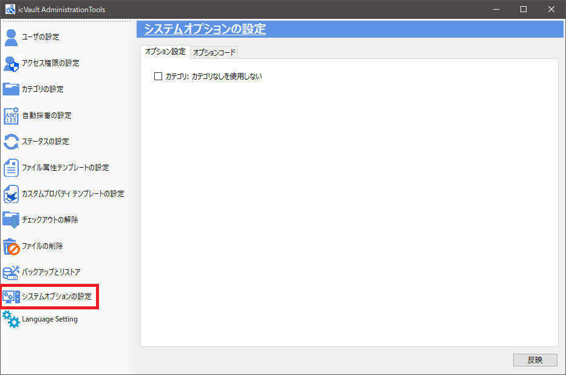
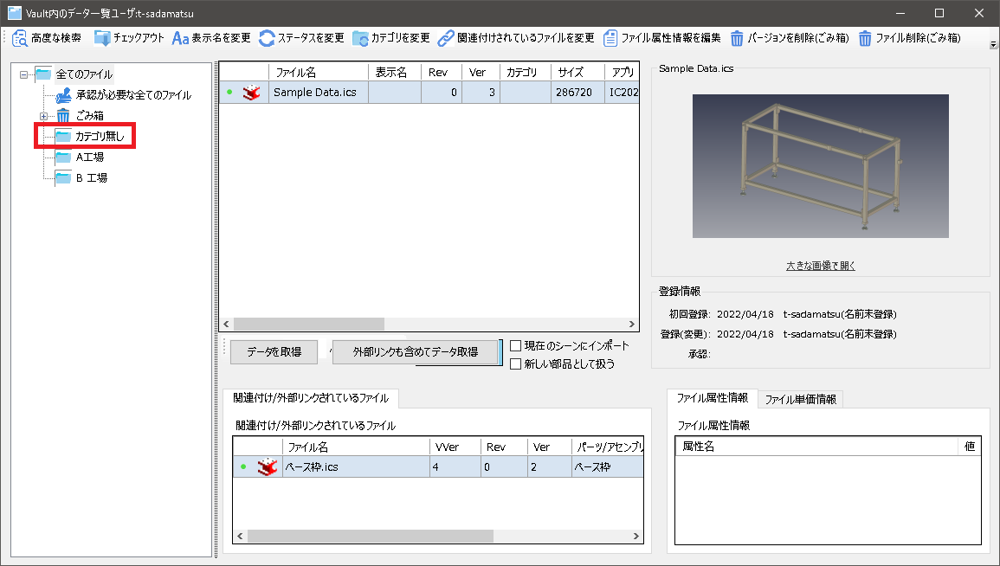

# システムオプションの設定
本項目は、icVauitアドインの操作画面(ファイル一覧など)の設定を変更する場合に使用します。
バージョンアップにより内容が追加される場合があります。

### オプション設定

#### カテゴリ: カテゴリなしを使用しない

icVaultアドインのファイル一覧に表示される「カテゴリ無し」を使用しない場合にチェックを入れます。 

**「カテゴリ無し」は不要、または「カテゴリ無し」があるとユーザがカテゴリ設定しないデータが増えて困るなど
の場合に使用します。**

<ul>
<li>すでに「カテゴリ無し」に設定されているデータは、カテゴリの「全てのファイル」に移動します。 
選択・変更する場合は高度な検索または「全てのファイル」を選択してください。 
 
<li>システムオプションで本項目のチェックを変更する際、ユーザがすでにファイル一覧を開いている場合は
変更を反映されるため、一度ユーザ側でログアウトし、再度ログインしてください。</li>
</ul>

### オプションコード

