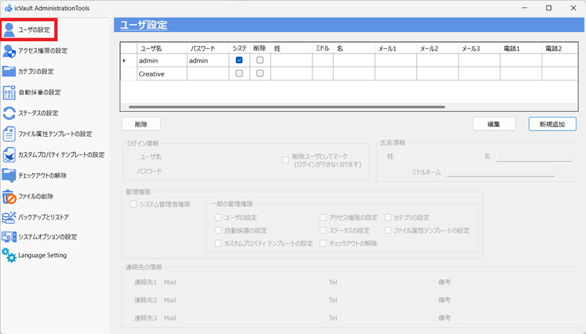

# ユーザーの追加/削除/変更
ユーザーの追加/削除/ユーザ情報の変更は左側メニューの〔ユーザの設定〕で行います。 

<ul>
icVaultのシステム管理者の設定も本メニューから行います。
</ul>

## 新規ユーザの追加(登録)

### 手順1.　登録画面を開く
〔新規追加〕をクリックします。

### 手順2.　ユーザ情報を入力する

###### ログイン情報
<table>
<tr>
<th>ユーザ名</th>
<td>ログイン時のユーザ名を入力します。 ※他のユーザと重複することはできません。</td>
</tr>
<tr>
<th>パスワード(入力任意)</th>
<td>ログイン時のパスワードを入力します。</td>
</tr>
<tr>
<th>システム管理者権限</th>
<td>ユーザにシステム管理者権限を付与する場合はチェックを入れます。</td>
</tr>
<tr>
<th>削除ユーザとしてマーク</th>
<td>icVaultにアクセス不要となったユーザにチェックを入れます。</td>
</tr>
</table>

<ul>
システム管理者権限を付与されたユーザが、icVaultAdministrationToolsへのログインとマスタの設定が可能となります。
</ul>

###### 氏名情報
<table>
<tr>
<th>姓(入力任意)</th>
<td>姓名を入力します。</td>
</tr>
<tr>
<th>名(入力任意)</th>
<td>名前を入力します。</td>
</tr>
<tr>
<th>ミドルネーム(入力任意)</th>
<td>ミドルネームを入力します。</td>
</tr>
</table>

###### 連絡先
<table>
<tr>
<th>Mail(入力任意)</th>
<td>メールアドレスを入力します。</td>
</tr>
<tr>
<th>Tel(入力任意)</th>
<td>電話番号を入力します。</td>
</tr>
<tr>
<th>備考(入力任意)</th>
<td>メモしておきたい内容などを入力します。</td>
</tr>
</table>

### 手順3.　登録する
すべての入力を完了後、〔登録〕をクリックします。

続けて、登録の確認メッセージが表示されます。 
〔はい〕をクリックします。

## ユーザの削除

### 手順1.　ユーザを選択する
一覧からicVaultへのアクセスを遮断したいユーザを選択します。

### 手順2.　ユーザ情報の削除
〔削除〕をクリックします。

続けて、削除の確認メッセージが表示されます。 
〔はい〕をクリックします。

## ユーザ情報の変更

### 手順1.　ユーザを選択する
一覧から登録情報を変更するユーザを選択します。

### 手順2.　変更内容を入力する
〔編集〕をクリックします。

ユーザの情報を変更し、〔更新〕をクリックします。

続けて、変更の確認メッセージが表示されます。 
〔はい〕をクリックします。

