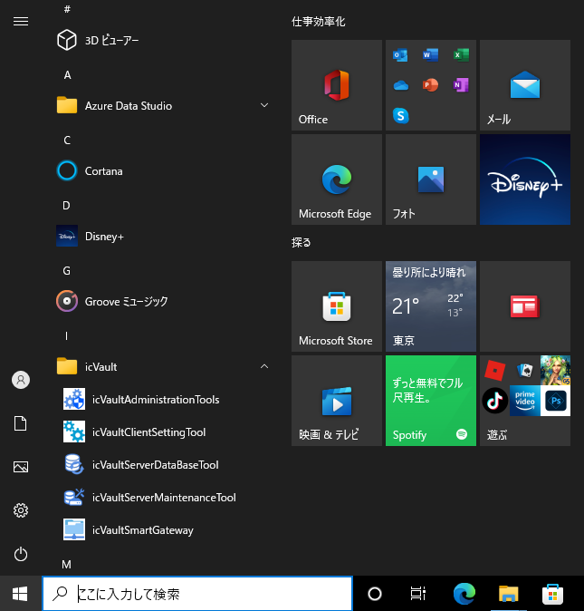
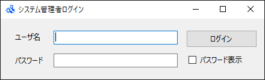
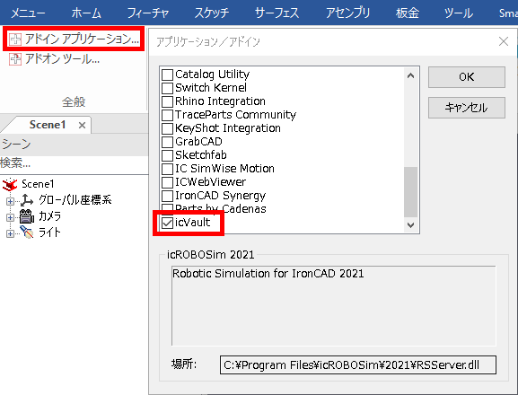
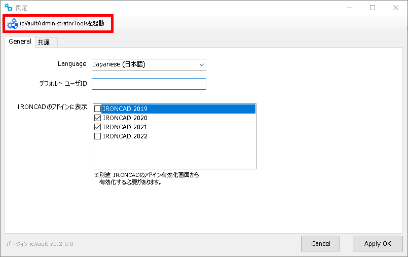

# icVaultAdministrationToolsの起動
使用者全員に関わる icVault のすべての設定・変更・削除・バックアップを本ツールで実施します。

<ul>
運用するにあたり自由に変更できないよう専任の管理者を配置することをお勧めします。
</ul>

Windows のスタートメニューまたは、icVaultアドイン から起動します。

## Windows のスタートメニューから起動する方法

〔1〕Windows スタートメニューを開き、icVault フォルダを展開します。

続いて、icVaultAdministrationToolsをクリックします。

〔2〕ユーザ名とパスワードを入力し、〔ログイン〕します。

## icVault アドインから起動する方法

<ul>
サーバとして使用する PC に IRONCAD がインストールされている場合に限ります。
</ul>

〔1〕IRONCAD を起動します。

〔2〕アドインタブからアドインアプリケーションを開きます。  
[icVault] にチェックを入れ、[OK] をクリックします。

〔3〕icVaultアドインから[設定] をクリックします。 

〔4〕画面左上の [icVaultAdministrationToolsを起動] クリックします。 

〔5〕ユーザ名とパスワードを入力し、[ログイン] します。

[初期設定] 
ユーザ名：admin 
パスワード：admin

<ul>
専任の管理者を配置された場合は管理者を設定後、初期設定の ID は削除することをお勧めします。
</ul>

