ファイルサーバーの通信許可設定を実施します。

### Windows Defender ファイヤーウォール画面を開く

〔1〕Windows メニューから [コントロールパネル] を開きます。

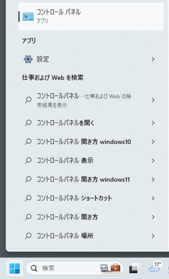

〔2〕コントロール パネルのメニューから [システムとセキュリティ] をクリックします。

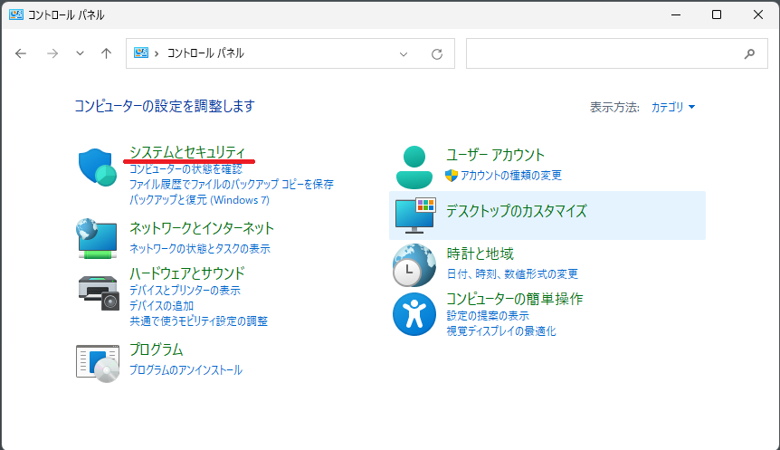

〔3〕[Windows Defenderファイアウォール] をクリックします。

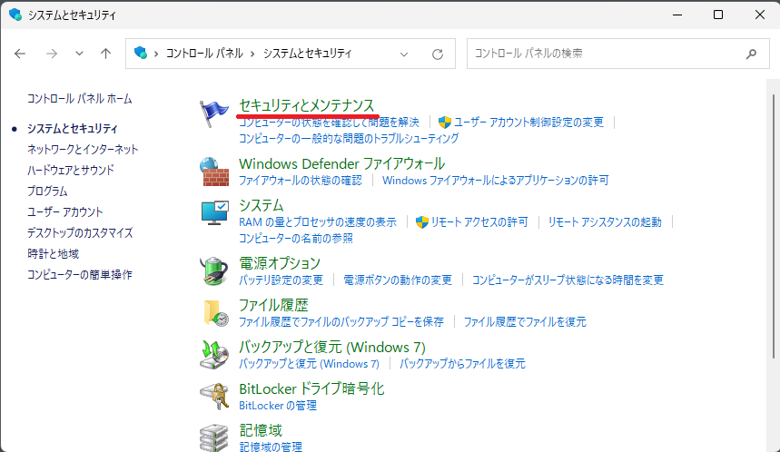

〔4〕左側メニュー欄の [詳細設定] をクリックします。

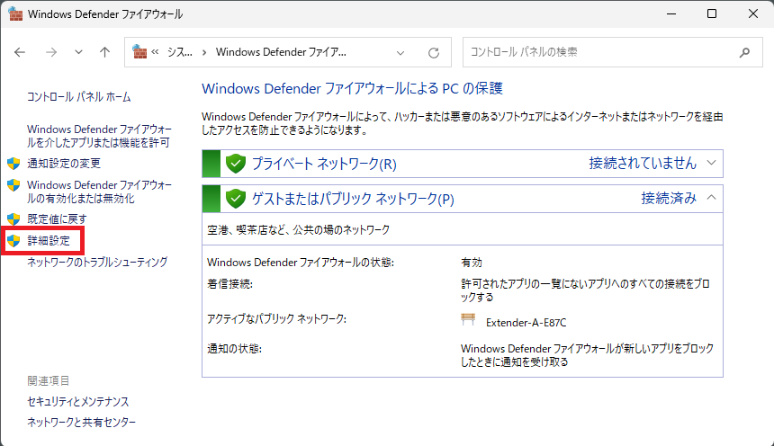

〔5〕[セキュリティが強化されたWindows Defenderファイアウォール] の画面が開きます。

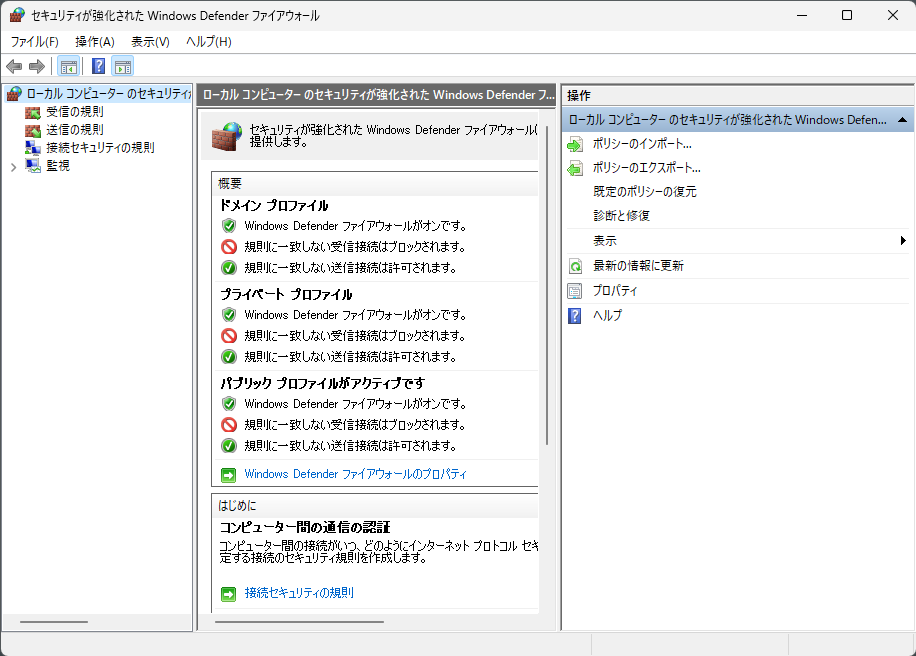

### 受信の許可設定

〔1〕左側メニュー欄の [受信の規則] をクリックします。 
続いて、右メニュー [新しい規則] をクリックします。

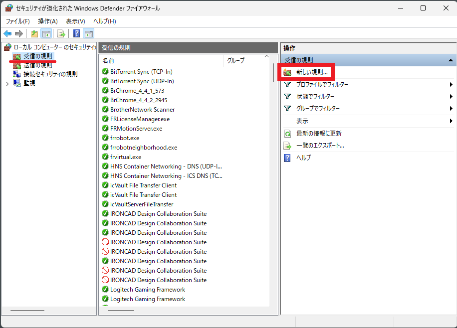

〔2〕[規則の種類] の設定では [プログラム] を選択し、[次へ] をクリックします。

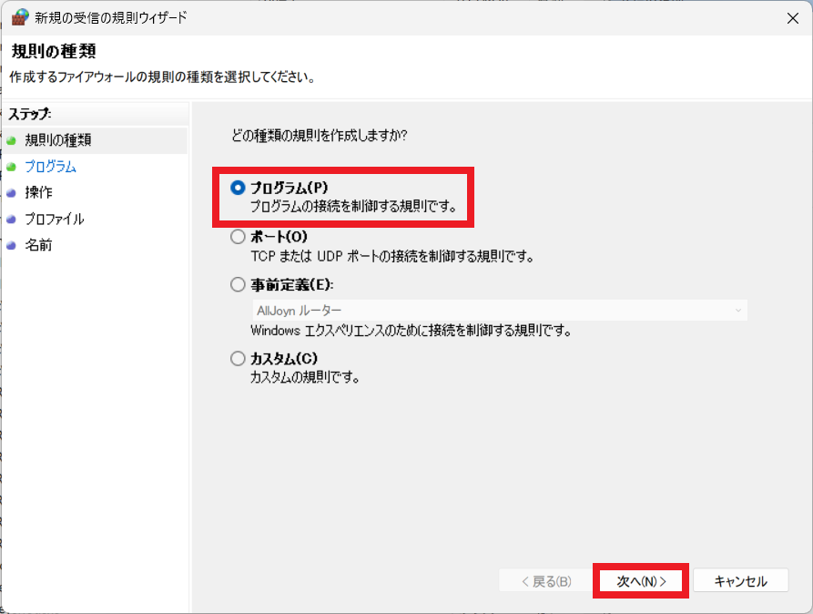

〔3〕[このプログラムのパス(T):] にチェックし、[参照] をクリックします。

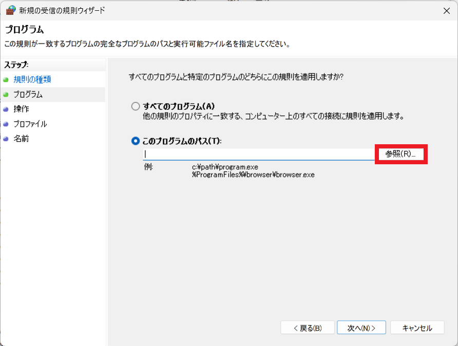

〔4〕icVaultServerFileTransfer のインストールパスに移動し、icVault FileTransfer Server.exe を選択し、[開く] をクリックします。 
※標準では C:\Program Files\CreativeMachine\icVaultServerFileTransfer にインストールされています

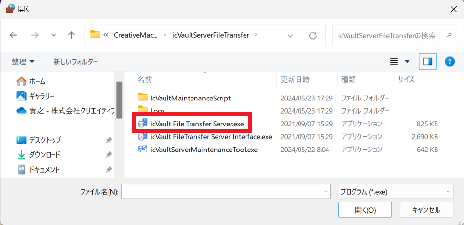

〔5〕選択したパスが表示されたことを確認し、[次へ] をクリックします。

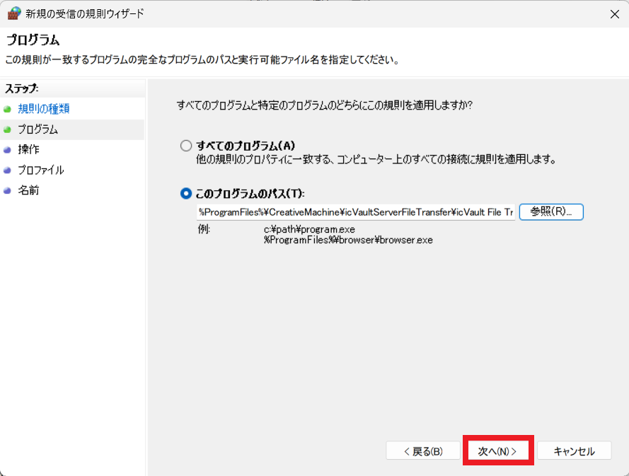

〔6〕[接続を許可する(A)] にチェックを入れ、[次へ] をクリックします。

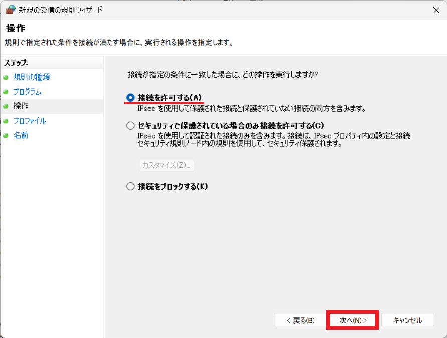

〔7〕プロファイルの設定では現在の接続設定の項目にチェックを入れ、[次へ] をクリックします。　
※不明の場合はすべての項目にチェックを入れます。

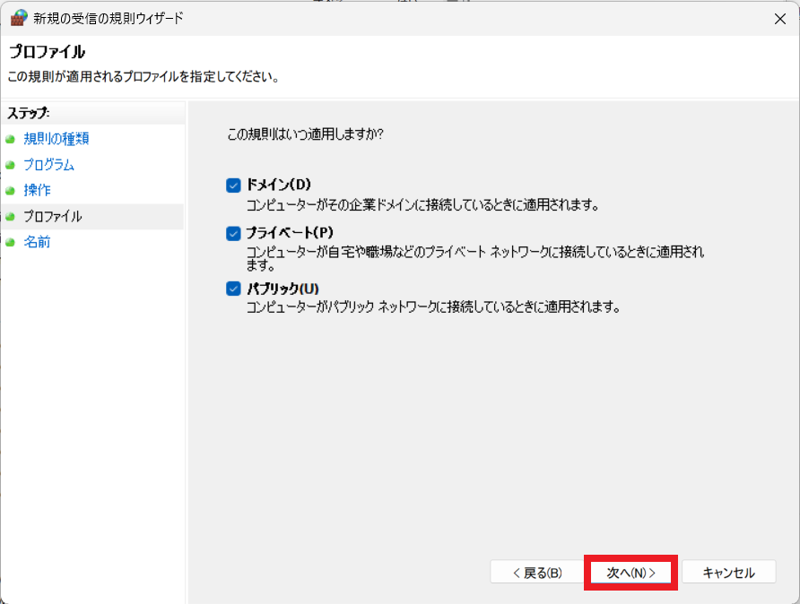

〔8〕名前の設定では、名前に [icVaultServerFileTransfer] を入力し、説明に [icVaultファイル送受信サーバ] を入力します。

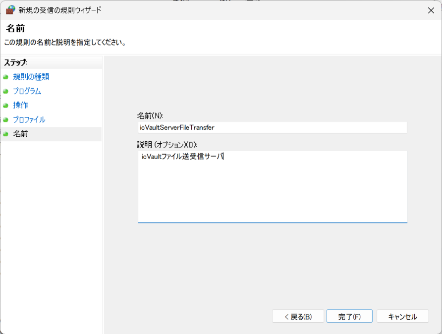

[完了] をクリックし、終了します。。

〔8〕の名前は上記以外の任意の名前でも問題ありません。サーバ管理者が分かりやすい名前を付けても大丈夫です。

### 送信の許可設定

〔1〕左側メニュー欄の [送信の規則] をクリックします。 
続いて、右メニュー [新しい規則] をクリックします。

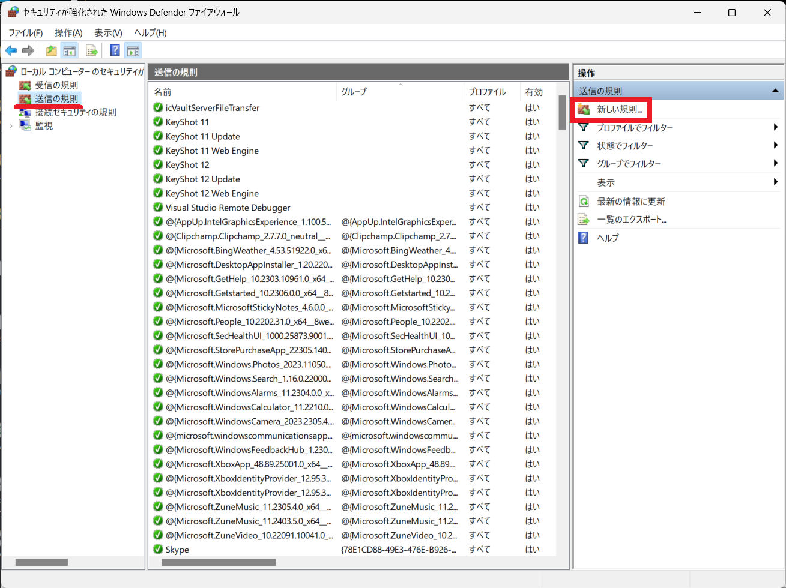

〔2〕[規則の種類] の設定では [プログラム] を選択し、[次へ] をクリックします。

〔3〕[このプログラムのパス(T):] にチェックし、[参照] をクリックします。

〔4〕icVaultServerFileTransfer のインストールパスに移動し、icVault FileTransfer Server.exe を選択し、[開く] をクリックします。 
※標準では C:\Program Files\CreativeMachine\icVaultServerFileTransfer にインストールされています

〔5〕選択したパスが表示されたことを確認し、[次へ] をクリックします。

〔6〕[接続を許可する(A)] にチェックを入れ、[次へ] をクリックします。

〔7〕プロファイルの設定では現在の接続設定の項目にチェックを入れ、[次へ] をクリックします。　
※不明の場合はすべての項目にチェックを入れます。

〔8〕名前の設定では、名前に [icVaultServerFileTransfer] を入力し、説明に [icVaultファイル送受信サーバ] を入力します。

[完了] をクリックし、終了します。。

〔8〕の名前は上記以外の任意の名前でも問題ありません。サーバ管理者が分かりやすい名前を付けても大丈夫です。

以上で、外部との通信許可設定は完了です。
