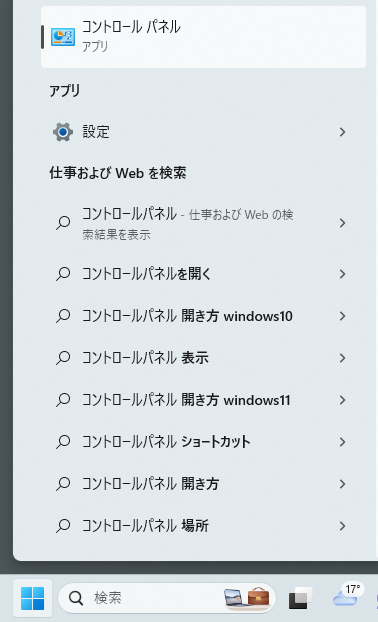
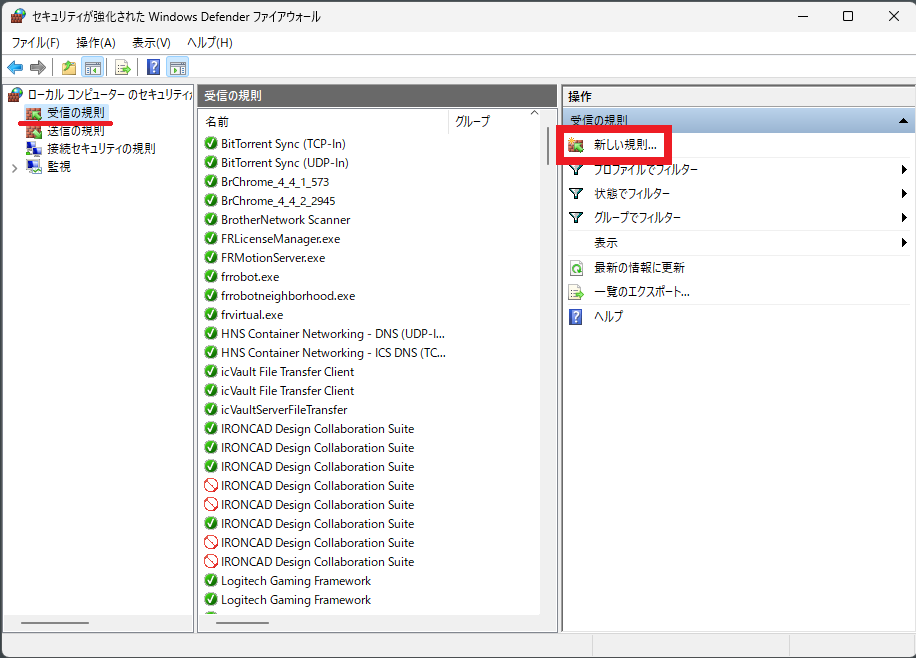

サーバーのファイヤーウォール設定を確認します。

### Windows Defender ファイヤーウォール画面を開く

〔1〕Windows メニューから [コントロールパネル] を開きます。

〔2〕コントロール パネルのメニューから [システムとセキュリティ] をクリックします。

〔3〕[Windows Defenderファイアウォール] をクリックします。

〔4〕左側メニュー欄の [詳細設定] をクリックします。

〔5〕[セキュリティが強化されたWindows Defenderファイアウォール] の画面が開きます。

### 受信の許可設定

〔1〕左側メニュー欄の [受信の規則] をクリックします。 
続いて、右メニュー [新しい規則] をクリックします。

〔2〕[規則の種類] の設定では [ポート] を選択し、[次へ] をクリックします。

〔3〕プロトコルおよびポートの設定では、[TCP] を選択し、[特定のローカル ポート] に[1433]を入力します。　
[次へ] をクリックします。

〔4〕操作の設定では [接続を許可する] を選択し、[次へ] をクリックします。

〔5〕プロファイルの設定では現在の接続設定の項目にチェックを入れ、[次へ] をクリックします。　
※不明の場合はすべての項目にチェックを入れます。

〔6〕名前の設定では、名前に [icVaultServerDataBase] を入力し、説明に [SQL Server(icVaultデータベースサーバ)] を入力します。

[完了] をクリックします。 

### 送信の許可設定

〔1〕左側メニュー欄の [送信の規則] をクリックします。 
続いて、右メニュー [新しい規則] をクリックします。

〔2〕[規則の種類] の設定では [ポート] を選択し、[次へ] をクリックします。

〔3〕プロトコルおよびポートの設定では、[TCP] を選択し、[特定のローカル ポート] に [1433] を入力します。　[次へ] をクリックします。

〔4〕操作の設定では[接続を許可する]を選択し、[次へ] をクリックします。

〔5〕プロファイルの設定では現在の接続設定の項目にチェックを入れ、[次へ] をクリックします。

※不明の場合はすべての項目にチェックを入れます。

〔6〕名前の設定では、名前に [icVaultServerDataBase] を入力し、説明に [SQL Server(icVaultデータベースサーバ)] を入力します。

[完了] をクリックします。 

以上で、外部との通信許可設定は完了です。
