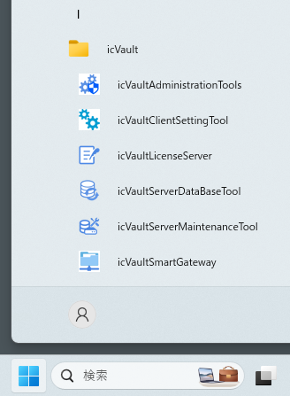
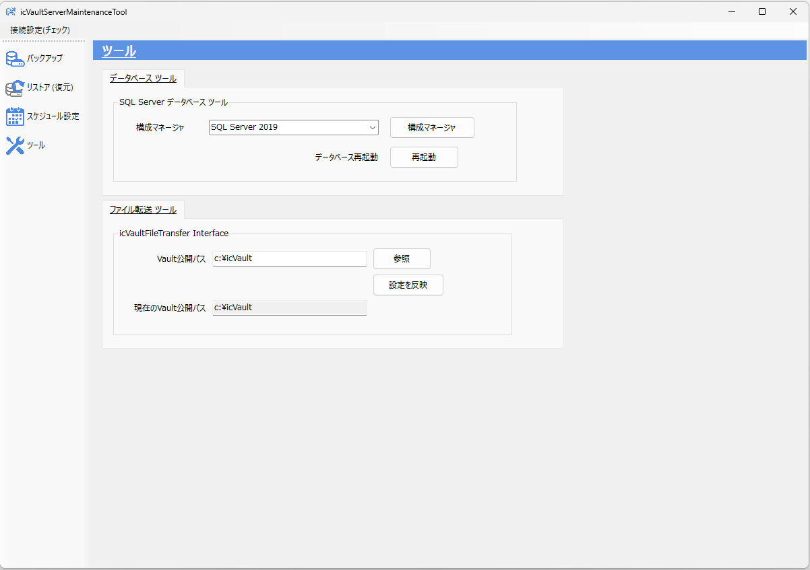
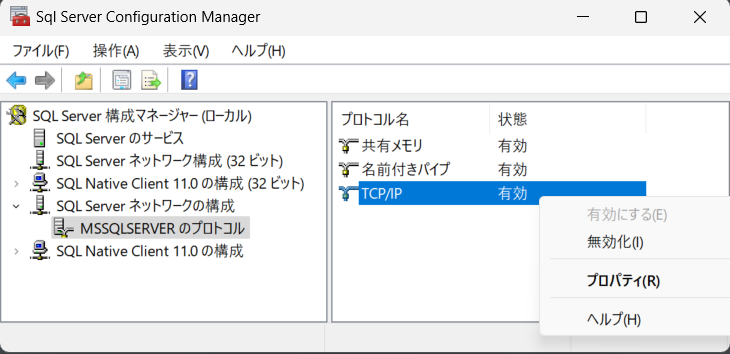
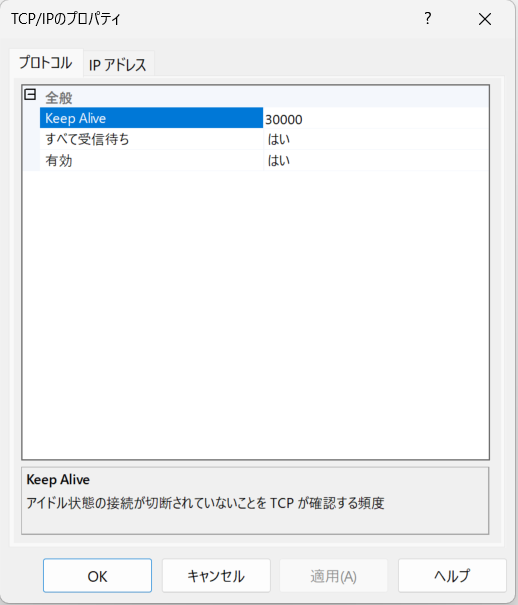
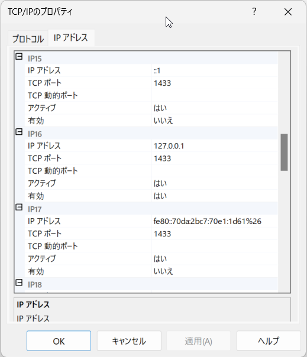
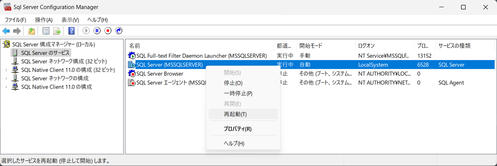

サーバーが外部との通信をできるよう設定してください。

### 外部との通信許可設定を確認

〔1〕スタートメニューから [icVault] → [icVaultServerMaintenanceTool] を起動します。

〔2〕左メニューの [ツール] をクリックします。

〔3〕[構成マネージャ] をクリックします。

〔4〕[SQL Serverネットワークの構成] → [MSSQLSERVERのプロトコル] を選択します。TCP/IP の項目を右クリックし、[プロパティ] をクリックします。

〔5〕TCP/IP のプロパティが表示されます。
プロトコルのタブを選択し、[全般] → [すべて受信待ち]と[有効] が、<はい> に設定されていることを確認します。

〔6〕同じ画面の [IPアドレス] タブを選択し、現在使用している IPアドレス の項目をリストから探します。 
当該リストの [有効] の設定を、<はい> に設定し、[OK] をクリックします。

〔7〕構成マネージャの画面に戻り、[SQL Serverのサービス] を選択します。 
SQL Server(MSSQLSERVER) の項目を右クリックし、[再起動] をクリックします。 
外部との通信が有効になります。

以上で、外部との通信許可設定は完了です。
