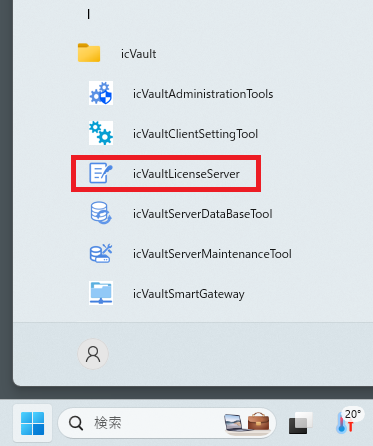
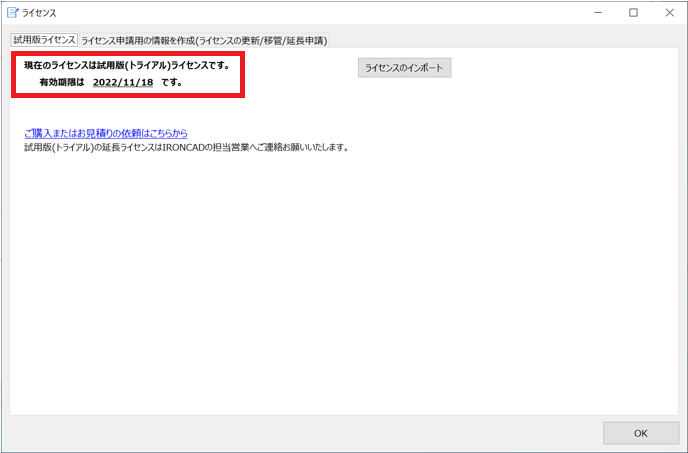

# 評価版の使用について

試用版ライセンスは icVaultServerDataBase.msi の新規インストール時に自動的適応されます。 
ライセンスの有効期限はインストール日から30日間です。

## 評価版ライセンス環境

評価版の icVaultLicenseServer では次の機能がご使用いただけます。

<li>試用版ライセンスの有効期限の確認</li>
<li>ライセンスのインポート(通常版ライセンス/試用延長ライセンス)</li>

### ライセンスと有効期限の確認
1.　スタートメニューから[icVault]-[icVaultLicenseServer]を起動します。

2.　タブ:試用版ライセンス の表示を確認します。

