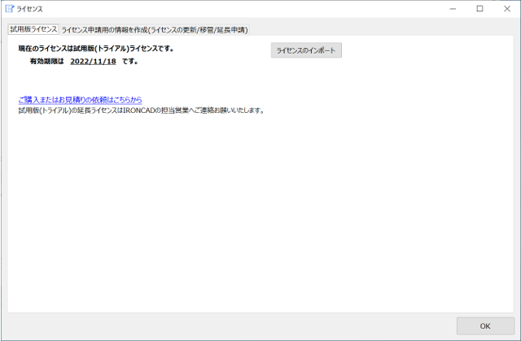
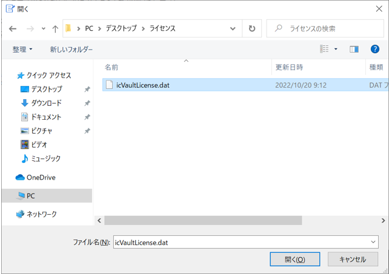
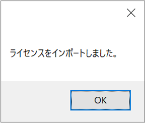

icVault を正式にご契約いただけました場合は、試用版ライセンスを製品版ライセンスへ切り替えることができます。 
事前に [ライセンスの申請] を実施してください。

> [参照][ライセンスの申請](./License/Li_apply.md)

### ライセンスの切り替え

〔1〕スタートメニューから[icVault]-[icVaultLicenseServer]を起動します。

〔2〕ライセンスのインポートをクリックします。

〔3〕IRONCAD サポートから受領したライセンスデータ(dat) を開きます。

〔4〕ライセンスがインポートされます。[OK] をクリックします。

