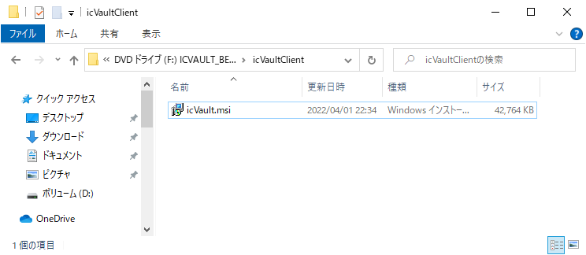
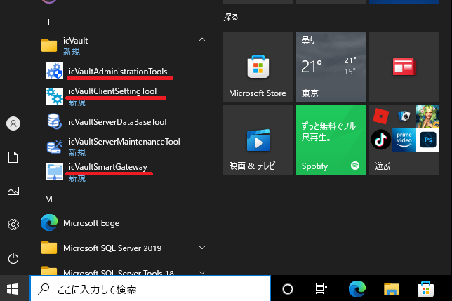

# ソフトウェアのインストール(新規)
本項目は、icVaultをご利用いただく際のIRONCADユーザ向けのご案内になります。 

**インストールするソフトウェア** 
<li>icVault.msi</li>  

## インストールの手順

### 手順 1　インストールファイルを開く

インストールメディアを開きます。

　　続けて、icVaultClient を開きます。

<ul>
インストールファイル一式をローカルフォルダへ移動して作業をする場合は、保存階層のパスの長さにご注意ください。
Windows10のパス長さには制限があります。　256文字を超えるパスの場合、インストールが正常に終了しません。
フォルダに日本語を使用している場合は、1文字に対して、パスは2とカウントされます。
</ul>

### 手順 2　アプリケーションをインストールする
cvmIcVault.msiをダブルクリックします。 

1.　セットアップウィザード画面が表示されます。 
　　「次へ」をクリックします。

2.　インストールフォルダの選択 
　　インストール先とユーザー条件を指定します。 
　　※インストールフォルダはデフォルトを推奨します。 
　　「次へ」をクリックします。

3.　インストールの確認 
　　「次へ」をクリックします。

　　※ユーザーアカウント制御画面が表示された場合は「はい」をクリックします。

4.　インストールが開始されます。 
　　※数秒かかる場合があります。

5.　インストールの完了 
　　「閉じる」をクリックし、終了します。

## インストール後の確認

WindowsのスタートメニューにicVaultフォルダとアプリケーションが追加されていることを確認します。

