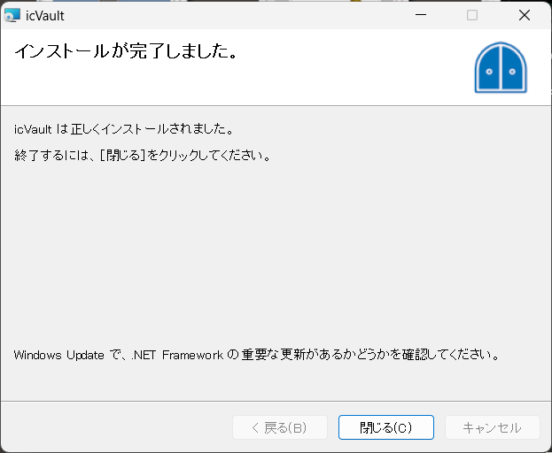

# ソフトウェアのインストール(新規)
本項目は、icVault をご利用いただく際の IRONCAD ユーザ向けのご案内になります。 

**インストールするソフトウェア** 
<li>icVault.msi</li>  

<ul>
インストールファイル一式をローカルフォルダへ移動して作業をする場合は、保存階層のパスの長さにご注意ください。
Windows のパス長さには制限があります。　260文字を超えるパスの場合、インストールが正常に終了しません。
フォルダに日本語を使用している場合は、1文字に対して、パスは2とカウントされます。
</ul>

## インストールの手順

### インストールする

〔1〕インストールメディアの icVaultClientフォルダ を開き、[icVault.msi] をダブルクリックします。
※ユーザーアカウント制御画面が表示された場合は [実行] をクリックします。

〔2〕セットアップウィザード画面が表示します。 
[次へ] をクリックします。

〔3〕インストールフォルダの選択  
インストール先とユーザー条件を指定します。 
※インストールフォルダはデフォルトを推奨します。 
[次へ] をクリックします。

〔4〕インストールの確認 
[次へ] をクリックします。 
※数秒かかります。

〔5〕icVault のインストール [自動でインストールが開始されます] 
※インストールには数分かかる場合があります。

〔6〕インストールの完了 
[閉じる] をクリックし、終了します。

