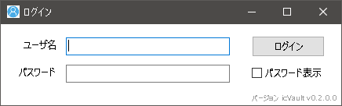
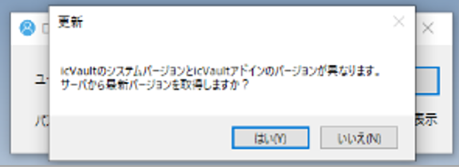
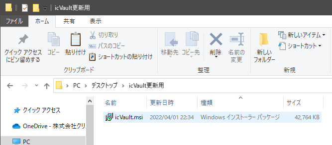

# ソフトウェアのインストール(アップデート)
本項目は、icVault をご利用いただく際の IRONCAD ユーザー様向けのご案内になります。 
すでに icVault.msi がインストールされていて、新しいバージョンが存在する場合に実施します。

## インストールの手順

### 1. インストーラーを取得する

〔1〕IRONCAD を起動し、icVault アドインを開きます。

〔2〕ログインします。

〔3〕新しいバージョンがある場合、更新メッセージが表示されます。 
[はい] をクリックします。

〔4〕新しいインストーラーを保存します。 
任意の場所に保存先を指定し、インストーラーを保存(所得)します。

### 2. アプリケーションをインストールする

〔1〕保存した icVault.msi をダブルクリックします。 
※ユーザーアカウント制御画面が表示された場合は [実行] をクリックします。

〔2〕セットアップウィザード画面が表示されます。 
[次へ] をクリックします。

〔3〕インストールフォルダの選択 
インストール先とユーザー条件を指定します。 
前回と同じ階層を確認し、[次へ] をクリックします。

〔4〕インストール開始。 
※数秒かかる場合があります。

〔5〕インストールの完了 
[閉じる] をクリックし、終了します。

