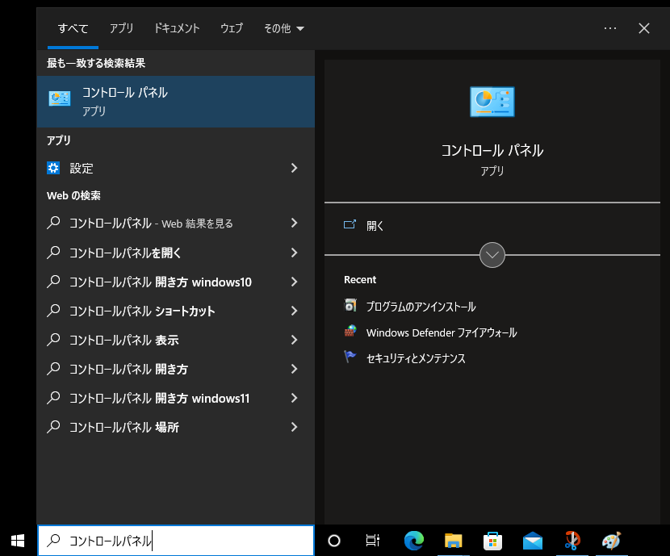
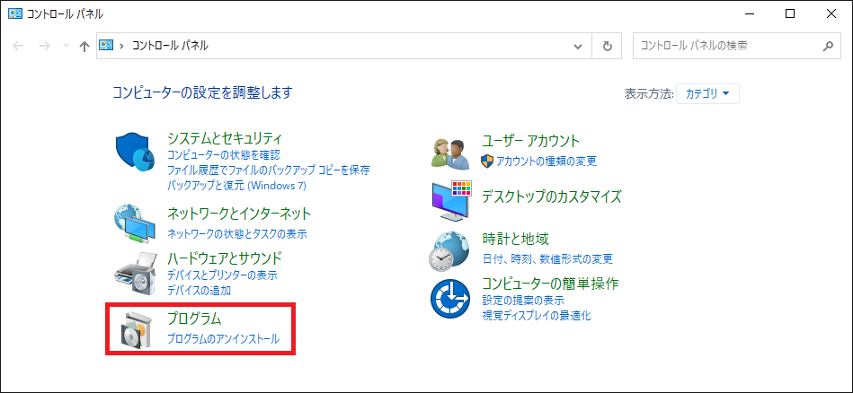
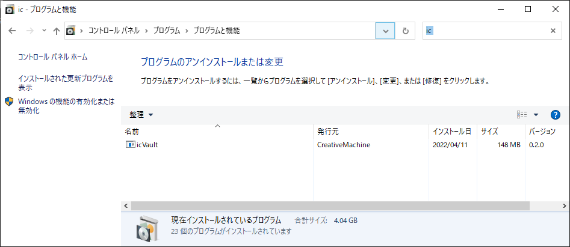

# アンインストール(ユーザ)

<ul>
<li>Windows の管理者権限が必要です。</li>
<li>アンインストールを開始する前に使用中のアプリケーションをすべて終了してください。</li>
</ul>

### 1. コントロールパネルを開く

〔1〕タスク バーの検索ボックスへ「コントロール パネル」と入力します。 
[コントロール パネル] を検索結果の一覧から選び、起動します。

〔2〕一覧から [プログラム] → [プログラムのアンインストール] をクリックします。

### 2. アプリケーションをアンインストールする
#### アンインストールするプログラム
**<li>icVault**</li>

〔1〕一覧よりファイルを検索します。

<ul>
<li>画面右上の検索欄に「ic」を入力すると表示します。</li>
</ul>

〔2〕icVaultを選択し、[アンインストール] をクリックします。

〔3〕アンインストールしたプログラムが一覧から消えていることを確認し、コントロールパネルを閉じます。

