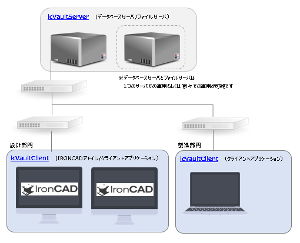
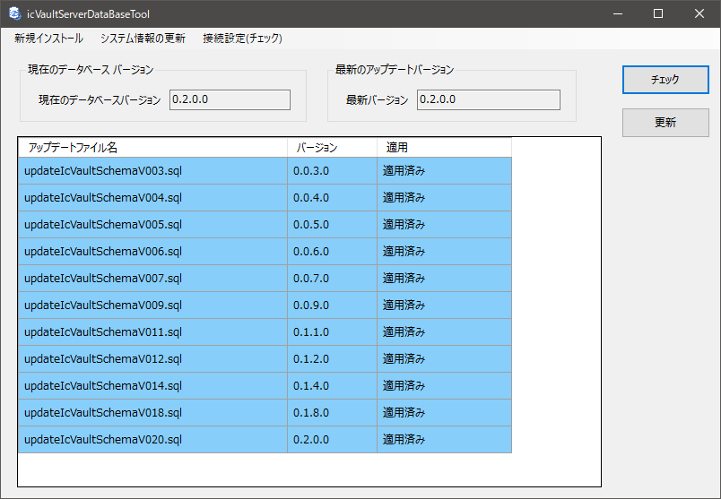
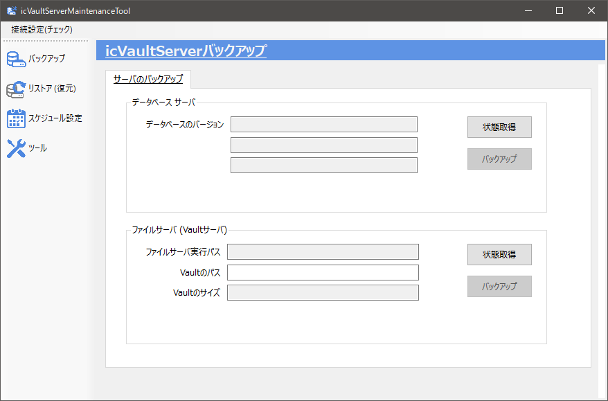
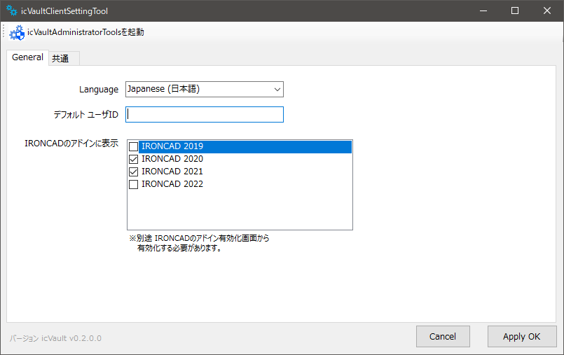
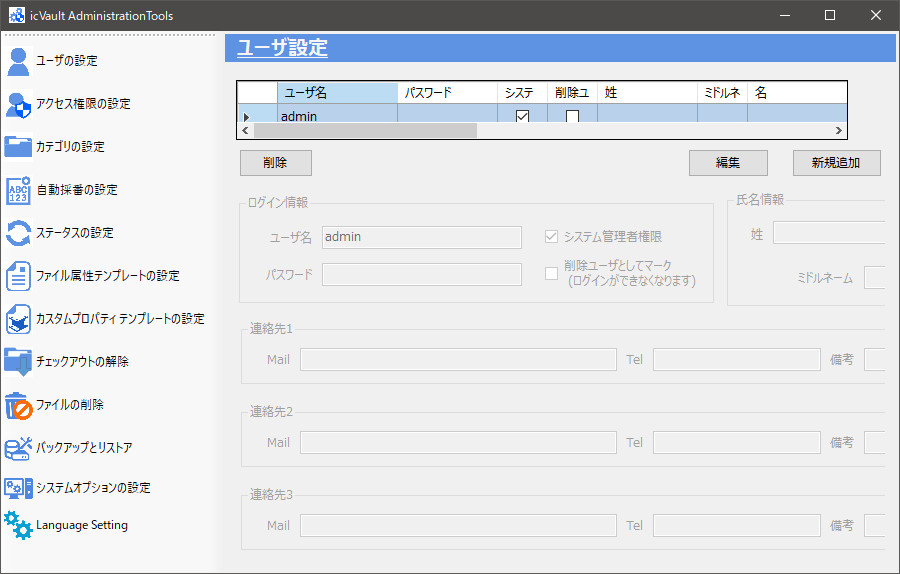
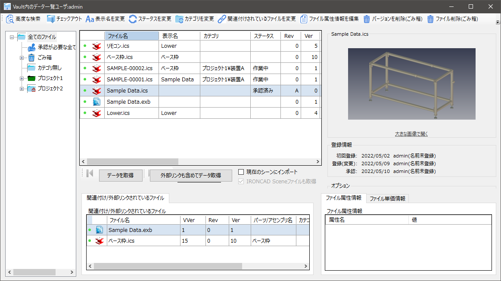

# システム・アプリケーション構成

icVault は icVault Server(サーバー側)と icVault Client(クライアント側)で構成されるデータ管理システムです。 

### icVaultサーバーの推奨システム条件

|項目               |必須環境|
|-------------------|--------|
|CPU                |2 コア以上(2.5GHz以上)|
|RAM                |8GB以上|
|HARD DISK          |200GB以上|
|OS                 |Windows Server 2019 Standard/ Essentioas/ IoT Strage|
|SQL                |Microsoft SQL Server 2019 Standard/ Express|

<li>Windows Server の種類によってはアクセスするユーザー数分の CAL が別途必要です。</li>
<li>余程のユーザー数や大量のデータを取り扱わない限り Express で運用可能です。</li>

### icVaultクライアントの動作環境

|項目               |必須環境|
|-------------------|--------|
|CPU                |2 コア以上(2.5GHz以上)|
|RAM                |8GB以上|
|HARD DISK          |- (インストールには約200MB必要です)|
|OS                 |Windows10|
|IRONCAD Version    |IRONCAD2020以降|

## icVaultServer

icVault はデータの管理(バックアップ含む)・アクセス権の管理・データの送受信を提供します。 
icVaultServer は 2つのサーバソフトウェアから構成されます。 
<li>データベースサーバ向けソフトウェア(icVaultServerDataBase.msi)</li>
<li>ファイルサーバ向けソフトウェア(icVaultServerFileTransfer.msi)</li>

それぞれのサーバソフトウェアは以下の機能を提供します。

### データベースサーバ向けソフトウェア(icVaultServerDataBase.msi)

<li>ユーザー情報</li>
<li>データのアクセス権</li>
<li>データに付与する情報の提供</li>

<ul>
ユーザの作成・アクセス権の設定は icVaultClient に含まれています。 
データベースサーバには icVaultClient もインストールすることをお勧めします。
</ul>

以下のアプリケーションが含まれます。

#### icVaultServerDataBaseTool
データベースの作成・データベーススキーマの更新を行うためのツールです。

#### icVaultServerMaintenanceTool
データベースのバックアップ/復元を実行・設定するツールです。 
定期的(毎日/毎週/毎月)に実行する設定も可能です。 

### ファイルサーバ向けソフトウェア（icVaultServerFileTransfer.msi）

以下のアプリケーションが含まれます。

#### icVaultServerMaintenanceTool
データベースのバックアップ/復元を実行・設定するツールです。 
※データベースサーバ向けのツールと同じアプリケーションです。

### ユーザ向けソフトウェア（icVaultClient）
本ツールはデータの登録/閲覧・ユーザの環境設定・サーバ(マスタ)の設定機能を提供します。 
IRONCAD がインストールされている端末では、icVault アドインを有効にすることで様々なデータの登録が可能です。

アクセス権やロール(役割)の設定が含まれますので、サーバPC にもインストールされることをお勧めします。

以下のアプリケーションが含まれます。

#### icVaultClientSettingTool
icVaultServer への接続設定や、IRONCAD へアドインを追加/削除するためのツールです。

#### icVaultAdministrationTools
icVaultServer の様々な設定を行うツールです。 
管理者が使用します。

#### icVaultSmartGateway
icVault のファイルを取得・情報を閲覧・検索することができます。 
ユーザが使用する icVault の [ファイル一覧] と同じツールです。

